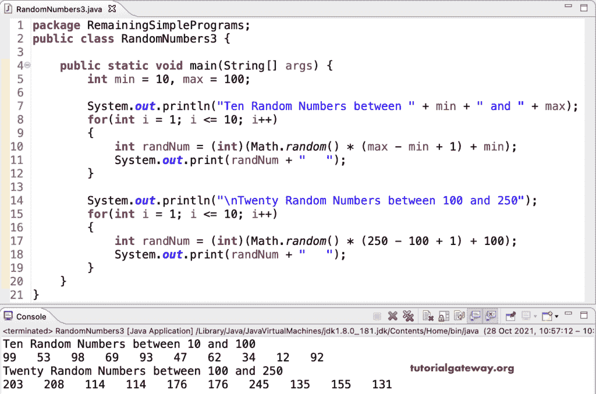

# Java 程序：生成随机数

> 原文：<https://www.tutorialgateway.org/java-program-to-generate-random-numbers/>

用一个例子编写一个生成随机数的 Java 程序。例如，在 Java 中，我们可以使用 Math random()方法、random 类和 ThreadLocalRandom 类来生成随机数。

## 用数学随机数生成随机数的 Java 程序()

在这个 Java 例子中，我们使用了 Math.random()方法，它生成 0 到 1 之间的双精度随机数。我们还可以对输出进行类型转换，以获得必要的数据类型。

```java
package RemainingSimplePrograms;

public class RandomNumbers1 {

	public static void main(String[] args) {

		System.out.println("The First Random Number  = " + Math.random());

		System.out.println("The Second Random Number = " + Math.random());

		System.out.println("The Third Random Number  = " + Math.random());

		System.out.println("The Fourth Random Number = " + Math.random());
	}
}
```

```java
The First Random Number  = 0.20037158212760142
The Second Random Number = 0.0012068894419960952
The Third Random Number  = 0.18700555955501663
The Fourth Random Number = 0.3230234616758232
```

通过使用[Java](https://www.tutorialgateway.org/learn-java-programs/)math . random()*(max–min+1)+min，我们可以生成最小值和最大值之间的随机数。

```java
package RemainingSimplePrograms;

public class RandomNumbers2 {

	public static void main(String[] args) {

		int min = 100, max = 300;

		System.out.print("The Double Random Number between " + min + " and " + max  + " = " );
		double rand1 = Math.random() * (max - min + 1) + min;
		System.out.print(rand1);

		System.out.print("\nThe Random Number between " + min + " and " + max  + " = " );
		int rand2 = (int)(Math.random() * (max - min + 1) + min);
		System.out.print(rand2);
	}
}
```

```java
The Double Random Number between 100 and 300 = 101.43411590322778
The Random Number between 100 and 300 = 282
```

到目前为止，我们在一个范围内生成了单个随机。但是，借助 Java for 循环，我们可以在一个范围内生成 N 个随机数。

```java
package RemainingSimplePrograms;

public class RandomNumbers3 {

	public static void main(String[] args) {

		int min = 10, max = 100;

		System.out.println("Ten Random Numbers between " + min + " and " + max);
		for(int i = 1; i <= 10; i++)
		{
			int randNum = (int)(Math.random() * (max - min + 1) + min);
			System.out.print(randNum + "   ");
		}

		System.out.println("\nTwenty Random Numbers between 100 and 250");
		for(int i = 1; i <= 10; i++)
		{
			int randNum = (int)(Math.random() * (250 - 100 + 1) + 100);
			System.out.print(randNum + "   ");
		}
	}
}
```



## 用随机类生成随机数的 Java 程序

Java Random 类有不同的方法来生成随机数。它们是

*   next int()–生成 0 到-1 之间的随机值
*   下一个点(最大值)
*   next float()–生成 0.0 到 1.0 之间的随机值
*   next double()–生成 0.0 到 1.0 之间的随机值
*   nextLong()
*   next 布尔值()

```java
package RemainingSimplePrograms;

import java.util.Random;

public class RandomNumbers4 {

	public static void main(String[] args) {

		Random rand = new Random();

		System.out.println("Randomly Generated Integer Values");
		System.out.println(rand.nextInt());
		System.out.println(rand.nextInt(20));
		System.out.println(rand.nextInt(100));

		System.out.println("Randomly Generated Double Values");
		System.out.println(rand.nextDouble());
		System.out.println(rand.nextDouble());

		System.out.println("Randomly Generated Float Values");
		System.out.println(rand.nextFloat());
		System.out.println(rand.nextFloat());

		System.out.println("Randomly Generated Long Values");
		System.out.println(rand.nextLong());
		System.out.println(rand.nextLong());
	}
}
```

```java
Randomly Generated Integer Values
1907114976
4
34
Randomly Generated Double Values
0.9425130257739933
0.35445514266974565
Randomly Generated Float Values
0.26128042
0.47151804
Randomly Generated Long Values
1983140345491940719
8269807721314480176
```

在这个 Java 例子中，我们使用 for 循环来生成十个最大限制值为 100 的整数类型的随机数。

```java
package RemainingSimplePrograms;

import java.util.Random;

public class RandomNumbers5 {

	public static void main(String[] args) {

		Random rand = new Random();

		System.out.println("Ten Randomly Generated Numbers are");
		for(int i = 1; i <= 10; i++)
		{
			System.out.print(rand.nextInt(100) + 1 + "   ");
		}
	}
}
```

```java
Ten Randomly Generated Numbers are
9   45   62   84   18   2   10   33   28   60 
```

## 用线程随机产生随机数的 Java 程序

我们也可以使用 ThreadLocalRandom 来生成一个范围内的随机数。nextInt()，nextDouble()，和 nextLong()接受最小和最大限制值。

```java
package RemainingSimplePrograms;

import java.util.concurrent.ThreadLocalRandom;

public class RandomNumbers6 {

	public static void main(String[] args) {

		System.out.println("Randomly Generated Integer Values");
		System.out.println(ThreadLocalRandom.current().nextInt());
		System.out.println(ThreadLocalRandom.current().nextInt(20));
		System.out.println(ThreadLocalRandom.current().nextInt(100, 500));

		System.out.println("Randomly Generated Double Values");
		System.out.println(ThreadLocalRandom.current().nextDouble());
		System.out.println(ThreadLocalRandom.current().nextDouble(50));
		System.out.println(ThreadLocalRandom.current().nextDouble(30, 50));

		System.out.println("Randomly Generated Float Values");
		System.out.println(ThreadLocalRandom.current().nextFloat());
		System.out.println(ThreadLocalRandom.current().nextFloat());

		System.out.println("Randomly Generated Long Values");
		System.out.println(ThreadLocalRandom.current().nextLong());
		System.out.println(ThreadLocalRandom.current().nextLong(40));
		System.out.println(ThreadLocalRandom.current().nextLong(400, 600));
	}
}
```

```java
Randomly Generated Integer Values
536433268
17
105
Randomly Generated Double Values
0.35695024289926547
29.875628014935078
45.29405097588917
Randomly Generated Float Values
0.62107533
0.9211104
Randomly Generated Long Values
-1523132321353307594
4
542
```

这个程序使用 ThreadLocalRandom 和 for 循环在一个范围内生成多个随机数。

```java
package RemainingSimplePrograms;

import java.util.concurrent.ThreadLocalRandom;

public class RandomNumbers7 {

	public static void main(String[] args) {

		int min = 100, max = 300;

		System.out.println("Ten Randomly Generated Numbers are");
		for(int i = 1; i <= 10; i++)
		{
			System.out.print(ThreadLocalRandom.current().nextInt(100) + 1 + "   ");
		}

		System.out.println("\nFifteen Randomly Generated Numbers are");
		for(int i = 0; i < 15; i++)
		{
			int rdNum = ThreadLocalRandom.current().nextInt(min, max);
			System.out.print(rdNum + "   ");
		}
	}
}
```

```java
Ten Randomly Generated Numbers are
10   88   47   68   41   79   45   74   1   41   
Fifteen Randomly Generated Numbers are
262   187   267   255   255   265   136   201   228   255   166   156   115   291   169
```