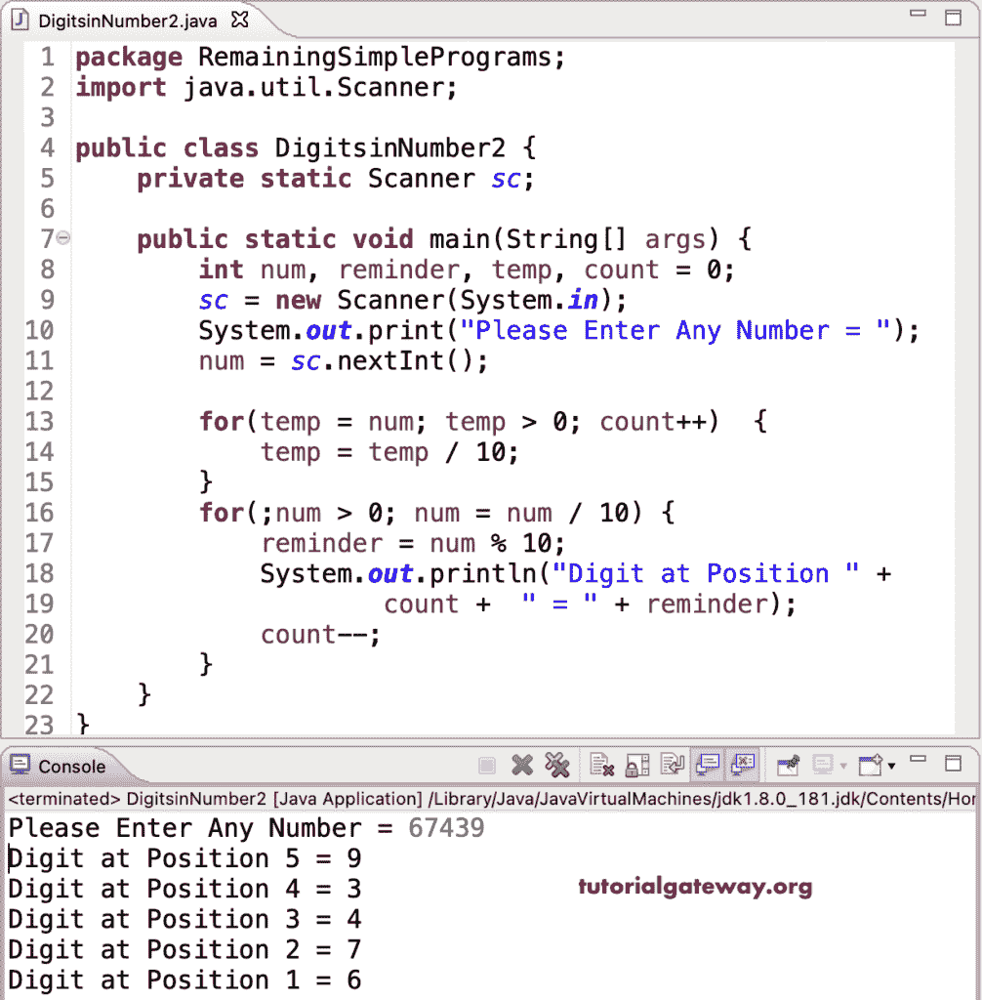

# Java 程序：将整数分解为数字

> 原文：<https://www.tutorialgateway.org/java-program-to-break-integer-into-digits/>

编写一个 Java 程序，使用 while 循环将兴趣分解成数字。在这个 Java 例子中，第一个 while 循环将计算一个数字的总位数。第二个 while 循环将迭代整数并打印每个数字作为输出。

```java
package RemainingSimplePrograms;

import java.util.Scanner;

public class DigitsinNumber1 {
	private static Scanner sc;
	public static void main(String[] args) {
		int num, reminder, temp, count = 0;
		sc = new Scanner(System.in);		
		System.out.print("Please Enter Any Number = ");
		num = sc.nextInt();

		temp = num;

		while(temp > 0)
		{
			temp = temp / 10;
			count++;
		}

		while(num > 0)
		{
			reminder = num % 10;
			System.out.println("Digit at Position " + count +  " = " + reminder);
			num = num / 10;
			count--;
		}
	}
}
```

```java
Please Enter Any Number = 98453217
Digit at Position 8 = 7
Digit at Position 7 = 1
Digit at Position 6 = 2
Digit at Position 5 = 3
Digit at Position 4 = 5
Digit at Position 3 = 4
Digit at Position 2 = 8
Digit at Position 1 = 9
```

[Java 程序](https://www.tutorialgateway.org/learn-java-programs/)使用 for 循环将整数分解为数字。

```java
package RemainingSimplePrograms;

import java.util.Scanner;

public class DigitsinNumber2 {

	private static Scanner sc;

	public static void main(String[] args) {

		int num, reminder, temp, count = 0;

		sc = new Scanner(System.in);

		System.out.print("Please Enter Any Number = ");
		num = sc.nextInt();

		for(temp = num; temp > 0; count++)
		{
			temp = temp / 10;
		}

		for(;num > 0; num = num / 10)
		{
			reminder = num % 10;
			System.out.println("Digit at Position " + count +  " = " + reminder);		
			count--;
		}
	}
}
```

