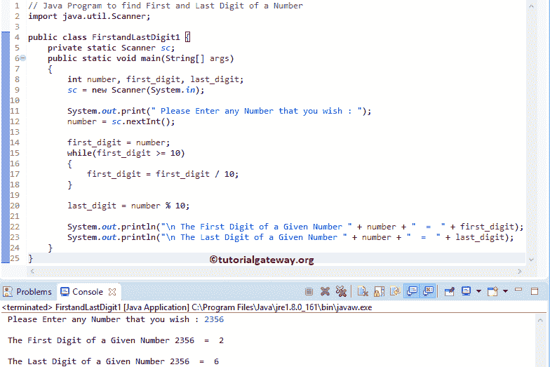

# Java 程序：寻找数字的第一位和最后一位

> 原文：<https://www.tutorialgateway.org/java-program-to-find-first-and-last-digit-of-a-number/>

写一个 Java 程序，用例子找出一个数字的第一个和最后一个数字。

## 返回数字的第一个和最后一个数字的 Java 程序示例 1

这个程序允许用户输入任何数字。接下来，这个 Java 程序返回用户输入值的第一个和最后一个数字。

```java
// Java Program to find First and Last Digit of a Number
import java.util.Scanner;

public class FirstandLastDigit1 {
	private static Scanner sc;
	public static void main(String[] args) 
	{
		int number, first_digit, last_digit;
		sc = new Scanner(System.in);

		System.out.print(" Please Enter any Number that you wish : ");
		number = sc.nextInt();	

		first_digit = number;
		while(first_digit >= 10)
		{
			first_digit = first_digit / 10;
		}	

		last_digit = number % 10;

		System.out.println("\n The First Digit of a Given Number " + number + "  =  " + first_digit);
		System.out.println("\n The Last Digit of a Given Number " + number + "  =  " + last_digit);
	}
}
```



数字= 2356

While 循环第一次迭代 while (2356 >= 10)
第一位=第一位/ 10 = 2356 / 10 = 235

第二次迭代 while(235 > = 10)
first _ digit = 235/10 = 23

第三次迭代同时(23 >= 10)
第一个 _ 数字= 23 / 10 = 5

第四次迭代，而(5 >= 10)
条件为假。因此， [Java](https://www.tutorialgateway.org/java-tutorial/) 编译器从 [While Loop](https://www.tutorialgateway.org/java-while-loop/)
第一位数字= 5 退出

最后 _ 位数= 2356 % 10
最后 _ 位数= 6T3

## 寻找数字的第一个和最后一个数字的 Java 程序示例 2

这个 [Java 程序](https://www.tutorialgateway.org/learn-java-programs/)和上面的第一个和最后一个数字例子是一样的。但是在这个程序中，我们创建了两个独立的 Java 方法来查找用户输入值的第一个数字和最后一个数字。我们在之前的文章中已经演示过了。所以，请参考[第一位](https://www.tutorialgateway.org/java-program-to-find-first-digit-of-a-number/)和[最后一位](https://www.tutorialgateway.org/java-program-to-find-last-digit-of-a-number/)文章。

```java
import java.util.Scanner;

public class FirstandLastDigit2 {
	private static Scanner sc;
	public static void main(String[] args) 
	{
		int number, first_digit, last_digit;
		sc = new Scanner(System.in);

		System.out.print(" Please Enter any Number that you wish : ");
		number = sc.nextInt();	
		first_digit = firstDigit(number);

		last_digit = lastDigit(number);

		System.out.println("\n The First Digit of a Given Number " + number + "  =  " + first_digit);	
		System.out.println("\n The Last Digit of a Given Number " + number + "  =  " + last_digit);
	}

	public static int firstDigit(int num)
	{
		while(num >= 10)
		{
			num = num / 10;
		}	
		return num;	
	}

	public static int lastDigit(int num)
	{
		return num % 10;	
	}
}
```

数字输出中的第一个和最后一个数字

```java
 Please Enter any Number that you wish : 789625

 The First Digit of a Given Number 789625  =  7

 The Last Digit of a Given Number 789625  =  5
```