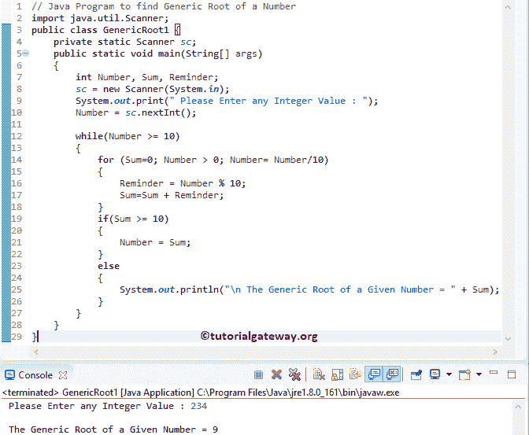

# Java 程序：寻找一个数的一般根

> 原文：<https://www.tutorialgateway.org/java-program-to-find-generic-root-of-a-number/>

写一个 Java 程序，用例子找到一个数的一般根。这个 Java 泛型根计算背后的公式只不过是计算一个数字中所有数字的总和，直到我们得到一个一位数的输出(小于 10)。例如，98765 的泛型根= 9 + 8 + 7 + 6 + 5 = 35 = 8。

## 寻找一个数字的一般根的 Java 程序示例 1

该程序允许用户输入任何正整数值。然后这个 Java 程序使用 While 循环、For 循环和 If Else 语句计算给定数字的泛型根。

```java
// Java Program to find Generic Root of a Number
import java.util.Scanner;

public class GenericRoot1 {
	private static Scanner sc;
	public static void main(String[] args) 
	{
		int Number, Sum, Reminder;
		sc = new Scanner(System.in);

		System.out.print(" Please Enter any Integer Value : ");
		Number = sc.nextInt();	

		while(Number >= 10)
		{
			for (Sum=0; Number > 0; Number= Number/10)
		    {
				Reminder = Number % 10;
				Sum=Sum + Reminder;  
		    }
		    if(Sum >= 10)
		    {
		    	Number = Sum;
		    }
		    else
		    {
		    	System.out.println("\n The Generic Root of a Given Number = " + Sum);
		    }
		}
	}
}
```



用户为此 Java 程序输入的值，以查找数字的一般根:数字= 236

[While 循环](https://www.tutorialgateway.org/java-while-loop/)–第一次迭代:While(数字> = 10)
条件为真。因此，它进入 [For Loop](https://www.tutorialgateway.org/java-for-loop/)

对于循环第一次迭代:对于(和= 0；数字> 0；Number = Number/10)
=>(Sum = 0；234>0；数字= 234/10)–条件为真。
提醒=数字% 10
提醒= 234 % 10 = 4
总和= 0 + 4 = 4

接下来，由“用于循环”更新的编号。
数字=数字/10 = > 234/10
数字= 23

第二次迭代:for(Sum = 0；23 > 0;数= 23/10)
条件为真。
提醒= 23 % 10 = 3
总和= 4 + 3 = 7

数量= 23/10
数量= 2

第三次迭代:for(Sum = 0；2 > 0;数字= 2/10)
条件为真。
提醒= 2 % 10 = 2
总和= 7 + 2 = 9

数量= 2/10
数量= 0.2

第四次迭代:for(Sum = 0；0.2 > 0;数字= 0.2/10)
条件为假。

接下来， [Java](https://www.tutorialgateway.org/java-tutorial/) 编译器进入 [If Else 语句](https://www.tutorialgateway.org/java-else-if-statement/)

如果(总和> = 10)–条件为假。因此，它执行 Else 块中的语句。

## 寻找一个数的一般根的 Java 程序示例 2

这个 [Java 程序](https://www.tutorialgateway.org/learn-java-programs/)计算一个数的泛型根和上面的例子是一样的。但是我们分离了逻辑，并把它放在一个单独的方法中。

```java
// Java Program to find Generic Root of a Number
import java.util.Scanner;

public class GenericRoot2 {
	private static Scanner sc;
	public static void main(String[] args) 
	{
		int Number;
		sc = new Scanner(System.in);

		System.out.print(" Please Enter any Integer Value : ");
		Number = sc.nextInt();	

		GenericRoot(Number);
	}

	public static void GenericRoot(int Number)
	{
		int Sum, Reminder;

		while(Number >= 10)
		{
			for (Sum=0; Number > 0; Number= Number/10)
		    {
				Reminder = Number % 10;
				Sum=Sum + Reminder;  
		    }
		    if(Sum >= 10)
		    {
		    	Number = Sum;
		    }
		    else
		    {
		    	System.out.println("\n The Generic Root of a Given Number = " + Sum);
		    }
		}
	}
}
```

Java 泛型根输出

```java
 Please Enter any Integer Value : 987586

 The Generic Root of a Given Number = 7
```