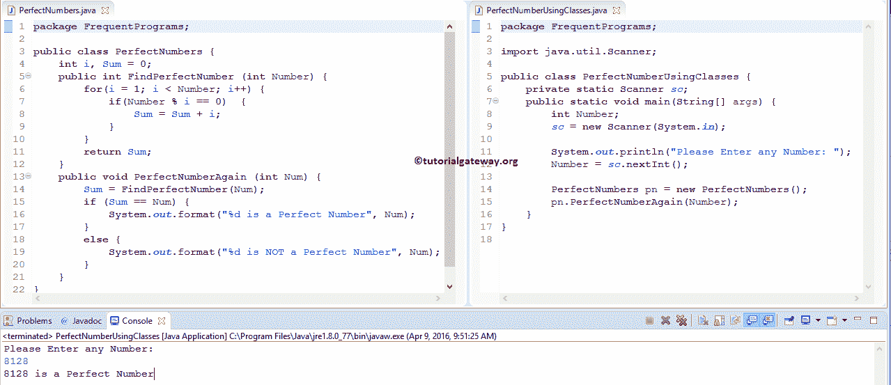

# Java 程序：完美数

> 原文：<https://www.tutorialgateway.org/perfect-number-program-in-java/>

使用 While 循环、For 循环和函数用 Java 编程语言编写一个完美数程序。我们还将展示 1 到 n 之间的 Java 完美数

## Java 中的完美数

任何数都可以是一个 Java 完美数，只要它的除数之和不包括数本身就等于这个数。例如，28 是一个完美数，因为 28 可以被 1、2、4、7、14 和 28 整除，这些值的总和是 1 + 2 + 4 + 7 + 14 = 28。记住，我们必须排除数字本身。这就是为什么我们没有在这里增加 28 个。一些 Java 完美数是 6、28、496、8128 和 33550336 等等。

## 用 For 循环实现 Java 中的完美数程序

这个完美数字的 Java 程序允许用户输入任何数字。接下来，这个程序将使用 Java For 循环检查这个数字是否是完美数。

```java
// Write Perfect Number program in Java using For Loop */

package FrequentPrograms;

import java.util.Scanner;

public class PerfectNumberUsingFor {
	private static Scanner sc;

	public static void main(String[] args) {
		int i, Number, Sum = 0 ;
		sc = new Scanner(System.in);		
		System.out.println("\n Please Enter any Number: ");
		Number = sc.nextInt();

		for(i = 1 ; i < Number ; i++) {
			if(Number % i == 0)  {
				Sum = Sum + i;
			}
		}
		if (Sum == Number) {
			System.out.format("\n% d is a Perfect Number", Number);
		}
		else {
			System.out.format("\n% d is NOT a Perfect Number", Number);
		}
	}
}
```


在 [Java](https://www.tutorialgateway.org/java-tutorial/) 程序的这个完美数中，首先，我们声明了三个整数变量 I、Number 和 Sum = 0。以下语句将要求用户输入任何正整数。然后，将该数字赋给变量 number。

```java
System.out.println("\n Please Enter any Number: ");
Number = sc.nextInt();
```

在下一行，我们有 [For 循环](https://www.tutorialgateway.org/java-for-loop/)，For 循环内部的条件(i <数)将确保我不会超过该数。在 For 循环中，我们使用 If 条件来检查数字是否能被 I 值完全整除。

1.  如果这个数完全能被 I 整除，那么我将被加到 Sum 中。
2.  如果这个数不能被 I 整除，那么我将加 1 并检查下一个值。

请参考 [Java If Else 语句](https://www.tutorialgateway.org/java-if-else-statement/)文章了解 If Else 语句

```java
for(i = 1 ; i < Number ; i++) {
	if(Number % i == 0)  {
		Sum = Sum + i;
	}
}
```

让我们从迭代的角度来看这个 for 循环的工作原理。从上面的 Java 完美数示例截图中，用户输入了值:Number = 6。

第一次迭代

对于第一次迭代，数字= 6，总和= 0，i = 1

*   For 循环(1 < 6)中的条件为真。因此，程序将开始在 For 循环中执行语句
*   在 for 循环中，我们有 [If Else 语句](https://www.tutorialgateway.org/java-if-else-statement/)，条件 if (6 % 1 == 0)为真，所以 Sum = Sum + i
*   总和= 0 + 1 = 1
*   最后，我将增加 1。请参考 Java 文章中的[递增和递减运算符来理解++符号。](https://www.tutorialgateway.org/increment-and-decrement-operators-in-java/)

第二次迭代

从第二次迭代开始，Sum 和 I 的值都变成了 Sum = 1 和 i = 2

*   For 循环内的条件(2 < 6)为真。
*   在 for 循环中，if 条件 if (6 % 2 == 0)为真。所以，总和=总和+我
*   总和= 1 + 2 = 3
*   最后，I 值增加 1。

第三次迭代

从 Java 完美数程序的第三次迭代中，Sum = 3 和 i = 3 的值

*   For 循环内的条件(3 < 6)为真。
*   在 for 循环中，if 条件 if (6 % 3 == 0)为真。所以，总和=总和+我
*   总和=3 + 3 = 6
*   最后，I 值增加 1。

第四次和第五次迭代

对于第四次和第五次迭代，if 条件将失败。

*   如果(6 % 4 == 0)为假
*   如果(6 % 5 == 0)为假

第六次迭代

对于第六次迭代，I 的值变为 6，这意味着 For 循环内的条件将失败(6 < 6). So, the Javac compiler will terminate the for loop.

在下一行中，我们有一个 If 条件来检查 Sum 变量中的值是否完全等于给定的 Number。

```java
if (Sum == Number)
```

如果条件(总和==数字)为真，则执行系统输出格式语句

```java
System.out.format("\n% d is a Perfect Number", Number);
```

如果条件(Sum == Number)为假，则执行以下系统输出格式语句

```java
System.out.format("\n% d is NOT a Perfect Number", Number);
```

本例中(总和==数字)为真。所以，给定的数是完美数

## 使用 While 循环的 Java 完美数程序

[Java 程序](https://www.tutorialgateway.org/learn-java-programs/)中的这个完美数字允许用户输入任意数字。通过使用该号码，该程序将使用 [While Loop](https://www.tutorialgateway.org/java-while-loop/) 检查用户输入的是否为完美号码。

```java
package FrequentPrograms;
import java.util.Scanner;

public class PerfectNumberUsingWhile {
	private static Scanner sc;	
	public static void main(String[] args) {
		int i = 1, Number, Sum = 0 ;
		sc = new Scanner(System.in);		
		System.out.println("Please Enter any Number: ");
		Number = sc.nextInt();

		while(i < Number) {
			if(Number % i == 0)  {
				Sum = Sum + i;
			}
			i++;
		}
		if (Sum == Number) {
			System.out.format("%d is a Perfect Number", Number);
		}
		else {
			System.out.format("%d is NOT a Perfect Number", Number);
		}
	}
}
```

在这个例子中，我们没有做任何特别的事情。我们刚刚用 While 循环替换了 Java 完美数程序中的 For 循环。如果你觉得很难理解 While 循环功能，那么请参考 [Java While 循环](https://www.tutorialgateway.org/java-while-loop/)一文。

使用 while 循环输出的 Java 完美数

```java
Please Enter any Number: 
496
496 is a Perfect Number
```

## 用函数实现 Java 中的完美数程序

这个 Java 完美数[程序](https://www.tutorialgateway.org/learn-java-programs/)允许用户输入任意整数值，我们将把用户输入的值传递给我们创建的方法。

在这个用户定义的函数中，java 程序中的这个完美数将使用[Java For Loop](https://www.tutorialgateway.org/java-for-loop/)检查用户输入的是否是完美数

```java
package FrequentPrograms;
import java.util.Scanner;

public class PerfectNumberUsingMethod {
	private static Scanner sc;

	public static void main(String[] args) {
		int Number;
		sc = new Scanner(System.in);		
		System.out.println("Please Enter any Number: ");
		Number = sc.nextInt();

		PerfectNumber (Number);
	}

	public static void PerfectNumber (int Number) {
		int i, Sum = 0;
		for(i = 1 ; i < Number ; i++) {
			if(Number % i == 0)  {
				Sum = Sum + i;
			}
		}
		if (Sum == Number) {
			System.out.format("%d is a Perfect Number", Number);
		}
		else {
			System.out.format("%d is NOT a Perfect Number", Number);
		}
	}
}
```

使用函数输出的 Java 完美数

```java
Please Enter any Number: 
28
28 is a Perfect Number
```

这里，我们的函数声明为 void，并且它不返回任何值。所以，我们在调用函数。

```java
PerfectNumber (Number);
```

当编译器到达 main()程序中 perfectnnumber(Number)行时，Javac 编译器会立即跳转到下面的函数:

```java
public static void PerfectNumber (int Number) {
```

我们已经在上面的例子中解释了逻辑。

## 使用 OOPS 的 Java 完美数程序

在这个 [Java 程序](https://www.tutorialgateway.org/learn-java-programs/)中，我们使用面向对象编程来划分代码。为此，首先，我们将创建一个类，该类包含一个方法来查找因数的总和。

```java
package FrequentPrograms;

public class PerfectNumber {
	int i, Sum = 0;
	public int FindPerfectNumber (int Number) {
		for(i = 1; i < Number; i++) {
			if(Number % i == 0)  {
				Sum = Sum + i;
			}
		}
		return Sum;
	}
}
```

在 Java 完美数的主程序中，我们将创建上述类的一个实例，并调用方法

```java
package FrequentPrograms;

import java.util.Scanner;

public class PerfectNumberUsingClass {
	private static Scanner sc;
	public static void main(String[] args) {
		int Number, Sum = 0;
		sc = new Scanner(System.in);

		System.out.println("Please Enter any Number: ");
		Number = sc.nextInt();

		PerfectNumber pn = new PerfectNumber();
		Sum = pn.FindPerfectNumber(Number);

		if (Sum == Number) {
			System.out.format("%d is a Perfect Number", Number);
		}
		else {
			System.out.format("%d is NOT a Perfect Number", Number);
		}		
	}
}
```

```java
Please Enter any Number: 
8128
8128 is a Perfect Number
```

完善的数字分类分析:

在这个 Java 完美数字程序中，我们创建了一个函数来查找给定数字的因数，并将这些因数相加。我们已经在上面的例子中解释了逻辑。

主类分析:

首先，我们创建了一个完美数字类的实例/对象

```java
PerfectNumber pn = new PerfectNumber();
```

接下来，我们将调用 FindPerfectNumber(数字)方法。众所周知，该方法将返回整数值，因此，我们将该返回值赋给 Sum

```java
Sum = pn.FindPerfectNumber(Number);
```

最后，我们使用 [Java If Else 语句](https://www.tutorialgateway.org/java-if-else-statement/)来检查返回值是否等于用户指定的数字。

我们还可以在 PerfectNumber 类中创建一个方法来检查 Sum 是否等于数字



根据 java 程序中的上述完美数，我们创建了一个函数来查找给定 number 的因数并对这些因数求和。接下来，我们又声明了一个函数来检查第一个函数返回值是否等于函数参数。根据结果，执行 System.out.format 语句。

注意:使用 PerfectNumberAgain(int Num)方法，我们调用 FindPerfectNumber)函数来获取因数的总和。

## 寻找 1 到 1000 之间的完美数的 Java 程序

这个[完美数字的 Java 程序](https://www.tutorialgateway.org/learn-java-programs/)允许用户输入最小值和最大值。在 java 程序中，这个完美数将在最小值和最大值之间找到完美数。

```java
// Java Program to Find Perfect Number between 1 to 1000

package FrequentPrograms;

import java.util.Scanner;

public class PerfectNumbersbetweenMin {
	private static Scanner sc;
	public static void main(String[] args) {
		int i, Number, Minimum, Maximum, Sum = 0;
		sc = new Scanner(System.in);

		System.out.println("Please Enter the Minimum Value: ");
		Minimum = sc.nextInt();

		System.out.println("Please Enter the Maximum Value: ");
		Maximum = sc.nextInt();

		for(Number = Minimum; Number <= Maximum; Number++) {
			for(i = 1, Sum =0; i < Number; i++)  {
				if(Number % i == 0)  {
					Sum = Sum + i;
				}
			}
			if (Sum == Number) {
				System.out.format("%d \t", Number);
			}
		}
	}
}
```

从 1 到 100 的 Java 完美数输出

```java
Please Enter the Minimum Value: 
1
Please Enter the Maximum Value: 
10000
6 	28 	496 	8128 
```

在这个 Java 完美数程序中，以下语句将要求用户输入最小值和最大值。然后我们将用户输入的值分配给最小和最大变量。

```java
System.out.println("Please Enter the Minimum Value: ");
Minimum = sc.nextInt();

System.out.println("Please Enter the Maximum Value: ");
Maximum = sc.nextInt();
```

接下来，我们使用 [For 循环](https://www.tutorialgateway.org/java-for-loop/)，这个循环帮助 Javac 在最小和最大变量之间迭代。这里，迭代从最小值开始，不会超过最大值变量。

```java
for(Number = Minimum; Number <= Maximum; Number++) {
```

在循环程序中，我们检查这个数是否是完美数。我们已经在第一个例子中解释了 for 循环迭代。