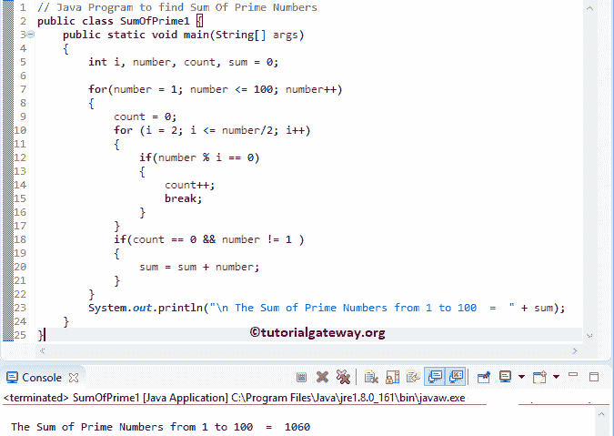

# Java 程序：计算质数之和

> 原文：<https://www.tutorialgateway.org/java-program-to-find-sum-of-prime-numbers/>

编写一个 Java 程序，使用 For 循环、While 循环和函数来求质数之和。

## 用 For 循环求质数和的 Java 程序

该程序允许用户输入任何整数值。接下来，它使用 For 循环查找从 1 到 100 的所有质数的和。

提示:请参考 [Java](https://www.tutorialgateway.org/java-tutorial/) 中 [Java 程序检查质数](https://www.tutorialgateway.org/java-program-to-check-prime-number/)一文，了解检查质数涉及的步骤

```java
// Java Program to Print Prime Numbers from 1 to N
public class PrintPrimeNumbers1 {

	public static void main(String[] args) 
	{
		int i, number, count, sum = 0 

		for(number = 1; number <= 100; number++)
		{
			count = 0;
		    for (i = 2; i <= number/2; i++)
		    {
		    	if(number % i == 0)
		    	{
		    		count++;
		    		break;
		    	}
		    }
		    if(count == 0 && number != 1 )
		    {
		    	sum = sum + number;
		    }  
		}
                System.*out*.println("\n The Sum of Prime Numbers from 1 to 100 = " + sum);
	}
}
```



## 用 While 循环计算质数和的 Java 程序

这个 Java 程序使用 While 循环计算 1 到 100 之间的质数之和。

```java
// Java Program to Print Prime Numbers from 1 to N
public class PrintPrimeNumbers2 {

	public static void main(String[] args) 
	{
		int i, number = 1, count, sum = 0

		while(number <= 100)
		{
			count = 0;
			i = 2;
		    while(i <= number/2 )
		    {
		    	if(number % i == 0)
		    	{
		    		count++;
		    		break;
		    	}
		    	i++;
		    }
		    if(count == 0 && number != 1 )
		    {
		    	sum = sum + number;
		    }
		    number++;
		}
                System.*out*.println("\n The Sum of Prime Numbers from 1 to 100 = " + sum);
	}
}
```

```java
 The Sum of Prime Numbers from 1 to 100 = 1060
```

我们刚刚用 While 循环替换了上面 Java 例子中的 [For 循环](https://www.tutorialgateway.org/java-for-loop/)。如果您不理解 While Loop，请参考: [WHILE LOOP](https://www.tutorialgateway.org/java-while-loop/ "C While Loop") 。

## 用方法求质数之和的程序

这个 [Java 程序](https://www.tutorialgateway.org/learn-java-programs/)接受来自用户的最小值和最大值。接下来，它找到最小值和最大值之间所有质数的和。

```java
// Java Program to Print Prime Numbers between Minimum and Maximum
import java.util.Scanner;

public class PrintPrimeNumbers3 {
	private static Scanner sc;
	public static void main(String[] args) 
	{
		int number, minimum, maximum, i, count, sum = 0; 
		sc = new Scanner(System.in);

		System.out.print(" Please Enter the Minimum value : ");
		minimum = sc.nextInt();	

		System.out.print(" Please Enter the Maximum value : ");
		maximum = sc.nextInt();	

		for(number = minimum; number <= maximum; number++)
		{
			count = 0;
		    for (i = 2; i <= number/2; i++)
		    {
		    	if(number % i == 0)
		    	{
		    		count++;
		    		break;
		    	}
		    }
		    if(count == 0 && number != 1 )
		    {
                        sum = sum + number;
		    }  
		}
                System.*out*.println("\n The Sum of Prime Numbers = " + sum);
	}
}
```

```java
 Please Enter the Minimum value : 10
 Please Enter the Maximum value : 500

 The Sum of Prime Numbers = 21519
```