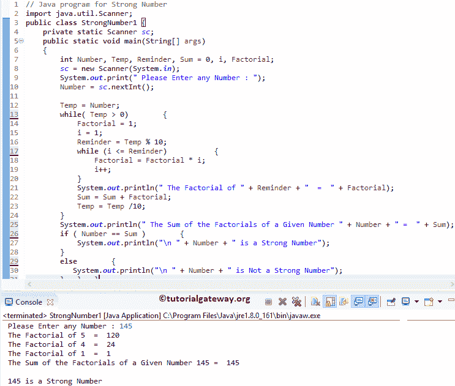

# Java 程序：强数

> 原文：<https://www.tutorialgateway.org/java-program-for-strong-number/>

使用 While 循环、for 循环和函数为强数编写一个 Java 程序。我们还展示了如何打印 1 到 n 之间的强数。如果每个数字的阶乘之和等于给定的数字，那么它被称为强数。

## 使用 While 循环的强数 Java 程序

这个 java 中的强数程序允许用户输入任何整数值。接下来，它使用 While 循环检查给定的数字是否强。

```java
// Java program for Strong Number
import java.util.Scanner;

public class StrongNumber1 {
	private static Scanner sc;
	public static void main(String[] args) 
	{
		int Number, Temp, Reminder, Sum = 0, i, Factorial;
		sc = new Scanner(System.in);

		System.out.print(" Please Enter any Number : ");
		Number = sc.nextInt();		

		Temp = Number;
		while( Temp > 0)
		{
			Factorial = 1; 
			i = 1; 
		    Reminder = Temp % 10;
		    while (i <= Reminder)
		    {
		     	Factorial = Factorial * i;
		     	i++;
		    }
		    System.out.println(" The Factorial of " + Reminder + "  =  " + Factorial);
		     Sum = Sum + Factorial;
		     Temp = Temp /10;
		}

		System.out.println(" The Sum of the Factorials of a Given Number " + Number + " =  " + Sum);

		if ( Number == Sum )
		{
			System.out.println("\n " + Number + " is a Strong Number");
		}
		else
		{
		   System.out.println("\n " + Number + " is Not a Strong Number");
		}
	}
}
```



用户为此 Java 强数程序输入的值:数字= 145，总和= 0
温度=数字= 145

第一次迭代:while( Temp > 0)
提醒= Temp % 10 = > 145 % 10
提醒= 5

接下来，它进入内部 While 循环。这里，它计算 5 = 120 的阶乘。请参考 [Java](https://www.tutorialgateway.org/java-tutorial/) 中的[阶乘程序](https://www.tutorialgateway.org/factorial-program-in-java/)文章。

总和=总和+120 => 0 + 120
总和= 120

温度=温度/10 => 145 /10
温度= 14

第二次迭代:而(14 > 0)
从第一次迭代开始，Temp 和 Sum 的值都发生了变化，Temp = 14，Sum = 120
提醒= 14 % 10 = 4

接下来，它计算 4 的阶乘，即 24。
总和= 120 + 24
总和= 144

温度= 14 /10
温度= 1

第三次迭代:当(1 > 0)
从第二次迭代开始:Temp = 1，Sum = 144
提醒= 1 % 10 = 0

接下来，1 的阶乘是 1
和= 144 + 1
和= 145

温度= 1 / 10
温度= 0

这里，温度= 0。所以，条件里面的[虽然循环](https://www.tutorialgateway.org/java-while-loop/)失败

if(Number = = Sum)= > if(145 = 145)–条件为真。所以，给定的数是一个强数

## 用 for 循环实现强数的 Java 程序

这个 Java 程序强数允许用户输入任意整数值。接下来，它使用 Java For Loop 检查给定的数字是否强。

我们刚刚用 For 循环替换了上面 Java 强数示例中的 While 循环。如果您不理解 For Loop，请参考: [FOR LOOP](https://www.tutorialgateway.org/java-for-loop/ "C While Loop") 。

```java
import java.util.Scanner;

public class StrongNumber2 {
	private static Scanner sc;
	public static void main(String[] args) 
	{
		int Number, Temp, Reminder, Sum = 0, i, Factorial;
		sc = new Scanner(System.in);

		System.out.print(" Please Enter any Number : ");
		Number = sc.nextInt();		

		for(Temp = Number; Temp > 0; Temp = Temp /10)
		{
			Factorial = 1; 

		    Reminder = Temp % 10;
		    for(i = 1; i <= Reminder; i++)
		    {
		     	Factorial = Factorial * i;
		    }
		    System.out.println(" The Factorial of " + Reminder + "  =  " + Factorial);
		     Sum = Sum + Factorial;
		}

		System.out.println(" The Sum of the Factorials of a Given Number " + Number + " =  " + Sum);

		if ( Number == Sum )
		{
			System.out.println("\n " + Number + " is a Strong Number");
		}
		else
		{
		   System.out.println("\n " + Number + " is Not a Strong Number");
		}
	}
}
```

```java
 Please Enter any Number : 40585
 The Factorial of 5  =  120
 The Factorial of 8  =  40320
 The Factorial of 5  =  120
 The Factorial of 0  =  1
 The Factorial of 4  =  24
 The Sum of the Factorials of a Given Number 40585 =  40585

 40585 is a Strong Number
```

## 强数使用方法程序

这个强数的[程序](https://www.tutorialgateway.org/learn-java-programs/)和第一个例子一样。但是我们分离了 Java 强数逻辑，并将其放在一个单独的方法中。

```java
import java.util.Scanner;

public class StrongNumber3 {
	private static Scanner sc;
	public static void main(String[] args) 
	{
		int Number, Temp, Reminder, Sum = 0, Factorial;
		sc = new Scanner(System.in);

		System.out.print(" Please Enter any Number : ");
		Number = sc.nextInt();		

		for(Temp = Number; Temp > 0; Temp = Temp /10)
		{
			Factorial = 1; 		
		    Reminder = Temp % 10;

		    // Calling Calculate_factorial Function
		    Factorial = Factorial(Reminder);

		    System.out.println(" The Factorial of " + Reminder + "  =  " + Factorial);
		    Sum = Sum + Factorial;
		}

		System.out.println(" The Sum of the Factorials of a Given Number " + Number + " =  " + Sum);

		if ( Number == Sum )
		{
			System.out.println("\n " + Number + " is a Strong Number");
		}
		else
		{
		   System.out.println("\n " + Number + " is Not a Strong Number");
		}
	}
	public static int Factorial(int num)
	{
		if (num == 0 || num == 1)
			return 1;
		else
		    return num * Factorial (num -1);
	}
}
```

```java
 Please Enter any Number : 145
 The Factorial of 5  =  120
 The Factorial of 4  =  24
 The Factorial of 1  =  1
 The Sum of the Factorials of a Given Number 145 =  145

 145 is a Strong Number
```

## 打印从 1 到 N 的强数的 Java 程序

这个强数程序接受来自用户的最小值和最大值。接下来，它打印最小值和最大值之间的强名称列表。

```java
import java.util.Scanner;

public class PrintStrongNumbers1 {
	private static Scanner sc;
	public static void main(String[] args) 
	{
		int Number, minimum, maximum, Temp, Sum = 0;
		sc = new Scanner(System.in);

		System.out.print(" Please Enter the Minimum value : ");
		minimum = sc.nextInt();			

		System.out.print(" Please Enter the Maximum value : ");
		maximum = sc.nextInt();	

		for(Number = minimum; Number <= maximum; Number++)
		{
			Temp = Number; 
			Sum = StrongNumber(Temp);

			if (Number == Sum )
			{
				System.out.println(" " + Number + " is a Strong Number");
			}
		}
	}
	public static int Factorial(int num)
	{
		if (num == 0 || num == 1)
			return 1;
		else
		    return num * Factorial (num -1);
	}
	public static int StrongNumber(int num)
	{
		int Temp, Reminder, Sum = 0, Factorial;

		for(Temp = num; Temp > 0; Temp = Temp /10)
		{
			Factorial = 1; 			
			Reminder = Temp % 10;
			Factorial = Factorial(Reminder);
			Sum = Sum + Factorial;
		}
		return Sum;
	}
}
```

Java 强数从 1 到 N 输出

```java
 Please Enter the Minimum value : 10
 Please Enter the Maximum value : 100000
 145 is a Strong Number
 40585 is a Strong Number
```