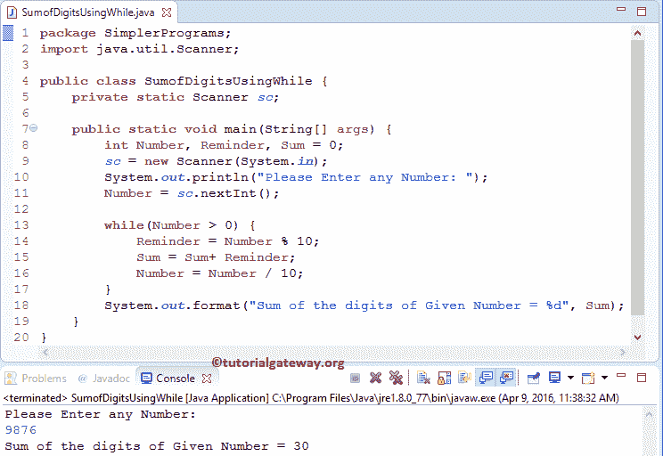

# Java 程序：数字总和

> 原文：<https://www.tutorialgateway.org/sum-of-digits-in-java/>

用 For 循环、While 循环、函数和递归在 Java 中编写一个求数字和的程序

## 用 While 循环在 Java 中求数字和的程序

Java 程序中的数字总和允许用户输入任意正整数。然后，它会将给定的数字分成单个数字，并使用 Java While Loop 将这些单个数字相加。

```java
// Write a Program to Find Sum of Digits in Java using While Loop
package SimplerPrograms;

import java.util.Scanner;

public class SumofDigitsUsingWhile {
	private static Scanner sc;

	public static void main(String[] args) {
		int Number, Reminder, Sum = 0;
		sc = new Scanner(System.in);		
		System.out.println("Please Enter any Number: ");
		Number = sc.nextInt();

		while(Number > 0) {
			Reminder = Number % 10;
			Sum = Sum+ Reminder;
			Number = Number / 10;
		}
		System.out.format("Sum of the digits of Given Number = %d", Sum);
	}
}
```



在这个 Java 数字和程序中，首先，我们声明了三个整数变量 Number，余数和 Sum = 0。前两个语句将要求用户输入任意正整数。然后，将该数字赋给变量 number。

接下来， [While Loop](https://www.tutorialgateway.org/java-while-loop/) 中的条件将确保给定的数字大于 0(表示正整数且大于 0)

让我们看看迭代循环的工作原理。

从上面一个数字截图的 Java 位数总和来看，用户输入的值:Number= 9876。

Java 数字和程序的第一次迭代

对于第一次迭代，数字= 9876，总和= 0。意思是，虽然(9876 > 0)为真。所以，程序会在 while 循环 中开始执行语句

提醒=数字% 10
提醒= 9876 % 10 = 6

接下来，我们要找到 Sum
Sum= Sum+提醒
Sum= 0 + 6 = 6

最后，我们必须从用户指定的数字
中删除最后一位数字，数字=数字/ 10
数字= 9876 / 10 = 987

**第二次迭代**

从第一次迭代开始，“数”和“和”的值都更改为“数= 987”和“和= 6”。意思是，虽然(987 > 0)为真。因此，程序将开始在 while 循环中执行语句。

提醒= 987 % 10 = 7

总和= 6 + 7 = 13

数字= 987 / 10 = 98

**第三次迭代**

从 Java 的第二次迭代数字程序的数字总和来看，数字= 98，总和= 13。意思是，当(98 > 0)为真时

提醒= 98 % 10 = 8

总和= 13 + 8 = 21

数字= 98 / 10 = 9

**第四次迭代**

从第三次迭代开始，数= 9，和= 21。意思是，虽然(9 > 0)为真。

提醒= 9 % 10 = 9

总和= 21 + 9 = 30

数量= 9 / 10 = 0

这里数字= 0。因此，while 循环条件将失败。

最后一条语句将输出 Sum 变量。所以，给定变量 9876 的输出= 30。

## 用 For 循环在 Java 中求数字和的程序

这个 java 数字总和程序允许用户输入任意正整数。然后，它会将给定的数字分成单个数字，并使用 Java For Loop 将这些单个数字相加(求和)。

```java
// Write a Program to Find Sum of Digits in Java using For Loop 
package SimplerPrograms;

import java.util.Scanner;

public class SumofDigitsUsingFor {
	private static Scanner sc;

	public static void main(String[] args) {
		int Number, Reminder, Sum = 0;
		sc = new Scanner(System.in);		
		System.out.println("Please Enter any Number: ");
		Number = sc.nextInt();

		for (Sum = 0; Number > 0; Number = Number/10){
			Reminder = Number % 10;
			Sum = Sum+ Reminder;
		}
		System.out.format("Sum of the digits of Given Number = %d", Sum);
	}
}
```

我们刚刚用 For 循环替换了上面 Java 数字总和示例中的 While 循环。请参考 [Java For Loop](https://www.tutorialgateway.org/java-for-loop/) 。

```java
Please Enter any Number: 
2345
Sum of the digits of Given Number = 14
```

## 用函数在 Java 中求数字和的程序

Java 程序中的数字总和允许用户输入任何正整数值。接下来，我们将把用户输入的值传递给我们创建的方法。

在这个用户定义的函数中，这个 Java 数字和程序将给定的数字分成单个数字，并使用 Java For Loop 将这些单个(和)数字相加

```java
// Write a Program to Find Sum of Digits in Java Using Functions 

package SimplerPrograms;

import java.util.Scanner;

public class SumofDigitsUsingMethods {
	private static Scanner sc;
	private static int total = 0;
	public static void main(String[] args) {
		int Num;
		sc = new Scanner(System.in);		
		System.out.println("Please Enter any Value: ");
		Num = sc.nextInt();

		total = SumofDigits(Num);
		System.out.format("Sum of the digits = %d", total);
	}
	public static int SumofDigits(int Num) {
		int Reminder;
		for (total = 0; Num > 0;Num = Num/10) {
			Reminder = Num % 10;
			total = total+ Reminder;
		}
		return total;
	}
}
```

```java
Please Enter any Value: 
3698
Sum of the digits = 26
```

在这个 Java 数字总和程序中，我们称之为数字总和方法。众所周知，该方法将返回整数值，因此，我们将该返回值赋给 Sum

```java
total = SumofDigits(Num);
```

当编译器到达 SumOfDigits (Num)行时，编译器会立即跳转到下面的函数:

```java
public static int SumofDigits(int Num) {
```

我们已经在上面的数字总和例子中解释了逻辑。

## 用递归求 Java 中数字和的程序

这个数字总和示例允许用户输入任何正整数。然后，它会将给定的数字分成单个数字，并通过递归调用函数将这些单个数字相加。

在[程序](https://www.tutorialgateway.org/learn-java-programs/)的这个数字总和中，我们使用面向对象编程来划分代码。为此，首先，我们将创建一个类，该类包含一个递归反转整数的方法。

```java
package SimplerPrograms;

public class SumofDigits {
	int Sum = 0, Reminder;
	public int SumoftheDigits(int Number) {
		if(Number > 0) {
			Reminder = Number % 10;
			Sum = Sum + Reminder;
			SumoftheDigits(Number / 10);		
			return Sum;
		}
		else {
			return 0;
		}
	}
}

```

在数字总和主程序中，我们将创建上述指定类的一个实例，并调用方法

```java
package SimplerPrograms;

import java.util.Scanner;

public class SumofDigitsUsingRecursion {
	private static Scanner sc;

	public static void main(String[] args) {
		int Number, Sum = 0;
		sc = new Scanner(System.in);		
		System.out.println("\n Please Enter any Number: ");
		Number = sc.nextInt();

		SumofDigits sd = new SumofDigits();
		Sum = sd.SumoftheDigits(Number);

		System.out.format("\n Sum of the digits of Given Number = %d", Sum);
	}
}
```

```java
Please Enter any Number: 
456789
Sum of the digits of Given Number = 39
```

数字分类分析:

在这个 Java 数字总和程序示例中，在这个类中，我们定义了一个函数。下面的函数将接受整数值作为参数值并返回一个整数值。

```java
public int SumoftheDigits(int Number) {
```

让我们看看上面指定的函数中的 [If Else 语句](https://www.tutorialgateway.org/java-if-else-statement/)。如果(数字> 0)将检查给定的数字是否大于零。

*   如果条件为真，那么 [Java](https://www.tutorialgateway.org/java-tutorial/) 编译器将返回给定数字的位数总和。这里，我们使用的是数字总和(数字/10)；语句，因为它有助于用更新后的值递归调用函数。当您错过此语句时，在完成第一行后，它将终止。例如，Number = 4567 将输出返回为 7
*   如果条件为假，那么编译器将返回总和为零。

数字总和主要类别分析:

在数字程序的数字和的主类中，我们创建了一个数字和类的实例/对象

```java
SumofDigits sd = new SumofDigits();
```

接下来，我们将调用 Sumofthe Digits(数字)方法。我们都知道该方法将返回一个整数值。因此，我们将返回值赋给 Sum。

```java
Sum = sd.SumoftheDigits(Number);
```