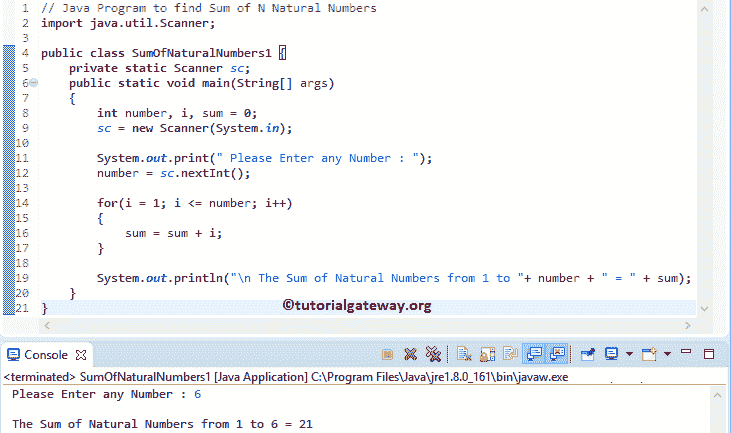

# Java 程序：寻找`N`个自然数之和

> 原文：<https://www.tutorialgateway.org/java-program-to-find-sum-of-n-natural-numbers/>

用 For 循环和 While 循环编写一个 Java 程序来求`N`个自然数的和，并举例说明。

## 用 For 循环求`N`个自然数之和的 Java 程序

该程序允许用户输入任何整数值(最大限值)。接下来，这个 Java 程序使用 For 循环计算从 1 到最大极限值的所有自然数的总和。

```java
// Java Program to find Sum of N Natural Numbers
import java.util.Scanner;

public class SumOfNaturalNumbers1 {
	private static Scanner sc;
	public static void main(String[] args) 
	{
		int number, i, sum = 0;
		sc = new Scanner(System.in);

		System.out.print(" Please Enter any Number : ");
		number = sc.nextInt();	

		for(i = 1; i <= number; i++)
		{
			sum = sum + i; 
		}	

		System.out.println("\n The Sum of Natural Numbers from 1 to "+ number + " = " + sum);
	}
}
```



用户输入的值:数字= 6

首先，我们使用 For 循环从 1 迭代到最大值(这里，number = 6)。

对于循环第一次迭代:对于(I = 1；i <= 6; i++)
条件为真。
sum = sum+I
sum = 0+1 = 1

第二次迭代:对于(I = 2；2 <= 6; 2++)
和= 1 + 2 = 3

第三次迭代:for(I = 3；3 <= 6; 3++)
总和= 3 + 3 = 6

第四次迭代:for(I = 4；4 <= 6; 4++)
总和= 6 + 4 = 10

第五次迭代:for(I = 5；5 <= 6; 5++)
总和= 10 + 5 = 15

第六次迭代:for(I = 6；6 <= 6; 6++)
总和= 15 + 6 = 21

第 7 次迭代:for(I = 7；7 <= 6; 7++)
条件(7 < = 6)为假。因此， [Java](https://www.tutorialgateway.org/java-tutorial/) 编译器退出 [For 循环](https://www.tutorialgateway.org/java-for-loop/)。

## 用 While 循环求`N`个自然数之和的 Java 程序

这个计算`N`个自然数之和的 Java 程序同上，不过这次我们用的是 [While Loop](https://www.tutorialgateway.org/java-while-loop/) 。

```java
import java.util.Scanner;

public class SumOfNaturalNumbers2 {
	private static Scanner sc;
	public static void main(String[] args) 
	{
		int number, i = 1, sum = 0;
		sc = new Scanner(System.in);

		System.out.print(" Please Enter any Number : ");
		number = sc.nextInt();	

		while(i <= number)
		{
			sum = sum + i; 
			i++;
		}	

		System.out.println("\n The Sum of Natural Numbers from 1 to "+ number + " = " + sum);
	}
}
```

```java
 Please Enter any Number : 10

 The Sum of Natural Numbers from 1 to 10 = 55
```

## 用方法求`N`个自然数之和的 Java 程序

数列 1 + 2+ 3+ … + N = N * (N + 1) / 2 之和背后的数学公式。在这个 Java 程序中，我们正在创建一个单独的方法来计算自然数的总和。

在函数中，我们使用 [If Else 语句](https://www.tutorialgateway.org/java-if-else-statement/)来检查数字是否等于零。如果为真，`N`个自然数之和= 0。否则，执行 N * (N + 1) / 2

```java
import java.util.Scanner;
public class SumOfNaturalNumbers3 {
	private static Scanner sc;
	public static void main(String[] args) 
	{
		int number, sum = 0;
		sc = new Scanner(System.in);

		System.out.print(" Please Enter any Number : ");
		number = sc.nextInt();	

		sum = SumOfNaturalNumbers(number);
		System.out.println("\n The Sum of Natural Numbers from 1 to "+ number + " = " + sum);
	}

	public static int SumOfNaturalNumbers(int num)
	{		
		if(num == 0)
		{
			return num;
		}
		else
		{
			return (num * (num + 1)/2);
		}
	}
}
```

```java
 Please Enter any Number : 30

 The Sum of Natural Numbers from 1 to 30 = 465
```

## 用递归方法计算`N`个自然数之和的 Java 程序

这个自然数求和程序与上面的例子相同。但是在这个 Java 程序中，我们用更新的值递归地调用 SumOfNaturalNumbers 方法。

```java
import java.util.Scanner;
public class SumOfNaturalNumbers4 {
	private static Scanner sc;
	public static void main(String[] args) 
	{
		int number, sum = 0;
		sc = new Scanner(System.in);

		System.out.print(" Please Enter any Number : ");
		number = sc.nextInt();	

		sum = SumOfNaturalNumbers(number);
		System.out.println("\n The Sum of Natural Numbers from 1 to "+ number + " = " + sum);
	}
	public static int SumOfNaturalNumbers(int num)
	{		
		if(num == 0)
		{
			return num;
		}
		else
		{
			return (num + SumOfNaturalNumbers(num - 1));
		}
	}
}
```

```java
 Please Enter any Number : 80

 The Sum of Natural Numbers from 1 to 80 = 3240
```

## 计算一个范围内`N`个自然数之和的 Java 程序

这个 [Java 程序](https://www.tutorialgateway.org/learn-java-programs/)允许输入最小值和最大值。接下来，Java 程序找到最小值和最大值之间的自然数之和。

```java
import java.util.Scanner;
public class SumOfNaturalNumbers5 {
	private static Scanner sc;
	public static void main(String[] args) 
	{
		int minimum, maximum, i, sum = 0;
		sc = new Scanner(System.in);

		System.out.print(" Please Enter the Minimum value : ");
		minimum = sc.nextInt();			

		System.out.print(" Please Enter the Maximum value : ");
		maximum = sc.nextInt();	

		for(i = minimum; i <= maximum; i++)
		{
			sum = sum + i; 
		}	

		System.out.println("\n The Sum of Natural Numbers from " + minimum + " to "+ maximum + " = " + sum);
	}
}
```

```java
 Please Enter the Minimum value : 5
 Please Enter the Maximum value : 100

 The Sum of Natural Numbers from 5 to 100 = 5040
```