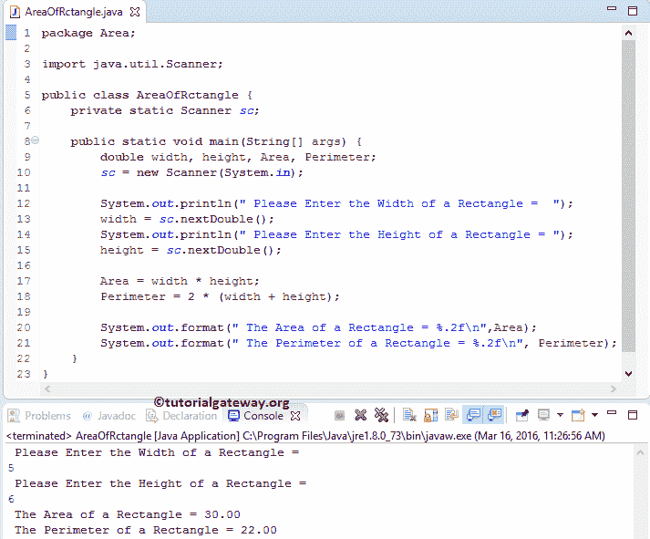

# Java 程序：寻找矩形面积

> 原文：<https://www.tutorialgateway.org/java-program-to-find-area-of-rectangle/>

用实例编写 Java 程序求矩形面积和矩形周长。

## 矩形的 Java 区域

*   如果我们知道矩形的宽度和高度，我们可以用下面的公式计算矩形的面积:面积=宽度*高度
*   周长是边缘周围的距离。我们可以使用公式计算矩形的周长:周长= 2 *(宽度+高度)

## 寻找矩形面积和矩形周长的 Java 程序

这个 Java 程序允许用户输入矩形的宽度和高度。通过使用这些值，这个 Java 程序将计算矩形的面积和周长。

```java
package Area;

import java.util.Scanner;

public class AreaOfRctangle {
	private static Scanner sc;

	public static void main(String[] args) {
		double width, height, Area, Perimeter; 
		sc = new Scanner(System.in);

		System.out.println(" Please Enter the Width of a Rectangle =  ");
		width = sc.nextDouble();
		System.out.println(" Please Enter the Height of a Rectangle = ");
		height = sc.nextDouble();

		Area = width * height;
		Perimeter = 2 * (width + height);

		System.out.format(" The Area of a Rectangle = %.2f\n",Area);
		System.out.format(" The Perimeter of a Rectangle = %.2f\n", Perimeter);
	}
}
```



在查找矩形面积的 Java 程序中，以下语句允许用户输入矩形的宽度和高度。然后，我们将把这些值赋给已经声明的名为宽度和高度的变量。

提示:可以去掉第二条 [Java](https://www.tutorialgateway.org/java-tutorial/) System.out.println 语句来缩短代码。

```java
System.out.println(" Please Enter the Width of a Rectangle =  ");
width = sc.nextDouble();

System.out.println(" Please Enter the Height of a Rectangle = ");
height = sc.nextDouble();
```

接下来，我们使用数学公式来计算矩形的面积。

```java
Area = width * height;
```

在下一行，我们计算矩形的周长

```java
Perimeter = 2 * (width + height);
```

以下 System.out.format 语句帮助我们打印矩形的周长和面积

```java
System.out.format(" The Area of a Rectangle = %.2f\n",Area);
System.out.format(" The Perimeter of a Rectangle = %.2f\n", Perimeter);
```

## 用函数求矩形面积的 Java 程序

这个 Java 程序使用我们在第一个例子中指定的逻辑。但是我们将把矩形逻辑的 Java 区域分开，放在一个方法中。

```java
package Area;

import java.util.Scanner;

public class AreaOfRctangleUsingMethods {
	private static Scanner sc;

	public static void main(String[] args) {
		double width, height; 
		sc = new Scanner(System.in);

		System.out.println("\n Please Enter the Width of a Rectangle =  ");
		width = sc.nextDouble();
		System.out.println("\n Please Enter the Height of a Rectangle = ");
		height = sc.nextDouble();

		AreaofRectangle(width, height);
	}

	public static void AreaofRectangle( double width, double height ) {
		double Area, Perimeter; 

		Area = width * height;
		Perimeter = 2 * (width + height);

		System.out.format("\n The Area of a Rectangle = %.2f\n",Area);
		System.out.format("\n The Perimeter of a Rectangle = %.2f\n", Perimeter);
	}
}
```

矩形输出的 Java 区域

```java
 Please Enter the Width of a Rectangle =  
7

 Please Enter the Height of a Rectangle = 
8

 The Area of a Rectangle = 56.00

 The Perimeter of a Rectangle = 30.00
```

## 用 Oops 查找矩形面积的 Java 程序

在这个 [Java 程序](https://www.tutorialgateway.org/learn-java-programs/)寻找矩形面积的例子中，我们使用面向对象编程来划分代码。为此，首先，我们将创建一个包含方法的类。

提示:一般来说，你不必写第一种方法。我们使用这种方法来显示可用的选项

```java
package Area;

public class AreaOfaRectangle {
	double Area, Perimeter; 

	public void AreaofRectangle( double width, double height ) {
		Area = width * height;
		Perimeter = 2 * (width + height);

		System.out.format(" The Area of Rectangle = %.2f\n", Area);
		System.out.format(" The Perimeter of Rectangle = %.2f\n", Perimeter);
	}

	public double RectangleArea( double width, double height ) {
		Area = width * height;
		return Area;
	}
}
```

在寻找矩形面积的主 Java 程序中，我们将创建上述指定类的一个实例并调用方法。

```java
package Area;

import java.util.Scanner;

public class AreaOfRectangleUsingClass {
	private static Scanner sc;

	public static void main(String[] args) {
		double width, height, Area; 
		sc = new Scanner(System.in);

		System.out.println(" Please Enter the Width of a Rectangle =  ");
		width = sc.nextDouble();
		System.out.println(" Please Enter the Height of a Rectangle = ");
		height = sc.nextDouble();

		AreaOfaRectangle ar = new AreaOfaRectangle();
		ar.AreaofRectangle(width, height);

		Area = ar.RectangleArea(width, height);
		System.out.format("\n Second Method: The Area of Rectangle = %.2f ", Area);
	}
}
```

```java
 Please Enter the Width of a Rectangle =  
5

 Please Enter the Height of a Rectangle = 
7

 The Area of a Rectangle = 35.00
 The Perimeter of a Rectangle = 24.00

 Second Method: The Area of Rectangle = 35.00
```

矩形类分析区域:

*   首先，我们用两个参数声明了一个函数 AreaofRectangle。在函数中，我们使用各自的数学公式计算矩形的面积和周长。接下来，我们使用 System.out.println 语句来打印输出。
*   接下来，我们用双精度类型的两个参数声明了一个矩形面积函数。在函数中，它将计算矩形的面积，我们将返回值。

矩形主类分析的 Java 区域:

首先，我们创建了一个矩形类的实例/对象

```java
AreaOfaRectangle ar = new AreaOfaRectangle();
```

接下来，我们将调用 AreaofRectangle 方法。注意，这是第一个带有 void 关键字的方法，该方法将计算面积和周长，并打印来自 AreaOfARectangle 类本身的输出。

```java
ar.AreaofRectangle(width, height);
```

接下来，我们将调用 RectangleArea 方法。这是第二种计算面积并返回值的双数据类型方法。因此，我们将返回值赋给面积变量。

```java
Area = ar.RectangleArea(width, height);
```

最后，下面的 [Java](https://www.tutorialgateway.org/java-tutorial/) System.out.format 语句打印矩形的面积，这个面积是用 RectangleArea 方法计算出来的。

```java
System.out.format("\n Second Method: The Area of Rectangle = %.2f ", Area);
```