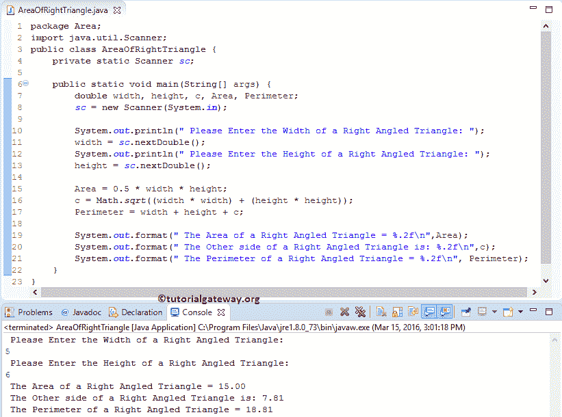

# Java 程序：计算直角三角形面积

> 原文：<https://www.tutorialgateway.org/java-program-to-find-area-of-a-right-angled-triangle/>

写一个 Java 程序，用例子找到直角三角形的面积。

## 直角三角形的面积

*   如果我们知道宽度和高度，我们可以用下面的公式计算直角三角形的面积。面积= (1/2) *宽度*高度
*   利用毕达哥拉斯公式，我们可以很容易地找到直角三角形中未知的边。c = a + b
*   直角三角形的周长是边缘周围的距离。我们可以用下面的公式计算周长。周长= a + b+ c

## 寻找直角三角形面积的 Java 程序示例

这个 Java 程序允许用户输入直角三角形的宽度和高度。使用这些值，我们将计算直角三角形的面积和周长。

```java
// Java Program to find Area of a Right Angled Triangle Example 

package Area;

import java.util.Scanner;

public class AreaOfRightTriangle {
	private static Scanner sc;

	public static void main(String[] args) {
		double width, height, c, Area, Perimeter; 
		sc = new Scanner(System.in);

		System.out.println("\n Please Enter the Width of a Right Angled Triangle: ");
		width = sc.nextDouble();
		System.out.println("\n Please Enter the Height of a Right Angled Triangle: ");
		height = sc.nextDouble();

		Area = 0.5 * width * height;
		c = Math.sqrt((width * width) + (height * height));
		Perimeter = width + height + c;

		System.out.format("\n The Area of a Right Angled Triangle = %.2f\n",Area);
		System.out.format("\n The Other side of a Right Angled Triangle is: %.2f\n",c);
		System.out.format("\n The Perimeter of a Right Angled Triangle = %.2f\n", Perimeter);
	}
}
```



以下 Java 语句允许用户输入直角三角形的宽度和高度，并将这些值分配给相应的变量。

```java
System.out.println("\n Please Enter the Width of a Right Angled Triangle: ");
width = sc.nextDouble();
System.out.println("\n Please Enter the Height of a Right Angled Triangle: ");
height = sc.nextDouble();
```

接下来，我们计算直角三角形的面积。1/2 = 0.5)所以，我们用 0.5 *宽*高作为公式

```java
Area = 0.5 * width * height;
```

在下一行中，我们使用毕达哥拉斯公式 C = a + b 计算直角三角形的另一边，类似于 C = √a +b，这里我们使用 [Java](https://www.tutorialgateway.org/java-tutorial/) Math.sqrt()函数计算 a + b 的平方根

```java
c = Math.sqrt((width * width) + (height * height));
```

在下一行，我们使用公式计算周长

```java
Perimeter = width + height + c;
```

以下 System.out.format 语句帮助我们打印直角三角形的周长、另一边和面积。

```java
System.out.format("\n The Area of a Right Angled Triangle = %.2f\n",Area);
System.out.format("\n The Other side of a Right Angled Triangle is: %.2f\n",c);
System.out.format("\n The Perimeter of a Right Angled Triangle = %.2f\n", Perimeter);
```

## 用函数求直角三角形面积的 Java 程序

这个 [Java 程序](https://www.tutorialgateway.org/learn-java-programs/)使用了我们在第一个例子中指定的逻辑。但是我们将把逻辑分离出来，放在一个方法中。

```java
package Area;

import java.util.Scanner;

public class AreaOfRightTriangleUsingMethods {
	private static Scanner sc;

	public static void main(String[] args) {
		double width, height; 
		sc = new Scanner(System.in);

		System.out.println("\n Please Enter the Width of a Right Angled Triangle: ");
		width = sc.nextDouble();
		System.out.println("\n Please Enter the Height of a Right Angled Triangle: ");
		height = sc.nextDouble();

		AreaofRightTriangle(width, height);

	}
	public static void AreaofRightTriangle( double width, double height ) {
		double c, Area, Perimeter; 

		Area = 0.5 * width * height;
		c = Math.sqrt((width * width) + (height * height));
		Perimeter = width + height + c;

		System.out.format("\n The Area of a Right Angled Triangle = %.2f\n",Area);
		System.out.format("\n The Other side of a Right Angled Triangle is: %.2f\n",c);
		System.out.format("\n The Perimeter of a Right Angled Triangle = %.2f\n", Perimeter);
	}
}
```

直角三角形输出的 Java 面积

```java
 Please Enter the Width of a Right Angled Triangle: 
10

 Please Enter the Height of a Right Angled Triangle: 
12

 The Area of a Right Angled Triangle = 60.00

 The Other side of a Right Angled Triangle is: 15.62

 The Perimeter of a Right Angled Triangle = 37.62
```

## 用 Oops 寻找直角三角形面积的 Java 程序

在这个直角三角形示例的 Java 面积中，我们使用面向对象编程来划分代码。为此，首先，我们将创建一个保存方法的类。

```java
package Area;

public class AreaOfaRightTriangle {
	double c, Area, Perimeter; 
	public void AreaofRightTriangle( double width, double height ) {
		Area = 0.5 * width * height;
		c = Math.sqrt((width * width) + (height * height));
		Perimeter = width + height + c;

		System.out.format("\n The Area of a Right Angled Triangle = %.2f\n",Area);
		System.out.format("\n The Other side of a Right Angled Triangle is: %.2f\n",c);
		System.out.format("\n The Perimeter of a Right Angled Triangle = %.2f\n", Perimeter);
	}

	public double RightTriangle( double width, double height ) {
		Area = 0.5 * width * height;
		return Area;
	}
}
```

在计算直角三角形面积的主 Java 程序中，我们将创建上述指定类的一个实例，并调用方法。

```java
package Area;

import java.util.Scanner;

public class AreaOfRightTriangleUsingClass {
	private static Scanner sc;

	public static void main(String[] args) {
		double Area, width, height; 
		sc = new Scanner(System.in);

		System.out.println("\n Please Enter the Width of a Right Angled Triangle: ");
		width = sc.nextDouble();
		System.out.println("\n Please Enter the Height of a Right Angled Triangle: ");
		height = sc.nextDouble();

		AreaOfaRightTriangle art = new AreaOfaRightTriangle();
		art.AreaofRightTriangle(width, height);
		Area = art.RightTriangle(width, height);

		System.out.format("\n Second Method: The Area of a Right Angled Triangle = %.2f\n", Area);
	}

}
```

```java
 Please Enter the Width of a Right Angled Triangle: 
7

 Please Enter the Height of a Right Angled Triangle: 
8

 The Area of a Right Angled Triangle = 28.00
 The Other side of a Right Angled Triangle is: 10.63
 The Perimeter of a Right Angled Triangle = 25.63
 Second Method: The Area of a Right Angled Triangle = 28.00
```