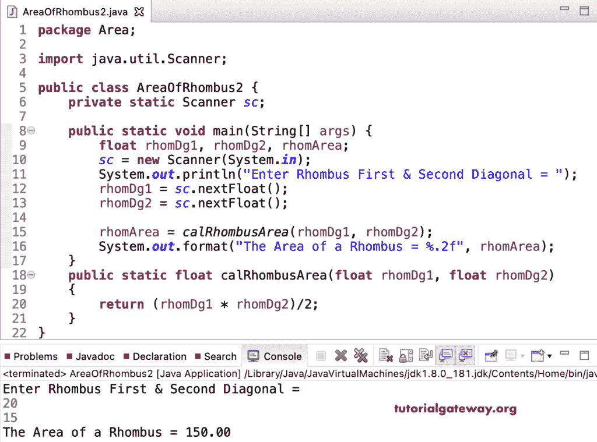

# Java 程序：计算菱形面积

> 原文：<https://www.tutorialgateway.org/java-program-to-find-area-of-a-rhombus/>

用一个例子写一个寻找菱形面积的 Java 程序。这个 Java 示例允许输入菱形对角线，并使用数学公式(d1 * d2)/2 计算面积。

```java
package Area;

import java.util.Scanner;

public class AreaOfRhombus1 {
	private static Scanner sc;

	public static void main(String[] args) {
		double rhomDg1, rhomDg2, rhomArea;
		sc = new Scanner(System.in);

		System.out.println("Enter Rhombus First & Second Diagonal = ");
		rhomDg1 = sc.nextDouble();
		rhomDg2 = sc.nextDouble();

		rhomArea = (rhomDg1 * rhomDg2)/2; 

		System.out.format("The Area of a Rhombus = %.2f", rhomArea);
	}
}
```

```java
Enter Rhombus First & Second Diagonal = 
22
28
The Area of a Rhombus = 308.00
```

在这个 [Java 程序](https://www.tutorialgateway.org/learn-java-programs/)中，我们声明了一个返回菱形面积的 cal 菱形面积函数。

```java
package Area;

import java.util.Scanner;

public class AreaOfRhombus2 {
	private static Scanner sc;

	public static void main(String[] args) {
		float rhomDg1, rhomDg2, rhomArea;
		sc = new Scanner(System.in);	

		System.out.println("Enter Rhombus First & Second Diagonal = ");
		rhomDg1 = sc.nextFloat();
		rhomDg2 = sc.nextFloat();

		rhomArea = calRhombusArea(rhomDg1, rhomDg2);

		System.out.format("The Area of a Rhombus = %.2f", rhomArea);
	}
	public static float calRhombusArea(float rhomDg1, float rhomDg2)
	{
		return (rhomDg1 * rhomDg2)/2; 
	}
}
```

