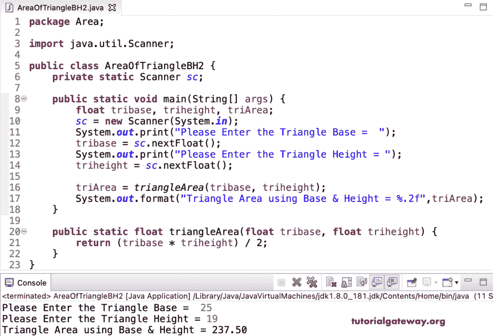

# Java 程序：用底和高求三角形面积

> 原文：<https://www.tutorialgateway.org/java-program-to-find-area-of-a-triangle-using-base-and-height/>

用一个例子写一个 Java 程序，用底和高来寻找三角形的面积。这个 Java 例子允许输入三角形的底和高，两者的乘积除以 2 得到面积。因此，三角形的面积等于底部乘以高度除以 2。

```java
package Area;

import java.util.Scanner;

public class AreaOfTriangleBH1 {
	private static Scanner sc;

	public static void main(String[] args) {
		double tribase, triheight, triArea; 
		sc = new Scanner(System.in);

		System.out.print("Please Enter the Triangle Base =  ");
		tribase = sc.nextDouble();

		System.out.print("Please Enter the Triangle Height = ");
		triheight = sc.nextDouble();

		triArea = (tribase * triheight) / 2;

		System.out.format("Triangle Area using Base & Height = %.2f",triArea);
	}
}
```

```java
Please Enter the Triangle Base =  18
Please Enter the Triangle Height = 25
Triangle Area using Base & Height = 225.00
```

在这个 [Java 程序](https://www.tutorialgateway.org/learn-java-programs/)中，我们声明了一个返回三角形面积的 triangleArea 函数。

```java
package Area;

import java.util.Scanner;

public class AreaOfTriangleBH2 {
	private static Scanner sc;

	public static void main(String[] args) {
		float tribase, triheight, triArea; 
		sc = new Scanner(System.in);

		System.out.print("Please Enter the Triangle Base =  ");
		tribase = sc.nextFloat();

		System.out.print("Please Enter the Triangle Height = ");
		triheight = sc.nextFloat();

		triArea = triangleArea(tribase, triheight);

		System.out.format("Triangle Area using Base & Height = %.2f",triArea);
	}

	public static float triangleArea(float tribase, float triheight) {
		return (tribase * triheight) / 2;
	}
}
```

