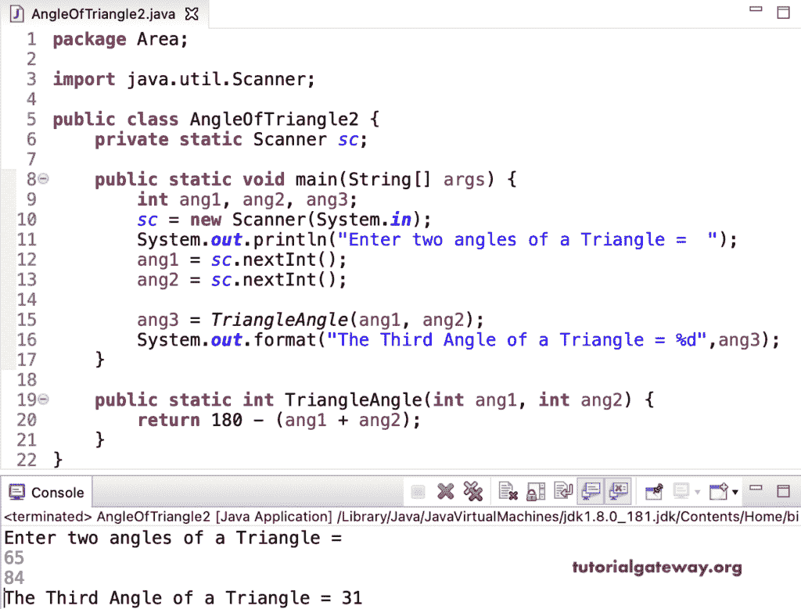

# Java 程序：寻找三角形角度

> 原文：<https://www.tutorialgateway.org/java-program-to-find-angle-of-a-triangle/>

用一个例子写一个寻找三角形角度的 Java 程序。这个 Java 例子允许输入三角形的剩余两个角。众所周知，三角形中三个角之和等于 180°。所以，从 180°减去给定的两个角，得到三角形的第三个角。

```java
package Area;

import java.util.Scanner;

public class AngleOfTriangle1 {
	private static Scanner sc;

	public static void main(String[] args) {
		int ang1, ang2, ang3; 
		sc = new Scanner(System.in);

		System.out.println("Enter two angles of a Triangle =  ");
		ang1 = sc.nextInt();
		ang2 = sc.nextInt();

		ang3 = 180 - (ang1 + ang2);

		System.out.format("The Third Angle of a Triangle = %d",ang3);
	}
}
```

```java
Enter two angles of a Triangle =  
60
45
The Third Angle of a Triangle = 75
```

在这个 [Java 程序](https://www.tutorialgateway.org/learn-java-programs/)中，我们声明了一个返回三角形剩余或第三个角的 triangle 函数。

```java
package Area;

import java.util.Scanner;

public class AngleOfTriangle2 {
	private static Scanner sc;

	public static void main(String[] args) {
		int ang1, ang2, ang3; 
		sc = new Scanner(System.in);

		System.out.println("Enter two angles of a Triangle =  ");
		ang1 = sc.nextInt();
		ang2 = sc.nextInt();

		ang3 = TriangleAngle(ang1, ang2);

		System.out.format("The Third Angle of a Triangle = %d",ang3);
	}

	public static int TriangleAngle(int ang1, int ang2) {
		return 180 - (ang1 + ang2);
	}
}
```

