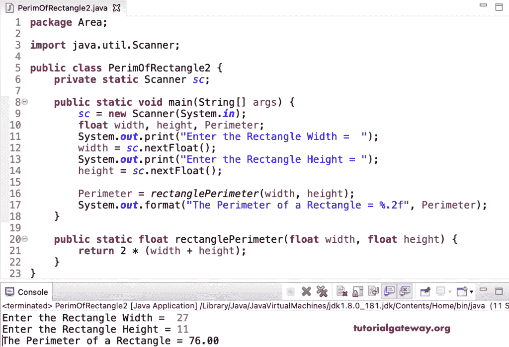

# Java 程序：计算矩形周长

> 原文：<https://www.tutorialgateway.org/java-program-to-find-perimeter-of-a-rectangle/>

用一个例子写一个寻找矩形周长的 Java 程序。这个 Java 例子允许输入矩形的宽度和高度。两者之和乘以 2 得到矩形面积。因此，矩形的周长等于 2 *(宽度+高度)。

```java
package Area;

import java.util.Scanner;

public class PerimOfRectangle1 {
	private static Scanner sc;

	public static void main(String[] args) {
		sc = new Scanner(System.in);

		double width, height, Perimeter; 

		System.out.print("Enter the Rectangle Width =  ");
		width = sc.nextDouble();

		System.out.print("Enter the Rectangle Height = ");
		height = sc.nextDouble();

		Perimeter = 2 * (width + height);

		System.out.format("The Perimeter of a Rectangle = %.2f", Perimeter);
	}
}
```

```java
Enter the Rectangle Width =  17
Enter the Rectangle Height = 44
The Perimeter of a Rectangle = 122.00
```

在这个 [Java 程序](https://www.tutorialgateway.org/learn-java-programs/)中，我们声明了一个返回矩形周长的 rectanglePerimeter 函数。

```java
package Area;

import java.util.Scanner;

public class PerimOfRectangle2 {
	private static Scanner sc;

	public static void main(String[] args) {
		sc = new Scanner(System.in);

		float width, height, Perimeter; 

		System.out.print("Enter the Rectangle Width =  ");
		width = sc.nextFloat();

		System.out.print("Enter the Rectangle Height = ");
		height = sc.nextFloat();

		Perimeter = rectanglePerimeter(width, height);

		System.out.format("The Perimeter of a Rectangle = %.2f", Perimeter);
	}

	public static float rectanglePerimeter(float width, float height) {
		return 2 * (width + height);
	}
}
```

