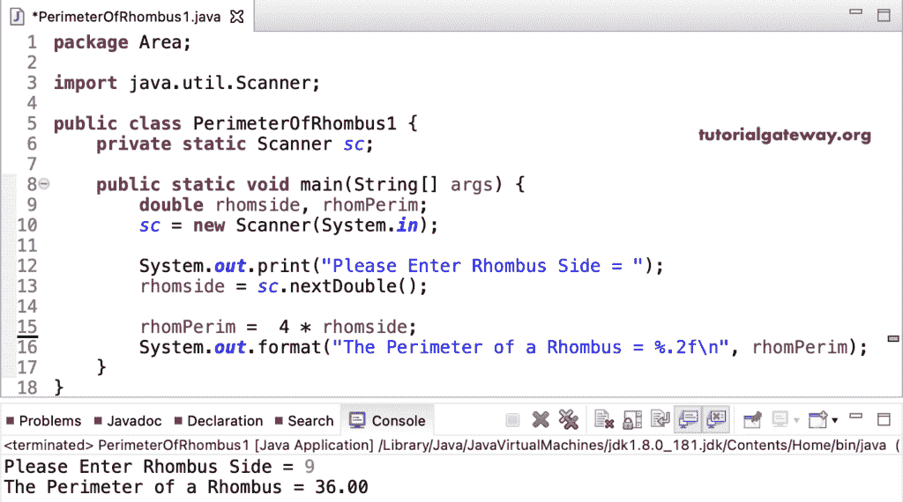

# Java 程序：计算菱形周长

> 原文：<https://www.tutorialgateway.org/java-program-to-find-perimeter-of-a-rhombus/>

用例子写一个寻找菱形周长的 Java 程序。这个 Java 例子允许进入菱形边，面积是边的四倍。

```java
package Area;

import java.util.Scanner;

public class PerimeterOfRhombus1 {
	private static Scanner sc;

	public static void main(String[] args) {
		double rhomside, rhomPerim;
		sc = new Scanner(System.in);

		System.out.print("Please Enter Rhombus Side = ");
		rhomside = sc.nextDouble();

		rhomPerim =  4 * rhomside; 
		System.out.format("The Perimeter of a Rhombus = %.2f\n", rhomPerim);
	}
}
```



在这个 [Java 程序](https://www.tutorialgateway.org/learn-java-programs/)中，我们创建了一个返回菱形周长的函数。

```java
package Area;

import java.util.Scanner;

public class PerimeterOfRhombus2 {
	private static Scanner sc;

	public static void main(String[] args) {
		float rhomside, rhomPerim;
		sc = new Scanner(System.in);

		System.out.print("Please Enter Rhombus Side = ");
		rhomside = sc.nextFloat();

		rhomPerim =  rhombusPerimeter(rhomside); 

		System.out.format("The Perimeter of a Rhombus = %.2f", rhomPerim);
	}

	public static float rhombusPerimeter(float rhomside) {
		return 4 * rhomside; 
	}
}
```

```java
Please Enter Rhombus Side = 13
The Perimeter of a Rhombus = 52.00
```