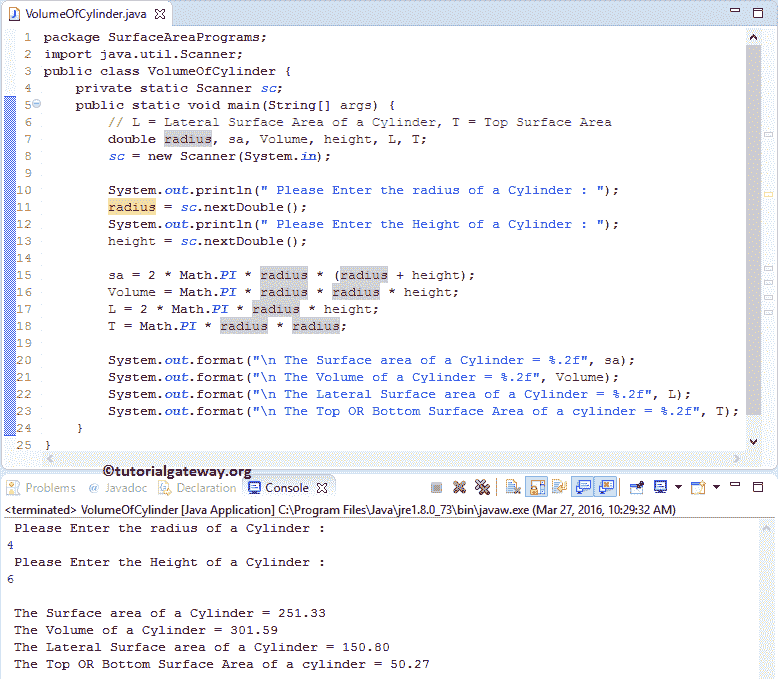

# Java 程序：计算圆柱体体积和表面积

> 原文：<https://www.tutorialgateway.org/java-program-to-find-volume-and-surface-area-of-a-cylinder/>

用实例编写 Java 程序求圆柱体的体积和表面积。在我们进入 Java 程序寻找圆柱体的体积和表面积之前，让我们看看圆柱体表面积、圆柱体顶部或底部表面积、圆柱体侧面表面积和体积背后的定义和公式。

## 圆柱体的表面积

如果我们知道圆柱体的半径和高度，那么我们可以用公式计算圆柱体的表面积:

圆柱体的表面积= 2πr + 2πrh(其中 r 是半径，h 是圆柱体的高度)。

## 圆柱体的 Java 卷

圆柱体内部的空间量称为体积。如果我们知道圆柱体的高度，那么我们可以用下面的公式计算圆柱体的体积:

*   圆柱体的体积= πr h
*   圆柱体的侧面面积= 2πrh
*   我们可以计算圆柱的顶面或底面面积= πr

## 计算圆柱体体积和表面积的 Java 程序

这个 Java 程序允许用户输入半径和高度的值。接下来，Java 程序将根据公式计算圆柱体的体积、圆柱体的侧面面积、圆柱体的表面面积以及圆柱体的顶部或底部表面面积。

```java
// Java Program to find Volume and Surface Area of a Cylinder

package SurfaceAreaPrograms;

import java.util.Scanner;

public class VolumeOfCylinder {
	private static Scanner sc;

	public static void main(String[] args) {
		// L = Lateral Surface Area of a Cylinder, T = Top Surface Area
		double radius, sa, Volume, height, L, T;
		sc = new Scanner(System.in);

		System.out.println("\n Please Enter the radius of a Cylinder : ");
		radius = sc.nextDouble();
		System.out.println("\n Please Enter the Height of a Cylinder : ");
		height = sc.nextDouble();

		sa = 2 * Math.PI * radius * (radius + height);
		Volume = Math.PI * radius * radius * height;
		L = 2 * Math.PI * radius * height;
		T = Math.PI * radius * radius;

		System.out.format("\n The Surface area of a Cylinder = %.2f", sa);
		System.out.format("\n The Volume of a Cylinder = %.2f", Volume);
		System.out.format("\n The Lateral Surface area of a Cylinder = %.2f", L);
		System.out.format("\n The Top OR Bottom Surface Area of a cylinder = %.2f", T);
	}
}
```



以下语句将允许用户输入圆柱体的半径和高度。然后，我们将用户输入的值分配给已经声明的变量，称为半径和高度。

```java
System.out.println("\n Please Enter the radius of a Cylinder : ");
radius = sc.nextDouble();
System.out.println("\n Please Enter the Height of a Cylinder : ");
height = sc.nextDouble();
```

接下来，我们使用数学公式来计算圆柱体的表面积

```java
sa = 2 * Math.PI * radius * (radius + height);
```

在接下来的 [Java](https://www.tutorialgateway.org/java-tutorial/) 行中，我们正在计算一个圆柱体的体积

```java
Volume = Math.PI * radius * radius * height;
```

在下一行中，我们将计算圆柱体的横向表面积和圆柱体的顶部或底部表面积

```java
L = 2 * Math.PI * radius * height;
T = Math.PI * radius * radius;
```

以下 System.out.format 语句将帮助我们打印圆柱体的体积、圆柱体的横向表面积、圆柱体的表面积以及圆柱体的顶部或底部表面积。

```java
System.out.format("\n The Surface area of a Cylinder = %.2f", sa);
System.out.format("\n The Volume of a Cylinder = %.2f", Volume);
System.out.format("\n The Lateral Surface area of a Cylinder = %.2f", L);
System.out.format("\n The Top OR Bottom Surface Area of a cylinder = %.2f", T);
```

从上面的截图中，你可以观察到我们已经输入了圆柱体的半径= 4，高度= 6

圆柱体的表面积为

圆柱体的表面积= 2πr + 2πrh

也可以写成

圆柱体的表面积= 2πr (r+h)
圆柱体的表面积= 2 *数学。PI *半径*(半径+高度)
圆柱体的表面积= 2 * 3.14 * 4 * (4 + 6)
圆柱体的表面积= 251.2

圆柱体的体积是

圆柱体的体积= πr h
圆柱体的体积=数学。PI *半径*半径*高度
圆柱体体积= 3.14 * 4 * 4 * 6
圆柱体体积= 301.44

圆柱体的侧面面积为

LSA = 2hr
LSA = 2 *数学。pi * radius * height
LSA = 2 * 3.14 * 4 * 6
LSA = 150.72

圆柱体的顶面或底面面积是

T = πr
T =数学。PI *半径*半径
T = 3.14 * 4 * 4
T = 50.24

注:为了计算的目的，我们取π = 3.14 而不是(3.142857142..).因此，以上所有值几乎等于程序输出，但可能相差 0.01。

## 用函数求圆柱体体积和表面积的 Java 程序

这个 [Java 程序](https://www.tutorialgateway.org/learn-java-programs/)允许用户输入半径和高度的值。接下来，这个 Java 程序将根据公式计算圆柱体的体积、圆柱体的侧面面积、圆柱体的表面面积以及圆柱体的顶部或底部表面面积。在这个例子中，我们使用我们在第一个例子中指定的逻辑，但是把它放在一个方法中。

```java
package SurfaceAreaPrograms;

import java.util.Scanner;

public class VolumeOfCylinderUsingMethods {
	private static Scanner sc;

	public static void main(String[] args) {
		double radius, height;
		sc = new Scanner(System.in);

		System.out.println("\n Please Enter the radius of a Cylinder : ");
		radius = sc.nextDouble();
		System.out.println("\n Please Enter the Height of a Cylinder : ");
		height = sc.nextDouble();
		VolumeOfCylinder(radius, height);

	}
	public static void VolumeOfCylinder (double radius, double height) {
		// L = Lateral Surface Area of a Cylinder, T = Top Surface Area
		double sa, Volume, L, T;
		sa = 2 * Math.PI * radius * (radius + height);
		Volume = Math.PI * radius * radius * height;
		L = 2 * Math.PI * radius * height;
		T = Math.PI * radius * radius;

		System.out.format("\n The Surface area of a Cylinder = %.2f", sa);
		System.out.format("\n The Volume of a Cylinder = %.2f", Volume);
		System.out.format("\n The Lateral Surface area of a Cylinder = %.2f", L);
		System.out.format("\n The Top OR Bottom Surface Area of a cylinder = %.2f", T);
	}
}
```

```java
 Please Enter the radius of a Cylinder : 
3

 Please Enter the Height of a Cylinder : 
5

 The Surface area of a Cylinder = 150.80
 The Volume of a Cylinder = 141.37
 The Lateral Surface area of a Cylinder = 94.25
 The Top OR Bottom Surface Area of a cylinder = 28.27
```

## 用 Oops 计算圆柱体体积和表面积的 Java 程序

在这个 Java 程序中，我们使用面向对象编程来划分圆柱体代码的体积和表面积。为此，我们将创建一个保存方法的类。

```java
package SurfaceAreaPrograms;

public class VolumeOfACylinder {
	double sa, Volume, L, T;

	public double VolumeOfCylinder (double radius, double height) {
		Volume = Math.PI * radius * radius * height;
		return Volume;
	}

	public double SurfaceAreaOfCylinder (double radius, double height) {
		sa =  2 * Math.PI * radius * (radius + height);
		return sa;
	}

	public double LateralSurfaceAreaOfCylinder (double radius, double height) {
		L =  2 * Math.PI * radius * height;
		return L;
	}

	public double TotalSurfaceAreaOfCylinder (double radius) {
		T = Math.PI * radius * radius;
		return T;
	}
}
```

在主 Java 程序中，为了找到圆柱体程序的体积和表面积，我们将创建上述指定类的一个实例，并调用方法。

```java
package SurfaceAreaPrograms;

import java.util.Scanner;

public class VolumeOfCylinderUsingClass {
	private static Scanner sc;

	public static void main(String[] args) {
		double radius, height, sa, Volume, L, T;
		sc = new Scanner(System.in);

		System.out.println("\n Please Enter the radius of a Cylinder : ");
		radius = sc.nextDouble();
		System.out.println("\n Please Enter the Height of a Cylinder : ");
		height = sc.nextDouble();
		VolumeOfACylinder vac = new VolumeOfACylinder();

		sa = vac.SurfaceAreaOfCylinder(radius, height);
		Volume = vac.VolumeOfCylinder(radius, height);
		L = vac.LateralSurfaceAreaOfCylinder(radius, height);
		T = vac.TotalSurfaceAreaOfCylinder(radius);

		System.out.format("\n The Surface area of a Cylinder = %.2f", sa);
		System.out.format("\n The Volume of a Cylinder = %.2f", Volume);
		System.out.format("\n The Lateral Surface area of a Cylinder = %.2f", L);
		System.out.format("\n The Top OR Bottom Surface Area of a cylinder = %.2f", T);
	}
}
```

```java
 Please Enter the radius of a Cylinder : 
5

 Please Enter the Height of a Cylinder : 
9

 The Surface area of a Cylinder = 439.82
 The Volume of a Cylinder = 706.86
 The Lateral Surface area of a Cylinder = 282.74
 The Top OR Bottom Surface Area of a cylinder = 78.54
```

气缸类分析区域:

1.  首先，我们用两个参数声明了一个函数 VolumeofCylinder。在寻找圆柱体的体积和表面积函数的 Java 程序中，我们计算圆柱体的体积并返回值。
2.  接下来，我们用两个参数声明了一个函数 SurfaceAreaofCylinder。在函数中，我们计算圆柱体的表面积并返回值。
3.  接下来，我们用两个参数声明了一个函数 LateralSurfaceAreaofCylinder。在该函数中，我们计算圆柱体的横向表面积并返回该值。
4.  这里，我们用一个参数声明了一个函数 TotalSurfaceAreaofCylinder。在该函数中，我们计算圆柱体的总表面积并返回该值。

主要类别分析:

在这个查找圆柱体体积和表面积的 Java 程序中，我们创建了一个圆柱体类的实例/对象

```java
VolumeOfACylinder vac = new VolumeOfACylinder();
```

接下来，我们调用 VolumeofCylinder 方法。这是我们用双数据类型创建的第一个方法，这个方法将计算圆柱体的体积并返回一个值。因此，我们将返回值赋给体积变量。

```java
Volume = vac.VolumeOfCylinder(radius, height);
```

接下来，我们将调用圆柱的 surface area 方法。这是我们用双数据类型创建的第二种方法，该方法将计算圆柱体的表面积并返回一个值。因此，我们将返回值赋给 sa 变量。

```java
sa = vac.SurfaceAreaOfCylinder(radius, height);
```

接下来，我们将调用 LateralSurfaceAreaofCylinder 方法。这是我们用双数据类型创建的第三种方法。该方法将计算圆柱体的侧面面积并返回一个值。所以，我们给 L 变量赋值。

```java
L = vac.LateralSurfaceAreaOfCylinder(radius, height);
```

接下来，我们调用 TotalSurfaceAreaofCylinder 方法。这是我们用双数据类型创建的第四种方法。该方法将计算圆柱体的总表面积并返回一个值。因此，我们将返回值赋给 T 变量。

```java
T = vac.TotalSurfaceAreaOfCylinder(radius);
```

最后，我们使用下面的 System.out.format 语句来打印圆柱体的 Java 体积、圆柱体的横向表面积、圆柱体的表面积以及圆柱体的顶部或底部表面积。

```java
System.out.format("\n The Surface area of a Cylinder = %.2f", sa);
System.out.format("\n The Volume of a Cylinder = %.2f", Volume);
System.out.format("\n The Lateral Surface area of a Cylinder = %.2f", L);
System.out.format("\n The Top OR Bottom Surface Area of a cylinder = %.2f", T);
```