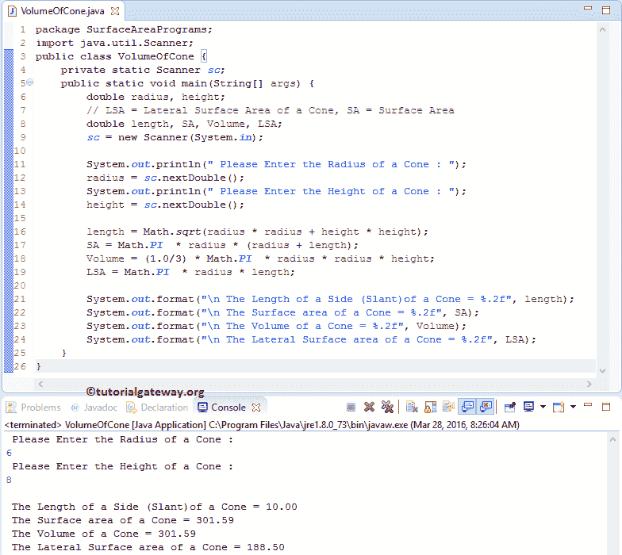

# Java 程序：计算圆锥体积和表面积

> 原文：<https://www.tutorialgateway.org/java-program-to-find-volume-and-surface-area-of-cone/>

用实例编写 Java 程序求圆锥体的体积和表面积。在我们进入 Java 程序寻找圆锥的体积和表面积之前，让我们看看圆锥表面积和圆锥体积后面的定义和公式

## 圆锥的表面积

如果我们知道圆锥的半径和倾斜度，那么我们就可以用下面的公式计算圆锥的表面积:

*   表面积=圆锥的面积+圆的面积
*   表面积=πR1+πr 其中 r=半径，l =倾斜度(从圆锥体顶部到圆锥体边缘的边的长度)

如果我们知道圆锥体的半径和高度，那么我们使用下面的公式计算圆锥体的表面积:

*   表面积= πr +πr √h + r
*   我们也可以把它写成表面积= πr (r+√h + r)

因为半径、高度和倾斜使形状成为直角三角形。所以，利用毕达哥拉斯定理:

*   l = h + r
*   l = √h + r

## 圆锥的爪哇体积

圆锥体内部的空间量称为体积。如果我们知道圆锥体的半径和高度，那么我们可以使用公式计算体积:

*   体积= 1/3 πr h(其中 h=圆锥体的高度)
*   圆锥的侧面面积=πR1

## 计算圆锥体积和表面积的 Java 程序

这个 Java 程序允许用户输入圆锥的半径和高度值。这个 Java 程序将根据公式计算圆锥的表面积、体积、边长(倾斜)和侧表面积。

```java
// Java Program to find Volume and Surface Area of Cone
package SurfaceAreaPrograms;

import java.util.Scanner;

public class VolumeOfCone {
	private static Scanner sc;

	public static void main(String[] args) {
		double radius, height;
		// LSA = Lateral Surface Area of a Cone, SA = Surface Area
		double length, SA, Volume, LSA;
		sc = new Scanner(System.in);

		System.out.println("\n Please Enter the Radius of a Cone : ");
		radius = sc.nextDouble();

		System.out.println("\n Please Enter the Height of a Cone : ");
		height = sc.nextDouble();

		length = Math.sqrt(radius * radius + height * height);
		SA = Math.PI  * radius * (radius + length);
		Volume = (1.0/3) * Math.PI  * radius * radius * height;
		LSA = Math.PI  * radius * length;

		System.out.format("\n The Length of a Side (Slant)of a Cone = %.2f", length);   
		System.out.format("\n The Surface area of a Cone = %.2f", SA);
		System.out.format("\n The Volume of a Cone = %.2f", Volume);
		System.out.format("\n The Lateral Surface area of a Cone = %.2f", LSA);
	}
}
```



在这个寻找圆锥体积和表面积的 Java 程序中，我们使用数学公式来计算圆锥的边长(斜面)

```java
length = Math.sqrt(radius * radius + height * height);
```

接下来，我们使用数学公式来计算圆锥体的表面积

```java
SA = Math.PI  * radius * (radius + length);
```

在下一行，我们计算圆锥的体积

```java
Volume = (1.0/3) * Math.PI  * radius * radius * height;
```

在下一行 Java 代码中，我们正在计算圆锥体的侧面面积

```java
LSA = Math.PI  * radius * length;
```

下面的 System.out.format 语句将帮助我们打印圆锥的体积、圆锥的侧表面积、边长(倾斜)和圆锥的表面积

```java
System.out.format("\n The Length of a Side (Slant)of a Cone = %.2f", length);   
System.out.format("\n The Surface area of a Cone = %.2f", SA);
System.out.format("\n The Volume of a Cone = %.2f", Volume);
System.out.format("\n The Lateral Surface area of a Cone = %.2f", LSA);
```

从上面的 [Java](https://www.tutorialgateway.org/java-tutorial/) 截图中，可以观察到我们已经输入了圆锥的半径= 6，高度= 8

根据毕达哥拉斯定理，我们可以计算出斜面(边长):

l = h+r
【l = h+r】>【t8+6】
=【64+36 = =>
100
【l = 10】

圆锥的表面积是

圆锥的表面积= πr +πrl ==> πr (r + l)
圆锥的表面积=数学。圆周率*半径*(半径+1)
圆锥体的表面积= 3.14 * 6 * (6 +10)
圆锥体的表面积= 301.44

圆锥的体积是

圆锥的体积= 1/3 πr h
圆锥的体积= (1.0/3) *数学。π*半径*半径*高度
圆锥体的体积= (1.0/3) * 3.14 * 6 * 6 * 8
圆锥体的体积= 301.44

圆锥的侧面面积是

侧表面积= πrl
侧表面积=数学。PI *半径* l
侧表面积= 3.14 * 6 * 10
侧表面积= 188.4

让我们使用半径而不使用斜面(标准公式)来计算圆锥的表面积:

圆锥的表面积= πr +πr √h + r ==> πr (r + √h + r )
表面积=数学。PI *半径*(半径+ sqrt((高度*高度)+(半径*半径)))
圆锥体的表面积= 3.14 * 6 * ( 6 + √8 + 6 )
圆锥体的表面积= 3.14 * 6 *(6+√100)=>3.14 * 6 *(16)
圆锥体的表面积= 301.44

## 用函数求圆锥体积和表面积的 Java 程序

这个 [Java 程序](https://www.tutorialgateway.org/learn-java-programs/)允许用户输入圆锥的半径和高度值。通过使用这些值，这个 Java 程序将根据公式计算圆锥的表面积、体积、边长(倾斜)和侧表面积。在这个例子中，我们将使用我们在第一个例子中指定的逻辑。但是，我们将分离逻辑并将其放在一个方法中。

```java
package SurfaceAreaPrograms;

import java.util.Scanner;

public class VolumeOfConeUsingMethods {
	private static Scanner sc;

	public static void main(String[] args) {
		double radius, height;
		sc = new Scanner(System.in);

		System.out.println(" Please Enter the Radius and Height of a Cone : ");
		radius = sc.nextDouble();
		height = sc.nextDouble();

		VolumeOfCone(radius, height);

	}
	public static void VolumeOfCone(double radius, double height) {
		double length, SA, Volume, LSA;
		length = Math.sqrt(radius * radius + height * height);
		SA = Math.PI  * radius * (radius + length);
		Volume = (1.0/3) * Math.PI  * radius * radius * height;
		LSA = Math.PI  * radius * length;

		System.out.format(" The Length of a Side (Slant)of a Cone = %.2f", length);   
		System.out.format("\n The Surface area of a Cone = %.2f", SA);
		System.out.format("\n The Volume of a Cone = %.2f", Volume);
		System.out.format("\n The Lateral Surface area of a Cone = %.2f", LSA);
	}
}
```

```java
 Please Enter the Radius and Height of a Cone : 
5
12
 The Length of a Side (Slant)of a Cone = 13.00
 The Surface area of a Cone = 282.74
 The Volume of a Cone = 314.16
 The Lateral Surface area of a Cone = 204.20
```

## 用 Oops 计算圆锥体积和表面积的 Java 程序

在这个 Java 程序中，我们使用面向对象编程来划分圆锥代码的体积和表面积。为此，我们将创建一个保存方法的类。

```java
package SurfaceAreaPrograms;

public class VolumeOfaCone {
	double length, SA, Volume, LSA;

	public double LengthOfCone (double radius, double height) {
		length = Math.sqrt(radius * radius + height * height);
		return length;
	}

	public double VolumeOfCone (double radius, double height) {
		Volume = (1.0/3) * Math.PI  * radius * radius * height;
		return Volume;
	}

	public double SurfaceAreaOfCone (double radius, double length) {
		SA =  Math.PI  * radius * (radius + length);
		return SA;
	}

	public double LateralSurfaceAreaOfCone(double radius, double length) {
		LSA = Math.PI  * radius * length;
		return LSA;
	}
}
```

在主 Java 程序中查找圆锥的体积和表面积程序，我们将创建一个上述指定类的实例并调用方法。

```java
package SurfaceAreaPrograms;

import java.util.Scanner;

public class VolumeOfConeUsingClass {
	private static Scanner sc;

	public static void main(String[] args) {
		double radius, height;
		// LSA = Lateral Surface Area of a Cone, SA = Surface Area
		double length, SA, Volume, LSA;
		sc = new Scanner(System.in);

		System.out.println(" Please Enter the Radius and Height of a Cone : ");
		radius = sc.nextDouble();
		height = sc.nextDouble();

		VolumeOfaCone vc = new VolumeOfaCone();
		length = vc.LengthOfCone(radius, height);
		SA = vc.SurfaceAreaOfCone(radius, length);
		Volume = vc.VolumeOfCone(radius, height);
		LSA = vc.LateralSurfaceAreaOfCone(radius, length);

		System.out.format(" The Length of a Side (Slant)of a Cone = %.2f", length);   
		System.out.format(" The Surface area of a Cone = %.2f", SA);
		System.out.format(" The Volume of a Cone = %.2f", Volume);
		System.out.format(" The Lateral Surface area of a Cone = %.2f", LSA);

	}
}

```

```java
 Please Enter the Radius and Height of a Cone : 
6
11
 The Length of a Side (Slant)of a Cone = 12.53
 The Surface area of a Cone = 349.28
 The Volume of a Cone = 414.69
 The Lateral Surface area of a Cone = 236.18
```

volumeofacome 类分析:

1.  首先，我们用两个参数声明了一个函数 LengthofCone。在寻找圆锥体积和表面积函数的 Java 程序中，我们正在寻找圆锥的边长或斜面，并返回值。
2.  接下来，我们用两个参数声明了一个函数 VolumeofCone。在函数中，我们计算圆锥的体积并返回值。
3.  接下来，我们用两个参数声明了一个函数 SurfaceAreaofCone。在函数中，我们计算圆锥的表面积并返回值。
4.  然后我们用两个参数声明了一个函数 LateralSurfaceAreaofCone。在函数中，我们计算圆锥的侧面面积并返回值。

主要类别分析:

在这个寻找圆锥体体积和表面积的 Java 程序中，首先，我们创建了一个圆锥体类的实例/对象

```java
VolumeOfaCone vc = new VolumeOfaCone();
```

接下来，我们通过传递两个参数来调用 LengthofCone 方法。这是我们用双数据类型创建的第一个方法，这个方法将计算边的长度并返回一个值。因此，我们将返回值赋给长度变量。

```java
length = vc.LengthOfCone(radius, height);
```

接下来，我们通过传递两个参数来调用 VolumeofCone 方法。这是我们用双数据类型创建的第二个方法，这个方法将计算圆锥体的体积并返回一个值。因此，我们将返回值赋给体积变量。

```java
Volume = vc.VolumeOfCone(radius, height);
```

接下来，我们将调用 SurfaceAreaofCone 方法。这是我们用双数据类型创建的第三种方法，该方法将计算圆锥体的表面积并返回一个值。因此，我们将返回值赋给 SA 变量。

```java
SA = vcd.SurfaceAreaOfCuboid(length, width, height);
```

接下来，我们将调用 LateralSurfaceAreaofCone 方法。这是我们用双数据类型创建的第四种方法，该方法将计算圆锥体的横向表面积并返回一个值。因此，我们将返回值赋给 LSA 变量。

```java
LSA = vc.LateralSurfaceAreaOfCone(radius, length);
```

最后，我们使用下面的 System.out.format 语句来打印边或斜面的长度、圆锥的体积、圆锥的侧表面积和圆锥的表面积。

```java
System.out.format(" The Length of a Side (Slant)of a Cone = %.2f", length);   
System.out.format("\n The Surface area of a Cone = %.2f", SA);
System.out.format("\n The Volume of a Cone = %.2f", Volume);
System.out.format("\n The Lateral Surface area of a Cone = %.2f", LSA);
```