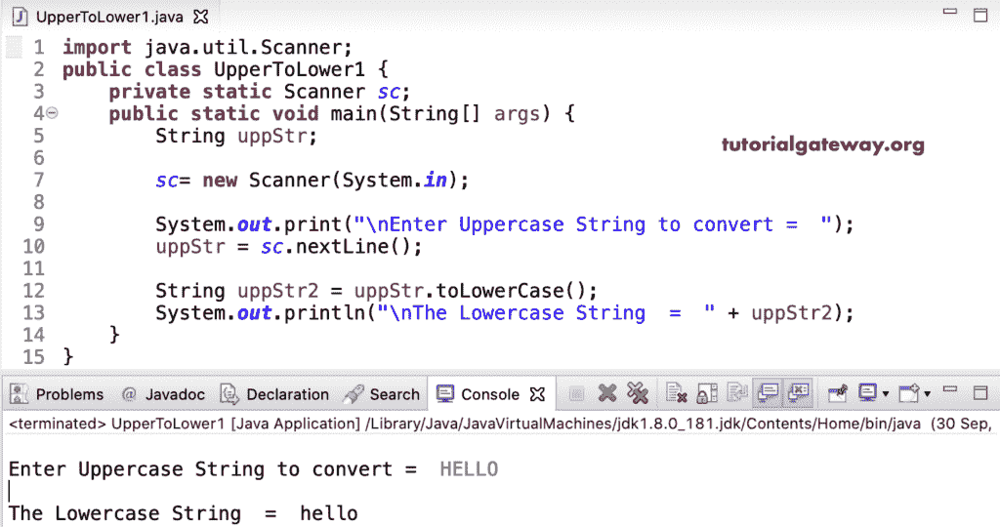

# Java 程序：将大写转换成小写

> 原文：<https://www.tutorialgateway.org/java-program-to-convert-uppercase-to-lowercase/>

用一个例子编写一个将大写转换成小写的 Java 程序。在本节中，我们使用内置函数、循环、ASCII 值来获得结果。在这个 Java 大写到小写的例子中，我们对给定的字符串使用了内置函数 [toLowerCase()](https://www.tutorialgateway.org/java-tolowercase-method/) 。

```java
import java.util.Scanner;

public class UpperToLower1 {
	private static Scanner sc;
	public static void main(String[] args) {
		String uppStr;

		sc= new Scanner(System.in);

		System.out.print("\nEnter Uppercase String to convert =  ");
		uppStr = sc.nextLine();

		String uppStr2 = uppStr.toLowerCase();	
		System.out.println("\nThe Lowercase String  =  " + uppStr2);
	}
}
```



在这里，在这个将大写转换为小写的例子中，首先，我们使用 [toCharArray()](https://www.tutorialgateway.org/java-tochararray-method/) 将 uppStr 字符串转换为 upch 字符数组。

接下来，我们使用 [For 循环](https://www.tutorialgateway.org/java-for-loop/)从头到尾迭代 upch 字符数组。在循环中，我们检查索引位置的字符是否大于或等于 A &小于或等于 z。如果是真的，我们在现有的 ASCII 值上增加 32。比如 A = 65，我们加 32 就变成 97，a = 97 的 ASCII 值。

```java
import java.util.Scanner;

public class UpperToLower2 {
	private static Scanner sc;
	public static void main(String[] args) {
		String uppStr;
		int i;

		sc= new Scanner(System.in);

		System.out.print("\nPlease Enter Uppercase String =  ");
		uppStr = sc.nextLine();

		char[] upch = uppStr.toCharArray();

		for(i = 0; i < upch.length; i++)
		{
			if(upch[i] >= 'A' && upch[i] <= 'Z') {
				upch[i] = (char) ((int)upch[i] + 32);;
			}
		}
		System.out.print("\nThe Lowercase String  =  ");
		for(i = 0; i < upch.length; i++) {
			System.out.print(upch[i]);
		}
	}
}
```

```java
Please Enter Uppercase String =  LEARN JAVA

The Lowercase String  =  learn java
```

## 将大写转换为小写的 Java 程序示例 3

这里，我们没有将 uppStr 字符串改为 char [数组](https://www.tutorialgateway.org/java-array/)。接下来，我们使用 uppStr 上的[字符函数](https://www.tutorialgateway.org/java-charat-method/)来获取索引位置的字符。然后，我们将每个字符分配给 lowStr2。

```java
import java.util.Scanner;

public class UpperToLower3 {
	private static Scanner sc;
	public static void main(String[] args) {
		String uppStr, lowStr2 = "";
		int i;

		sc= new Scanner(System.in);

		System.out.print("\nEnter Uppercase String to convert =  ");
		uppStr = sc.nextLine();

		char ch;

		for(i = 0; i < uppStr.length(); i++)
		{
			if(uppStr.charAt(i) >= 'A' && uppStr.charAt(i) <= 'Z') {
				ch = (char) (uppStr.charAt(i) + 32);
			}
			else {
				ch = (char) (uppStr.charAt(i));
			}
			lowStr2 += ch;
		}
		System.out.print("\nThe Lowercase String  =  " + lowStr2);
	}
}
```

```java
Enter Uppercase String to convert =  HAPPY PROGRAMMING

The Lowercase String  =  happy programming
```

在这个 [Java](https://www.tutorialgateway.org/java-tutorial/) 大写到小写的例子中，我们不是将其分配给一个新的字符串，而是打印循环中的每个字符。

```java
import java.util.Scanner;

public class UpperToLower4 {
	private static Scanner sc;
	public static void main(String[] args) {
		String uppStr;
		int i;

		sc= new Scanner(System.in);

		System.out.print("\nEnter Uppercase String to convert =  ");
		uppStr = sc.nextLine();

		System.out.print("\nThe Lowercase String =  ");
		for(i = 0; i < uppStr.length(); i++)
		{
			char ch = uppStr.charAt(i);
			if(ch >= 'A' && ch <= 'Z') {
				ch = (char) (ch + 32);
			}
			System.out.print(ch); // Str2 += ch;
		}
	}
}
```

```java
Enter Uppercase String to convert =  HELLO WORLD

The Lowercase String =  hello world
```

这个 [Java 程序](https://www.tutorialgateway.org/learn-java-programs/)使用 ASCII 值将大写转换为小写，我们比较 ASCII 值而不是比较字符。

```java
import java.util.Scanner;

public class UpperToLower5 {
	private static Scanner sc;
	public static void main(String[] args) {
		String uppStr1, lowStr2 = "";
		int i;

		sc= new Scanner(System.in);

		System.out.print("\nEnter Uppercase String to convert =  ");
		uppStr1 = sc.nextLine();

		for(i = 0; i < uppStr1.length(); i++)
		{
			char ch = uppStr1.charAt(i);
			if(ch >= 65 && ch <= 90) {
				ch = (char) (ch + 32);
			}
			lowStr2 += ch;
		}
		System.out.print("\nThe Lowercase String =  " + lowStr2);
	}
}
```

```java
Enter Uppercase String to convert =  JAVA PROGRAMMING

The Lowercase String =  java programming
```

这是大写到小写的 Java 代码，我们用函数来分隔逻辑。

```java
import java.util.Scanner;

public class UpperToLower6 {
	private static Scanner sc;
	public static void main(String[] args) {
		String uppStr, lowStr2;

		sc= new Scanner(System.in);

		System.out.print("\nEnter Uppercase String to convert =  ");
		uppStr = sc.nextLine();

		lowStr2 = toUpper(uppStr);
		System.out.print("\nThe Lowercase String =  " + lowStr2);
	}

	public static String toUpper(String uppStr) {
		String lowStr2 = "";

		for(int i = 0; i < uppStr.length(); i++)
		{
			char ch = uppStr.charAt(i);
			if(ch >= 65 && ch <= 90) {
				ch = (char) (ch + 32);
			}
			lowStr2 += ch;
		}
		return lowStr2;
	}
}
```

```java
Enter Uppercase String to convert =  30 SEP JAVA CODING!

The Lowercase String =  30 sep java coding!
```