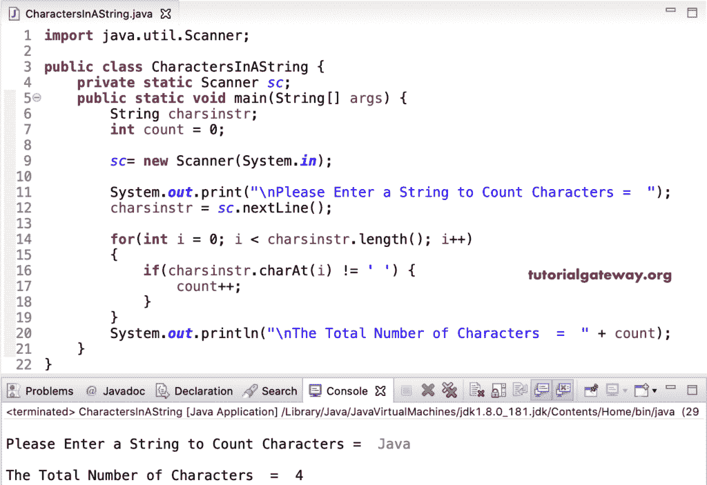

# Java 程序：计算字符串中的字符总数

> 原文：<https://www.tutorialgateway.org/java-program-to-count-total-characters-in-a-string/>

用一个例子编写一个计算字符串中的字符总数的 Java 程序。我们可以使用内置的长度函数来获取字符串的长度。但是，我们使用 Java 循环来获取字符串字符的总数。

在这个 [java](https://www.tutorialgateway.org/learn-java-programs/) 例子中，我们使用 [for 循环](https://www.tutorialgateway.org/java-for-loop/)从头到尾迭代字符串。在该循环中，我们使用 [if 语句](https://www.tutorialgateway.org/java-if-statement/)来检查字符是否为空。如果是真的，那么计数值将从 0 增加到 1。

```java
import java.util.Scanner;

public class CharactersInAString {
	private static Scanner sc;
	public static void main(String[] args) {
		String charsinstr;
		int count = 0;

		sc= new Scanner(System.in);

		System.out.print("\nPlease Enter a String to Count Characters =  ");
		charsinstr = sc.nextLine();

		for(int i = 0; i < charsinstr.length(); i++)
		{
			if(charsinstr.charAt(i) != ' ') {
				count++;
			}
		}		
		System.out.println("\nThe Total Number of Characters  =  " + count);
	}
}
```



## 使用 While 循环计算字符串中的字符总数的 Java 程序

```java
import java.util.Scanner;

public class CharactersInAString1 {
	private static Scanner sc;
	public static void main(String[] args) {
		String charsinstr;
		int count = 0, i = 0;

		sc= new Scanner(System.in);

		System.out.print("\nPlease Enter a String to Count Characters =  ");
		charsinstr = sc.nextLine();

		while(i < charsinstr.length())
		{
			if(charsinstr.charAt(i) != ' ') {
				count++;
			}
			i++;
		}		
		System.out.println("\nThe Total Number of Characters  =  " + count);
	}
}
```

```java
Please Enter a String to Count Characters =  hello world

The Total Number of Characters  =  10
```

在这个 [Java](https://www.tutorialgateway.org/java-tutorial/) 计数字符串总数的例子中，我们使用函数来分离逻辑。

```java
import java.util.Scanner;

public class CharactersInAString2 {
	private static Scanner sc;
	public static void main(String[] args) {
		String charsinstr;

		sc= new Scanner(System.in);

		System.out.print("\nPlease Enter a String to Count Characters =  ");
		charsinstr = sc.nextLine();

		int count = TotalNumberofCharacters(charsinstr);

		System.out.println("\nThe Total Number of Characters  =  " + count);		
	}
	public static int TotalNumberofCharacters(String charsinstr) {
		int i, count = 0;

		for(i = 0; i < charsinstr.length(); i++)
		{
			if(charsinstr.charAt(i) != ' ') {
				count++;
			}
		}		
		return count;
	}	
}
```

```java
 Please Enter a String to Count Characters =  java tutorial

The Total Number of Characters  =  12
```