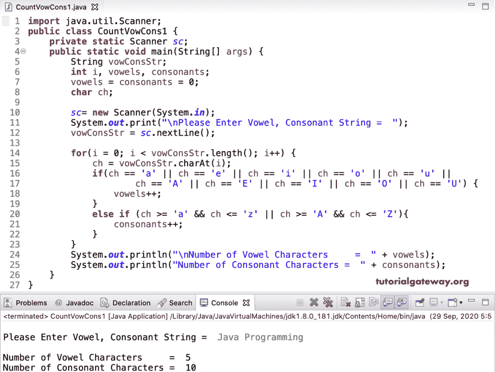

# Java 程序：统计字符串中元音和辅音

> 原文：<https://www.tutorialgateway.org/java-program-to-count-vowels-and-consonants-in-a-string/>

用一个例子写一个计算字符串中元音和辅音的 Java 程序。在这个 Java 计算字符串中辅音和元音的例子中，我们首先使用 for 循环来迭代 vowConsStr。在循环中，我们将(ch = vowconstr . charat(I))每个字符分配给 ch，以保持代码简单。接下来，我们使用了 Else If 语句。

在 if 条件下，我们检查字符是否等于 A、E、i o、u、A、E、I、O 和 u。如果为真，我们增加元音的值。在 [else if 语句](https://www.tutorialgateway.org/java-else-if-statement/)中，我们使用了(ch>= ' A '&&ch<= ' Z ' | | ch>= ' A '&&ch<= ' Z ')来检查字符是否为字母表。如果为真，我们增加辅音值。这里，我们还可以使用 else if(character . isalphabetic(ch))。

```java
import java.util.Scanner;

public class CountVowCons1 {
	private static Scanner sc;
	public static void main(String[] args) {
		String vowConsStr;
		int i, vowels, consonants;
		vowels = consonants = 0;
		char ch;

		sc= new Scanner(System.in);

		System.out.print("\nPlease Enter Vowel, Consonant String =  ");
		vowConsStr = sc.nextLine();

		for(i = 0; i < vowConsStr.length(); i++)
		{
			ch = vowConsStr.charAt(i);
			if(ch == 'a' || ch == 'e' || ch == 'i' || ch == 'o' || ch == 'u' ||
					ch == 'A' || ch == 'E' || ch == 'I' || ch == 'O' || ch == 'U') {
				vowels++;
			}
			else if (ch >= 'a' && ch <= 'z' || ch >= 'A' && ch <= 'Z'){
				consonants++;
			}
		}		
		System.out.println("\nNumber of Vowel Characters     =  " + vowels);
		System.out.println("Number of Consonant Characters =  " + consonants);
	}
}
```



## 使用 While 循环计算字符串中元音和辅音的 Java 程序

下面的 [toLowerCase()](https://www.tutorialgateway.org/java-tolowercase-method/) 语句将给定的字符串转换为小写。

 ```java
String lw_vowConsStr = vowConsStr.toLowerCase();
```

我们不是同时检查大写和小写字母，而是只比较小写字母，并计算元音和辅音。

```java
import java.util.Scanner;

public class CountVowCons2 {
	private static Scanner sc;
	public static void main(String[] args) {
		String vowConsStr;
		int i, vowels, consonants;
		i = vowels = consonants = 0;
		char ch;

		sc= new Scanner(System.in);

		System.out.print("\nPlease Enter String =  ");
		vowConsStr = sc.nextLine();

		String lw_vowConsStr = vowConsStr.toLowerCase();

		while(i < lw_vowConsStr.length())
		{
			ch = lw_vowConsStr.charAt(i);
			if(ch == 'a' || ch == 'e' || ch == 'i' || ch == 'o' || ch == 'u') {
				vowels++;
			}
			else if(ch >= 'a' && ch <= 'z') {
				consonants++;
			}
			i++;
		}		
		System.out.println("\nNumber of Vowel Characters     =  " + vowels);
		System.out.println("Number of Consonant Characters =  " + consonants);
	}
}
```

```java
Please Enter String =  Tutorial gateway

Number of Vowel Characters     =  7
Number of Consonant Characters =  8
```

在这个 Java 计算字符串中辅音和元音的例子中，我们比较 ASCII 值，而不是比较字符。

```java
import java.util.Scanner;

public class CountVowCons3 {
	private static Scanner sc;
	public static void main(String[] args) {
		String vowConsStr;
		int i, vowels, consonants;
		vowels = consonants = 0;
		int cp;

		sc= new Scanner(System.in);

		System.out.print("\nPlease EnterString =  ");
		vowConsStr = sc.nextLine();

		String up_vowConsStr = vowConsStr.toUpperCase();

		for(i = 0; i < up_vowConsStr.length(); i++)
		{
			cp = up_vowConsStr.codePointAt(i);
			if(cp == 65 || cp == 69 || cp == 73 || cp == 79 || cp == 85) {
				vowels++;
			}
			else if(cp >= 65 && cp <= 90 || cp >= 97 && cp <= 122)  {
				consonants++;
			}
		}		
		System.out.println("\nNumber of Vowel Characters     =  " + vowels);
		System.out.println("Number of Consonant Characters =  " + consonants);
	}
}
```

```java
Please Enter String =  Hello World

Number of Vowel Characters     =  3
Number of Consonant Characters =  7
```

这个 [Java 代码](https://www.tutorialgateway.org/learn-java-programs/)统计字符串元音和辅音的方法同上。这里，我们使用 [Java](https://www.tutorialgateway.org/java-tutorial/) 函数分离了元音和辅音逻辑。

 ```java
import java.util.Scanner;

public class CountVowCons4 {
	private static Scanner sc;
	public static void main(String[] args) {
		String vowConsStr;

		sc= new Scanner(System.in);

		System.out.print("\nPlease Enter String =  ");
		vowConsStr = sc.nextLine();

		VowOrCons(vowConsStr.toLowerCase());
	}
	public static void VowOrCons (String vowConsStr) {
		int i, vowels, consonants;
		vowels = consonants = 0;
		char ch;

		for(i = 0; i < vowConsStr.length(); i++)
		{
			ch = vowConsStr.charAt(i);
			if(ch == 'a' || ch == 'e' || ch == 'i' || ch == 'o' || ch == 'u') {
				vowels++;
			}
			else if(ch >= 'a' && ch <= 'z') {
				consonants++;
			}
		}		
		System.out.println("\nNumber of Vowel Characters     =  " + vowels);
		System.out.println("Number of Consonant Characters =  " + consonants);

	}
}
```

```java
Please Enter String =  Hi, Howe are you 123?

Number of Vowel Characters     =  7
Number of Consonant Characters =  5
```