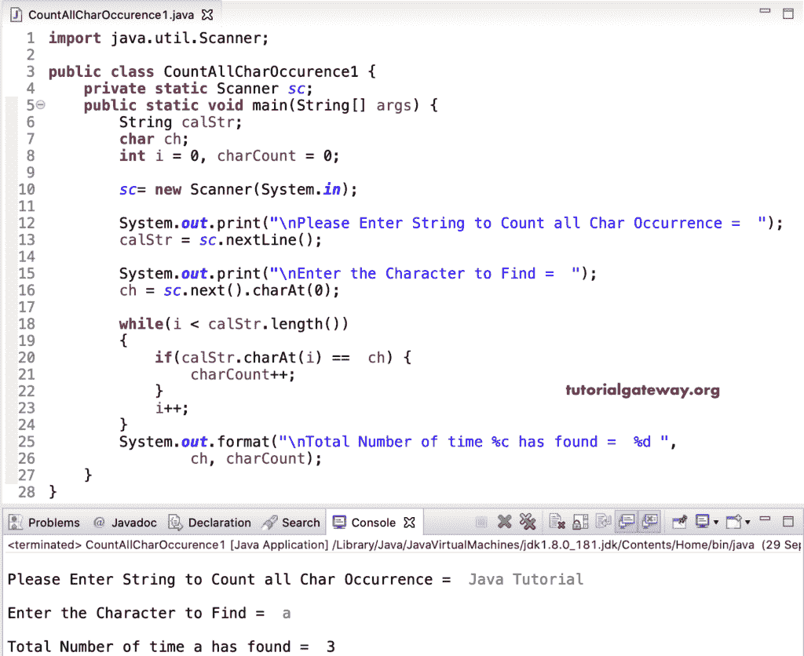

# Java 程序：计算字符串中字符总出现次数

> 原文：<https://www.tutorialgateway.org/java-program-to-count-total-occurrence-of-character-in-a-string/>

用一个例子编写一个计算字符串中字符总出现次数的 Java 程序。在这个 Java 字符串总出现次数示例中，我们使用 While 循环从头到尾迭代 calStr 字符串。在循环中，我们将每个 calStr 字符串字母(charAt())与 ch 进行比较。如果它们相等，我们增加字符数。最后，我们打印字符计数作为输出。

```java
import java.util.Scanner;

public class CountAllCharOccurence1 {
	private static Scanner sc;
	public static void main(String[] args) {
		String calStr;
		char ch;
		int i = 0, charCount = 0;

		sc= new Scanner(System.in);

		System.out.print("\nPlease Enter String to Count all Char Occurrence =  ");
		calStr = sc.nextLine();

		System.out.print("\nEnter the Character to Find =  ");
		ch = sc.next().charAt(0);

		while(i < calStr.length())
		{
			if(calStr.charAt(i) ==  ch) {
				charCount++;
			}
			i++;
		}
		System.out.format("\nTotal Number of time %c has found =  %d ", 
				ch, charCount);	
	}
}
```



这个 [Java](https://www.tutorialgateway.org/learn-java-programs/) 计数一个字符总出现次数的例子同上，我们把 [While loop](https://www.tutorialgateway.org/java-while-loop/) 替换为 [For Loop](https://www.tutorialgateway.org/java-for-loop/) 。

```java
import java.util.Scanner;

public class CountAllCharOccurence2 {
	private static Scanner sc;
	public static void main(String[] args) {
		String calStr;
		char ch;
		int i, charCount = 0;

		sc= new Scanner(System.in);

		System.out.print("\nPlease Enter String to Count all Char Occurrence =  ");
		calStr = sc.nextLine();

		System.out.print("\nEnter the Character to Find =  ");
		ch = sc.next().charAt(0);

		for(i = 0; i < calStr.length(); i++)
		{
			if(calStr.charAt(i) ==  ch) {
				charCount++;
			}
		}
		System.out.format("\nTotal Number of time %c has found =  %d ", 
				ch, charCount);	
	}
}
```

```java
Please Enter String to Count all Char Occurrence =  hello world

Enter the Character to Find =  l

Total Number of time l has found =  3 
```

## 用函数计算字符串中字符总出现次数的 Java 程序

这里，我们创建了一个 countalcharocc[Java](https://www.tutorialgateway.org/java-tutorial/)函数，返回字符数。

```java
import java.util.Scanner;

public class CountAllCharOccurence3 {
	private static Scanner sc;
	public static void main(String[] args) {

		sc= new Scanner(System.in);

		System.out.print("\nPlease Enter Text =  ");
		String calStr = sc.nextLine();

		System.out.print("\nEnter the Letter to Find =  ");
		char ch = sc.next().charAt(0);

		int charCount = CountAllCharOcc(calStr, ch);
		System.out.format("\nTotal Number of time %c has found =  %d ", ch, charCount);	
	}

	public static int CountAllCharOcc(String calStr, char ch) {
		int i, charCount = 0;

		for(i = 0; i < calStr.length(); i++)
		{
			if(calStr.charAt(i) ==  ch) {
				charCount++;
			}
		}
		return charCount;
	}
}
```

```java
Please Enter Text =  tutorial gateway

Enter the letter to Find =  t

Total Number of time t has found =  3 
```