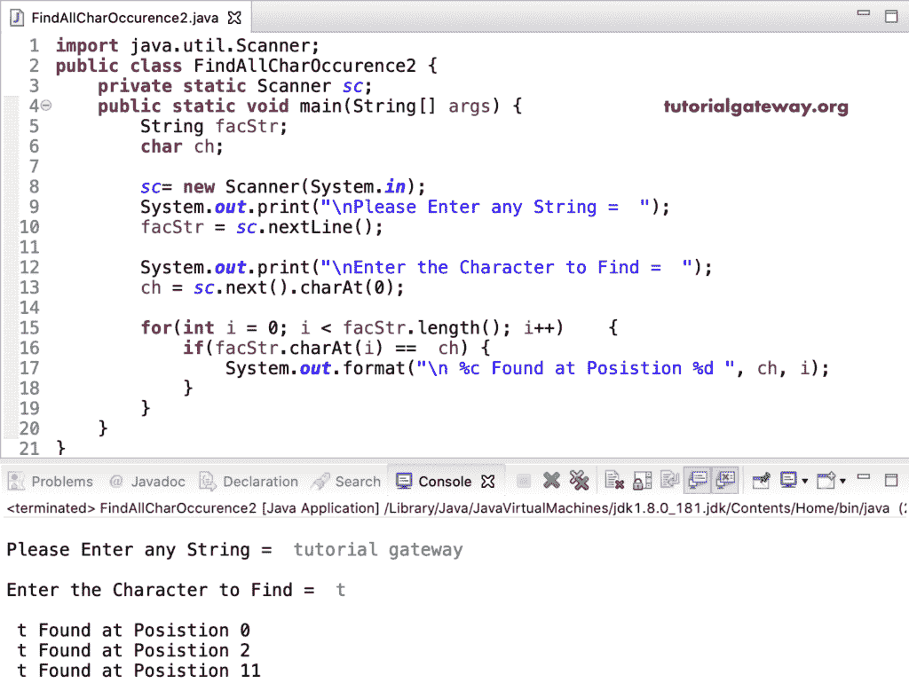

# Java 程序：查找字符串中的字符的所有出现

> 原文：<https://www.tutorialgateway.org/java-program-to-find-all-occurrences-of-a-character-in-a-string/>

编写一个 Java 程序来查找字符串中的字符的所有出现，并给出一个例子。在这个 java 返回所有字符出现的例子中，我们使用 While 循环从头到尾迭代 facStr。其中，我们使用字符串字符(FactStr . charAt(I))函数来读取每个索引位置的字符。

接下来，我们将 acStr.charAt(i)字符与 ch 字符进行比较，以检查它们是否相等。如果为真，我们将该字符与位置(而不是索引位置)一起打印。如果要提取索引位置，请将 i + 1 替换为 i.

```java
import java.util.Scanner;

public class FindAllCharOccurence1 {
	private static Scanner sc;
	public static void main(String[] args) {
		String facStr;
		char ch;
		int i = 0;

		sc= new Scanner(System.in);

		System.out.print("\nPlease Enter any String =  ");
		facStr = sc.nextLine();

		System.out.print("\nEnter the Character to Find =  ");
		ch = sc.next().charAt(0);

		while(i < facStr.length())
		{
			if(facStr.charAt(i) ==  ch) {
				System.out.format("\n %c Found at Position %d ", ch, i + 1);
			}
			i++;
		}
	}
}
```

字符串输出中字符的所有出现

```java
Please Enter any String =  hello world

Enter the Character to Find =  l

 l Found at Position 3 
 l Found at Position 4 
 l Found at Position 10 
```

## 使用 For 循环查找字符串中所有字符的 Java 程序

```java
import java.util.Scanner;

public class FindAllCharOccurence2 {
	private static Scanner sc;
	public static void main(String[] args) {
		String facStr;
		char ch;

		sc= new Scanner(System.in);

		System.out.print("\nPlease Enter any String =  ");
		facStr = sc.nextLine();

		System.out.print("\nEnter the Character to Find =  ");
		ch = sc.next().charAt(0);

		for(int i = 0; i < facStr.length(); i++)
		{
			if(facStr.charAt(i) ==  ch) {
				System.out.format("\n %c Found at Position %d ", ch, i );
			}
		}
	}
}
```



返回给定字符串中的字符的所有出现是另一个 Java 例子。这里，我们使用 [Java](https://www.tutorialgateway.org/java-tutorial/) 函数来分离逻辑。

```java
import java.util.Scanner;

public class FindAllCharOccurence3 {
	private static Scanner sc;
	public static void main(String[] args) {
		String facStr;
		char ch;

		sc= new Scanner(System.in);

		System.out.print("\nPlease Enter any String =  ");
		facStr = sc.nextLine();

		System.out.print("\nEnter the Character to Find =  ");
		ch = sc.next().charAt(0);

		FindAllCharacterOccurences(facStr, ch);	
	}

	public static void FindAllCharacterOccurences(String facStr, char ch) {
		for(int i = 0; i < facStr.length(); i++)
		{
			if(facStr.charAt(i) ==  ch) {
				System.out.format("\n %c Found at Position %d ", ch, i);
			}
		}
	}
}
```

```java
Please Enter any String =  java programming language

Enter the Character to Find =  a

 a Found at Position 1 
 a Found at Position 3 
 a Found at Position 10 
 a Found at Position 18 
 a Found at Position 22 
```