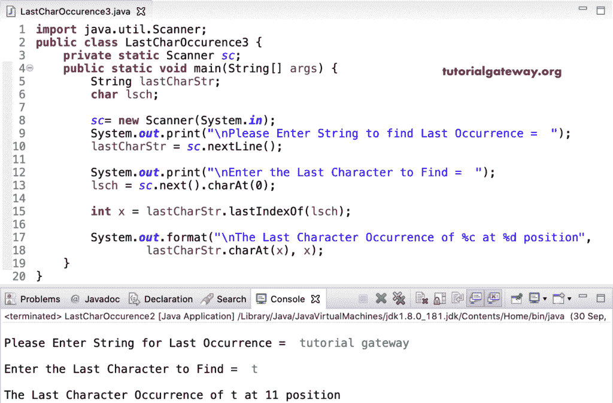

# Java 程序：查找字符串中字符的最后一次出现

> 原文：<https://www.tutorialgateway.org/java-program-to-find-last-character-occurrence-in-a-string/>

用一个例子编写一个查找字符串中字符的最后一次出现的 Java 程序。在这个 java 字符的最后一次出现的例子中，我们使用 While 循环从头到尾迭代字符的最后一次出现。我们在 lastCharStr 上使用了 String charAt 函数来获取 while 循环中每个索引位置的字符。

接下来，我们将该字符与 lsch 字符进行比较，以检查它们是否相等。如果为真，我们将 I 值赋给索引变量，并增加 I 值。接下来，我们使用 [Java If Else 语句](https://www.tutorialgateway.org/java-if-else-statement/)来检查索引值是否等于-1(不匹配)。如果为假，则打印字符索引位置。

```java
import java.util.Scanner;

public class LastCharOccurence1 {
	private static Scanner sc;
	public static void main(String[] args) {
		String lastCharStr;
		int i = 0, lIndex = -1;

		sc= new Scanner(System.in);

		System.out.print("\nPlease Enter String to find Last Occurrence =  ");
		lastCharStr = sc.nextLine();

		System.out.print("\nEnter the Last Character to Find =  ");
		int lsch = sc.next().charAt(0);

		while(i < lastCharStr.length())
		{
			if(lastCharStr.charAt(i) ==  lsch) {
				lIndex = i;
			}
			i++;
		}
		if(lIndex == -1) {
			System.out.println("\nSorry! We haven't found the Character ");
		}
		else {
			System.out.format("\nThe Last Character Occurrence of %c at %d position", lsch, lIndex);
		}
	}

}
```

字符串输出中的字符的最后一次出现

```java
Please Enter String to find Last Occurrence =  java programmings

Enter the Last Character to Find =  a

The Last Character Occurrence of a at 10 position
```

## 查找字符串中字符的最后一次出现的 Java 程序示例 2

和上面是同一个 Java 字符的最后一次出现的例子，我们把 [While 循环](https://www.tutorialgateway.org/java-while-loop/)替换为 [For 循环](https://www.tutorialgateway.org/java-for-loop/)。

```java
import java.util.Scanner;

public class LastCharOccurence2 {
	private static Scanner sc;
	public static void main(String[] args) {
		String lastCharStr;
		int i, lIndex = 0;

		sc= new Scanner(System.in);

		System.out.print("\nPlease Enter String for Last Occurrence =  ");
		lastCharStr = sc.nextLine();

		System.out.print("\nEnter the Last Character to Find =  ");
		char lsch = sc.next().charAt(0);

		for(i = 0; i < lastCharStr.length(); i++)
		{
			if(lastCharStr.charAt(i) ==  lsch) {
				lIndex = i;
			}
		}
		if(lIndex == -1) {
			System.out.println("\nSorry! We haven't found the Character ");
		}
		else {
			System.out.format("\nThe Last Character Occurrence of %c at %d position", lsch, lIndex );
		}
	}

}
```

```java
Please Enter String to find Last Occurrence =  learn java

Enter the Last Character to Find =  a

The Last Character Occurrence of a at 9 position
```

在 Java 编程中，有一个名为 lastIndexOf 的字符串函数。函数的作用是:返回字符串中 lsch 字符的最后一个索引位置。接下来，我们在 lastCharStr 上使用字符串 charAt 函数返回该索引位置的字符。

```java
import java.util.Scanner;

public class LastCharOccurence3 {
	private static Scanner sc;
	public static void main(String[] args) {
		String lastCharStr;
		char lsch;

		sc= new Scanner(System.in);

		System.out.print("\nPlease Enter String to find Last Occurrence =  ");
		lastCharStr = sc.nextLine();

		System.out.print("\nEnter the Last Character to Find =  ");
		lsch = sc.next().charAt(0);

		int x = lastCharStr.lastIndexOf(lsch);

		System.out.format("\nThe Last Character Occurrence of %c at %d position", 
				lastCharStr.charAt(x), x);
	}
}
```



[Java](https://www.tutorialgateway.org/java-tutorial/) StringBuilder 和 StringBuffer 也有 lastIndexOf 和 charAt 函数来返回字符串的字符的最后一次出现。在这个 [Java 示例代码](https://www.tutorialgateway.org/learn-java-programs/)中，我们将给定的字符串转换为 StringBuilder、StringBuffer，并返回输出。

```java
import java.util.Scanner;
public class LastCharOccurence4 {
	private static Scanner sc;
	public static void main(String[] args) {
		String lastCharStr;
		char ch;		
		sc= new Scanner(System.in);
		System.out.print("\nPlease Enter String to find Last Occurrence =  ");
		lastCharStr = sc.nextLine();		
		System.out.print("\nEnter the Character to Find =  ");
		ch = sc.next().charAt(0);

		StringBuilder sb = new StringBuilder(lastCharStr);
		int a = sb.lastIndexOf(String.valueOf(ch));

		System.out.format("\nThe Last Character Occurrence of %c at %d position", 
				sb.charAt(a), a);

		StringBuffer sbuff = new StringBuffer(lastCharStr);
		int b = sb.lastIndexOf(String.valueOf(ch));

		System.out.format("\nThe Last Character Occurrence of %c at %d position", 
				sbuff.charAt(b), b);
	}
}
```

```java
lease Enter String to find Last Occurrence =  hello world l

Enter the Character to Find =  l

The Last Character Occurrence of l at 12 position
The Last Character Occurrence of l at 12 position
```