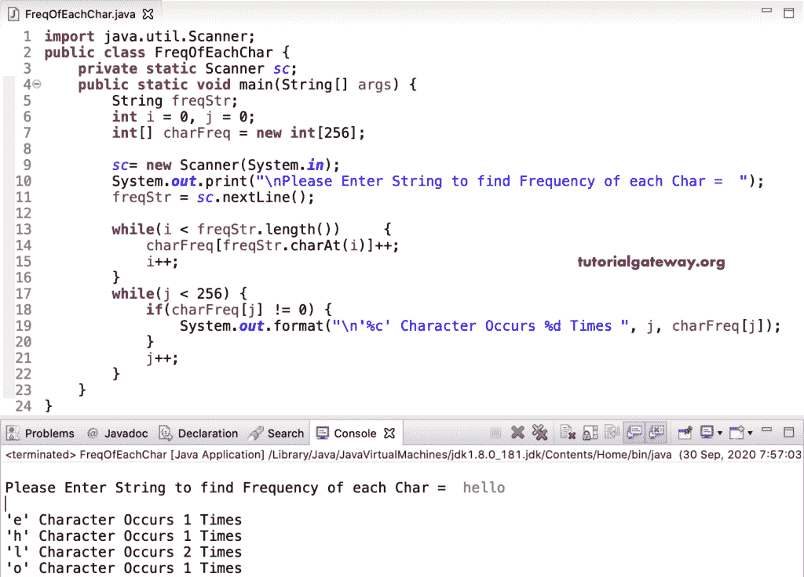

# Java 程序：计算字符串中每个字符的频率

> 原文：<https://www.tutorialgateway.org/java-program-to-find-frequency-of-each-character-in-a-string/>

编写一个 Java 程序，用 while 循环查找字符串中每个字符的频率，并给出一个例子。首先，我们声明了 256 大小的 charFreq 整数数组。接下来，我们遍历 freqStr 字符串，并将字符频率分配给 charFreq 数组。然后，我们使用另一个 while 循环来返回输出。

```java
import java.util.Scanner;

public class FreqOfEachChar {
	private static Scanner sc;
	public static void main(String[] args) {
		String freqStr;
		int i = 0, j = 0;
		int[] charFreq = new int[256];

		sc= new Scanner(System.in);

		System.out.print("\nPlease Enter String to find Frequency of each Char =  ");
		freqStr = sc.nextLine();

		while(i < freqStr.length())
		{
			charFreq[freqStr.charAt(i)]++;
			i++;
		}
		while(j < 256) {
			if(charFreq[j] != 0) {
				System.out.format("\n'%c' Character Occurs %d Times ", j, charFreq[j]);	
			}
			j++;
		}
	}
}
```



## 使用 For 循环查找字符串中每个字符的频率的 Java 程序

```java
import java.util.Scanner;

public class FreqOfEachChar2 {
	private static Scanner sc;
	public static void main(String[] args) {
		String freqStr;
		int i;
		int[] charFreq = new int[256];

		sc= new Scanner(System.in);

		System.out.print("\nPlease Enter String to find Frequency of each Char =  ");
		freqStr = sc.nextLine();

		for(i = 0; i < freqStr.length(); i++)
		{
			charFreq[freqStr.charAt(i)]++;
		}
		for(i = 0; i < 256; i++) {
			if(charFreq[i] != 0) {
				System.out.format("\n'%c' Character Occurs %d Times ", i, charFreq[i]);	
			}
		}
	}
}
```

```java
Please Enter String to find Frequency of each Char =  java program

' ' Character Occurs 1 Times 
'a' Character Occurs 3 Times 
'g' Character Occurs 1 Times 
'j' Character Occurs 1 Times 
'm' Character Occurs 1 Times 
'o' Character Occurs 1 Times 
'p' Character Occurs 1 Times 
'r' Character Occurs 2 Times 
'v' Character Occurs 1 Times 
```

编写 Java 程序的另一种方法是返回字符串中的每个字符频率。

```java
import java.util.Scanner;

public class FreqOfEachChar3 {
	private static Scanner sc;
	public static void main(String[] args) {
		String freqStr;
		int i;
		int[] charFreq = new int[256];

		sc= new Scanner(System.in);

		System.out.print("\nEnter String to find Frequency of each Char =  ");
		freqStr = sc.nextLine();

		for(i = 0; i < freqStr.length(); i++)
		{
			char ch = freqStr.charAt(i);
			if(ch >= 'a' && ch <= 'z') {
				charFreq[ch - 'a']++;
			}
			else if(ch >= 'A' && ch <= 'Z') {
				charFreq[ch - 'A']++;
			}
		}
		for(i = 0; i < 256; i++) {
			if(charFreq[i] != 0) {
				System.out.format("\n'%c' Occurs %d Times ", i + 'a', charFreq[i]);	
			}
		}
	}
}
```

```java
Enter String to find Frequency of each Char =  hello world

'd' Occurs 1 Times 
'e' Occurs 1 Times 
'h' Occurs 1 Times 
'l' Occurs 3 Times 
'o' Occurs 2 Times 
'r' Occurs 1 Times 
'w' Occurs 1 Times 
```

这个 [Java 代码](https://www.tutorialgateway.org/learn-java-programs/)查找字符串的频率同上。这里，我们使用 [Java](https://www.tutorialgateway.org/java-tutorial/) 函数分离逻辑。

```java
import java.util.Scanner;

public class FreqOfEachChar4 {
	private static Scanner sc;
	public static void main(String[] args) {
		String freqStr;

		sc= new Scanner(System.in);

		System.out.print("\nEnter String to find Frequency of each Char =  ");
		freqStr = sc.nextLine();

		FreqOfEachChar(freqStr);		
	}

	public static void FreqOfEachChar(String freqStr) {
		int i;
		int[] charFreq = new int[256];

		for(i = 0; i < freqStr.length(); i++)
		{
			charFreq[freqStr.charAt(i)]++;
		}
		for(i = 0; i < 256; i++) {
			if(charFreq[i] != 0) {
				System.out.format("\n'%c' Character Occurs %d Times ", i, charFreq[i]);	
			}
		}
	}
}
```

```java
 Enter String to find Frequency of each Char =  tutorial gateway

' ' Character Occurs 1 Times 
'a' Character Occurs 3 Times 
'e' Character Occurs 1 Times 
'g' Character Occurs 1 Times 
'i' Character Occurs 1 Times 
'l' Character Occurs 1 Times 
'o' Character Occurs 1 Times 
'r' Character Occurs 1 Times 
't' Character Occurs 3 Times 
'u' Character Occurs 1 Times 
'w' Character Occurs 1 Times 
'y' Character Occurs 1 Times 
```