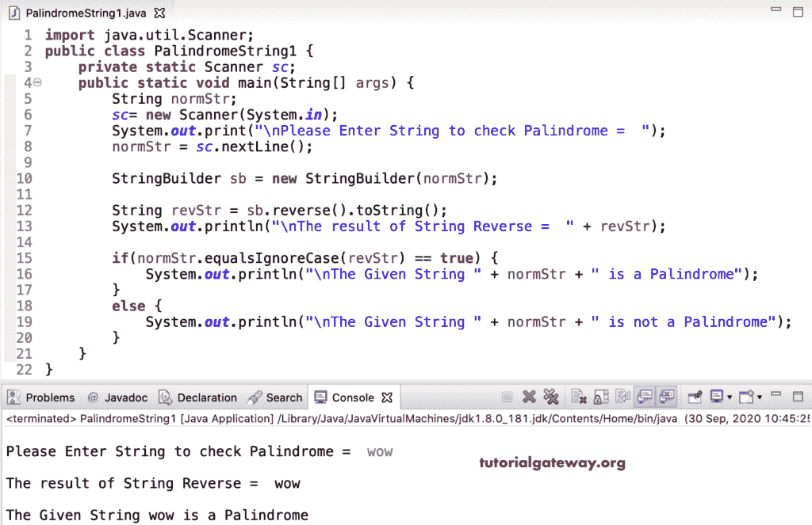

# Java 程序：检查字符串是否为回文

> 原文：<https://www.tutorialgateway.org/java-program-to-check-the-string-is-palindrome/>

用一个例子写一个 Java 程序来检查字符串是否是回文。在 java 中，任何文本都是一个回文字符串，如果它正好等于该字符串的反义词。

在这个 Java 回文字符串示例中，我们使用 StringBuilder 反向函数来反转 normStr，并将其分配给 revStr。接下来，我们使用 [If Else 语句](https://www.tutorialgateway.org/java-if-else-statement/)中的 equalsIgnoreCase()(或使用[等于](https://www.tutorialgateway.org/java-equals-method/)())来比较 normStr 和 revStr。如果为 True，则 normStr 是 Java 中的回文字符串；否则，就不是了。

```java
import java.util.Scanner;

public class PalindromeString1 {
	private static Scanner sc;
	public static void main(String[] args) {
		String normStr;

		sc= new Scanner(System.in);

		System.out.print("\nPlease Enter String to check Palindrome =  ");
		normStr = sc.nextLine();

		StringBuilder sb = new StringBuilder(normStr);

		String revStr = sb.reverse().toString();
		System.out.println("\nThe result of String Reverse =  " + revStr);

		if(normStr.equalsIgnoreCase(revStr) == true) {
			System.out.println("\nThe Given String " + normStr + " is a Palindrome");
		}
		else {
			System.out.println("\nThe Given String " + normStr + " is not a Palindrome");
		}		
	}
}
```



Java StringBuffer 也有一个应用于 normStr 的反向函数。我们用这个函数来检查 java 中的回文字符串。

```java
import java.util.Scanner;

public class PalindromeString2 {
	private static Scanner sc;
	public static void main(String[] args) {
		String normStr;

		sc= new Scanner(System.in);

		System.out.print("\nPlease Enter Text =  ");
		normStr = sc.nextLine();

		StringBuffer sbuff = new StringBuffer(normStr);

		String revStr = sbuff.reverse().toString();
		System.out.println("\nThe result of Reverse =  " + revStr);

		if(normStr.equalsIgnoreCase(revStr) == true) {
			System.out.println("\nThe Given " + normStr + " is a Palindrome");
		}
		else {
			System.out.println("\nThe Given " + normStr + " is not");
		}		
	}
}
```

使用 StringBuffer 输出

```java
Please Enter Text =  javaj

The result of Reverse =  javaj

The Given javaj is a Palindrome
```

在这个 Java 回文字符串程序中，我们使用 for 循环从头到尾(以相反的顺序)迭代 normStr，并将其协调到 revStr。接下来，我们使用(normstr . equalsignorase(revStr)= true)来检查 java 中的回文字符串。

```java
import java.util.Scanner;

public class PalindromeString3 {
	private static Scanner sc;
	public static void main(String[] args) {
		String normStr;
		int i;

		sc= new Scanner(System.in);

		System.out.print("\nPlease Enter String to check Palindrome =  ");
		normStr = sc.nextLine();

		String revStr = "";

		for(i = normStr.length() - 1; i >= 0; i--) {
			revStr += normStr.charAt(i);
		}

		System.out.println("\nThe result of String Reverse =  " + revStr);

		if(normStr.equalsIgnoreCase(revStr) == true) {
			System.out.println("\nThe Given String " + normStr + " is a Palindrome");
		}
		else {
			System.out.println("\nThe Given String " + normStr + " is not a Palindrome");
		}		
	}
}
```

```java
Please Enter String to check Palindrome =  hellh

The result of String Reverse =  hellh

The Given String hellh is a Palindrome
```

在这个 Java 回文字符串程序中，我们将 normStrr 转换为 StrCharArr 字符数组。接下来，我们使用 for 循环从右向左迭代字符串，并将最后一个字符分配给第一个索引，等等。然后，我们使用[等号](https://www.tutorialgateway.org/java-string-equalsignorecase-method/)来比较和检查回文字符串。

```java
import java.util.Scanner;

public class PalindromeString4 {
	private static Scanner sc;
	public static void main(String[] args) {
		String normStr;
		int i, j = 0;

		sc= new Scanner(System.in);

		System.out.print("\nPlease Enter String to check Palindrome =  ");
		normStr = sc.nextLine();

		char[] StrCharArr = normStr.toCharArray();

		for(i = StrCharArr.length - 1; i >= 0; i--) {
			StrCharArr[j++] = normStr.charAt(i);
		}	

		String revStr = String.valueOf(StrCharArr);
		System.out.println("\nThe result of String Reverse =  " + revStr);

		if(normStr.equalsIgnoreCase(revStr) == true) {
			System.out.println("\nThe Given String " + normStr + " is a Palindrome");
		}
		else {
			System.out.println("\nThe Given String " + normStr + " is not a Palindrome");
		}		
	}
}
```

```java
Please Enter String to check Palindrome =  aaabbaaa

The result of String Reverse =  aaabbaaa

The Given String aaabbaaa is a Palindrome
```

在这个回文串 [Java 程序](https://www.tutorialgateway.org/learn-java-programs/)中，我们比较第一个字符和最后一个字符，以此类推。如果它们不相等，标志将为 1，后面跟着[中断声明](https://www.tutorialgateway.org/java-break-statement/)退出循环。如果标志值等于 0，则该字符串是回文。

```java
import java.util.Scanner;

public class PalindromeString5 {
	private static Scanner sc;
	public static void main(String[] args) {
		String normStr;
		int i, flag = 0;

		sc= new Scanner(System.in);

		System.out.print("\nPlease Enter String to check Palindrome =  ");
		normStr = sc.nextLine();

		char[] StrCharArr = normStr.toCharArray();

		for(i = 0; i < StrCharArr.length; i++) {
			if(StrCharArr[i] != StrCharArr[StrCharArr.length - i -1]) {
				flag = 1;
				break;
			}
		}	

		if(flag == 0) {
			System.out.println("\nThe Given String " + normStr + " is a Palindrome");
		}
		else {
			System.out.println("\nThe Given String " + normStr + " is not a Palindrome");
		}		
	}
}
```

```java
Please Enter String to check Palindrome =  huh

The Given String huh is a Palindrome
```

这是另一个 [Java](https://www.tutorialgateway.org/java-tutorial/) 回文字符串的例子。

```java
import java.util.Scanner;

public class PalindromeString6 {
	private static Scanner sc;
	public static void main(String[] args) {
		String normStr;
		int i;

		sc= new Scanner(System.in);

		System.out.print("\nPlease Enter text =  ");
		normStr = sc.nextLine();

		int len = normStr.length();
		int endIndex = len - 1;
		for(i = 0; i <= endIndex; i++) {
			if(normStr.charAt(i) != normStr.charAt(endIndex)) {
				break;
			}
			endIndex--;
		}	

		if(i >= endIndex) {
			System.out.println("\nThe Given " + normStr + " is a Palindrome");
		}
		else {
			System.out.println("\nThe Given " + normStr + " is not");
		}		
	}
}
```

```java
Please Enter text =  hopoh

The Given hopoh is a Palindrome
```

用递归检查字符串是否是回文的 Java 程序。

```java
import java.util.Scanner;

public class PalindromeString7 {
	private static Scanner sc;
	public static void main(String[] args) {
		String normStr;
		int i, flag = 0;

		sc= new Scanner(System.in);

		System.out.print("\nPlease Enter text =  ");
		normStr = sc.nextLine();

		String revStr = reverseString(normStr);
		System.out.println("\nThe result of Reverse =  " + revStr);

		for(i = 0; i < normStr.length(); i++) {
			if(normStr.charAt(i) != revStr.charAt(i)) {
				flag = 1;
				break;
			}
		}			
		if(flag == 0) {
			System.out.println("\nThe Given " + normStr + " is a Palindrome");
		}
		else {
			System.out.println("\nThe Given " + normStr + " is not");
		}		
	}
	private static String reverseString(String normStr) {
		if(normStr.isEmpty()) {
			return normStr;
		}
		return reverseString(normStr.substring(1)) + normStr.charAt(0);
	}
}
```

```java
Please Enter text =  hello

The result of Reverse =  olleh

The Given hello is not a Palindrome
```