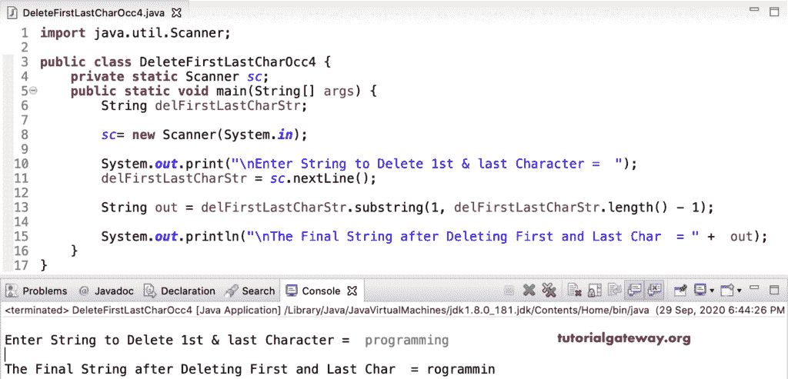

# Java 程序：删除字符串中第一个和最后一个字符

> 原文：<https://www.tutorialgateway.org/java-program-to-remove-first-and-last-character-in-a-string/>

编写一个 Java 程序来删除字符串中的第一个和最后一个字符。在这个 java 移除第一个和最后一个字符的例子中，我们使用了 StringBuilder deleteCharAt 函数。为了获得最后一个索引位置，我们使用了 delFirstLastCharStr 上的字符串长度函数。

Java StringBuilder 有 deleteCharAt 函数，可以删除给定索引位置的字符。因此，我们使用这个 deleteCharAt 函数来删除 delFirstLastCharStr 字符串的第一个和最后一个字符。

```java
import java.util.Scanner;

public class DeleteFirstLastCharOcc1 {
	private static Scanner sc;
	public static void main(String[] args) {
		String delFirstLastCharStr;

		sc= new Scanner(System.in);

		System.out.print("\nEnter String to Delete 1st & last Character =  ");
		delFirstLastCharStr = sc.nextLine();		

		StringBuilder sb = new StringBuilder(delFirstLastCharStr);
		sb.deleteCharAt(0);		
		System.out.println("\nThe Final String after Deleting First Char  = " +  sb);

		sb.deleteCharAt(sb.length() - 1);		
		System.out.println("\nThe Final String after Deleting First & Last Char  = " +  sb);
	}
}
```

Java 删除第一个和最后一个字符串输出

```java
Enter String to Delete 1st & last Character =  hello

The Final String after Deleting First Char  = ello

The Final String after Deleting First & Last Char  = ell
```

## 删除字符串中第一个和最后一个字符的 Java 程序示例 2

[Java](https://www.tutorialgateway.org/java-tutorial/) StringBuffer 也有 deleteCharAt 函数，可以删除索引位置的字符。因此，我们在 delFirstLastCharStr 上使用这个函数来移除字符串的第一个和最后一个字符。

```java
import java.util.Scanner;

public class DeleteFirstLastCharOcc2 {
	private static Scanner sc;
	public static void main(String[] args) {
		String delFirstLastCharStr;

		sc= new Scanner(System.in);

		System.out.print("\nEnter String to Delete 1st & last Character =  ");
		delFirstLastCharStr = sc.nextLine();		

		StringBuffer sbuff = new StringBuffer(delFirstLastCharStr);
		sbuff.deleteCharAt(0);		
		System.out.println("\nThe Final String after Deleting First Char  = " +  sbuff);

		sbuff.deleteCharAt(sbuff.length() - 1);		
		System.out.println("\nThe Final String after Deleting First & Last Char  = " +  sbuff);
	}
}
```

```java
Enter String to Delete 1st & last Character =  java

The Final String after Deleting First Char  = ava

The Final String after Deleting First & Last Char  = av
```

删除第一个和最后一个字符串是另一个 [Java 例子](https://www.tutorialgateway.org/learn-java-programs/)。

```java
import java.util.Scanner;

public class DeleteFirstLastCharOcc3 {
	private static Scanner sc;
	public static void main(String[] args) {
		String delFirstLastCharStr;

		sc= new Scanner(System.in);

		System.out.print("\nEnter String to Delete 1st & last Character =  ");
		delFirstLastCharStr = sc.nextLine();		

		StringBuilder sb = new StringBuilder(delFirstLastCharStr);
		StringBuffer sbuff = new StringBuffer(delFirstLastCharStr);

		sb.deleteCharAt(0);		
		System.out.println("\nString Builder - String after Deleting First Char  = " +  sb);		

		sbuff.deleteCharAt(0);		
		System.out.println("String Buffer  - String after Deleting First Char  = " +  sbuff);

		sb.deleteCharAt(sb.length() - 1);		
		System.out.println("\nString Builder - String after Deleting First and Last Char  = " +  sb);

		sbuff.deleteCharAt(sbuff.length() - 1);		
		System.out.println("String Buffer  - String after Deleting First and Last Char  = " +  sbuff);
	}
}
```

```java
Enter String to Delete 1st & last Character =  hello world

String Builder - String after Deleting First Char  = ello world
String Buffer  - String after Deleting First Char  = ello world

String Builder - String after Deleting First and Last Char  = ello worl
String Buffer  - String after Deleting First and Last Char  = ello worl
```

这个 Java 删除第一个和最后一个字符的例子使用了[子串函数](https://www.tutorialgateway.org/java-substring-method/)。这里，delfirst lastcharstr . substring(1，delfirst lastcharstr . length()–1)返回从索引位置 1 开始到长度-1 的字符串

```java
import java.util.Scanner;

public class DeleteFirstLastCharOcc4 {
	private static Scanner sc;
	public static void main(String[] args) {
		String delFirstLastCharStr;

		sc= new Scanner(System.in);

		System.out.print("\nEnter String to Delete 1st & last Character =  ");
		delFirstLastCharStr = sc.nextLine();		

		String out = delFirstLastCharStr.substring(1, delFirstLastCharStr.length() - 1);

		System.out.println("\nThe Final String after Deleting First and Last Char  = " +  out);
	}
}
```

