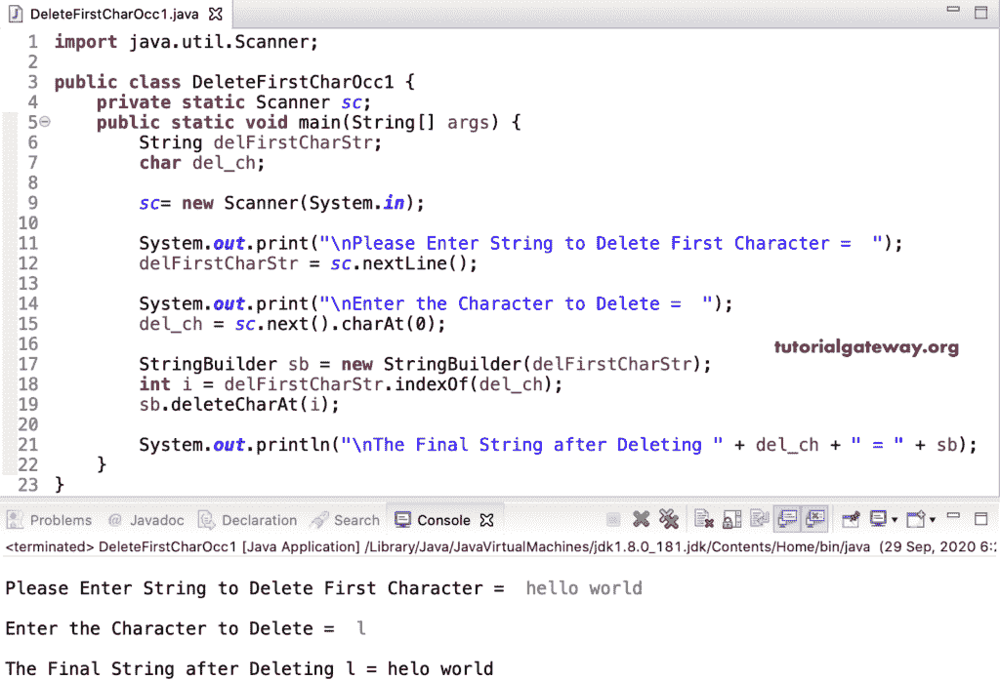

# Java 程序：删除字符串中字符的第一次出现

> 原文：<https://www.tutorialgateway.org/java-program-to-remove-first-character-occurrence-in-a-string/>

编写一个 Java 程序来删除字符串中字符的第一次出现，并给出一个例子。在这个 Java Remove 第一次出现字符的例子中，我们使用了 StringBuilder indexOf 和 deleteCharAt 函数。

为了得到索引位置，我们使用了 indexOf，delfirscharstr . indexOf(del _ ch)返回第一个索引位置。接下来，我们使用 sb.deleteCharAt(i)从 delFirstCharStr 中删除或移除该字符。

```java
import java.util.Scanner;

public class DeleteFirstCharOcc1 {
	private static Scanner sc;
	public static void main(String[] args) {
		String delFirstCharStr;
		char del_ch;

		sc= new Scanner(System.in);

		System.out.print("\nPlease Enter String to Delete First Character =  ");
		delFirstCharStr = sc.nextLine();

		System.out.print("\nEnter the Character to Delete =  ");
		del_ch = sc.next().charAt(0);

		StringBuilder sb = new StringBuilder(delFirstCharStr);
		int i = delFirstCharStr.indexOf(del_ch);
		sb.deleteCharAt(i);

		System.out.println("\nThe Final String after Deleting " + del_ch + " = " + sb);
	}
}
```



Java StringBuffer 还具有 indexOf 和 deleteCharAt 函数，用于删除字符串中的字符的第一次出现。

```java
import java.util.Scanner;

public class DeleteFirstCharOcc2 {
	private static Scanner sc;
	public static void main(String[] args) {
		String delFirstCharStr;
		char del_ch;

		sc= new Scanner(System.in);

		System.out.print("\nPlease Enter String to Delete First Character =  ");
		delFirstCharStr = sc.nextLine();

		System.out.print("\nEnter the Character to Delete =  ");
		del_ch = sc.next().charAt(0);

		StringBuffer sbuff = new StringBuffer(delFirstCharStr);
		int i = delFirstCharStr.indexOf(del_ch);
		sbuff.deleteCharAt(i);

		System.out.println("\nThe Final String after Deleting First Occurrence " 
		+ del_ch + " = " + sbuff);
	}
}
```

Java 删除字符串输出中的字符的第一次出现

```java
Please Enter String to Delete First Character =  java programs

Enter the Character to Delete =  a

The Final String after Deleting First Occurrence a = jva programs
```

## 删除字符串中字符的第一次出现的 Java 程序示例 3

在这个 Java 中，删除了字符的第一次出现示例，我们使用 For 循环从头到尾迭代 delFirstCharStr。在循环中，我们将每个字符与 del_ch 进行比较。如果它们相等，break 语句将从 for 循环中退出 Javac。接下来，我们使用 StringBuffer 和 StringBuilder deleteCharAt 函数删除该字符。

```java
import java.util.Scanner;

public class DeleteFirstCharOcc3 {
	private static Scanner sc;
	public static void main(String[] args) {
		String delFirstCharStr;
		char del_ch;
		int i;

		sc= new Scanner(System.in);

		System.out.print("\nPlease Enter String to Delete First Character =  ");
		delFirstCharStr = sc.nextLine();

		System.out.print("\nEnter the Character to Delete =  ");
		del_ch = sc.next().charAt(0);

		StringBuilder sb = new StringBuilder(delFirstCharStr);
		StringBuffer sbuff = new StringBuffer(delFirstCharStr);

		for(i = 0; i < delFirstCharStr.length(); i++) {
			if(delFirstCharStr.charAt(i) == del_ch) {
				break;
			}
		}		
		System.out.format("\nThe First Character Occurrence of %c at %d position", del_ch, i);

		sb.deleteCharAt(i);		
		System.out.println("\nThe Final String after Deleting " + del_ch + " = " + sb);

		sbuff.deleteCharAt(i);
		System.out.println("\nThe Final String after Deleting First Occurrence " 
		+ del_ch + " = " + sbuff);
	}
}
```

```java
Please Enter String to Delete First Character =  delete

Enter the Character to Delete =  e

The First Character Occurrence of e at 1 position
The Final String after Deleting e = dlete

The Final String after Deleting First Occurrence e = dlete
```

要删除字符的第一次出现，我们可以使用 Java String [substring 函数](https://www.tutorialgateway.org/java-substring-method/)。在这个 [Java 程序](https://www.tutorialgateway.org/learn-java-programs/)中，delFirstCharStr.indexOf(del_ch)找到字符的第一次出现的索引位置。接下来，delFirstCharStr.substring(0，I)返回直到 I 的子字符串。然后，delFirstCharStr.substring(i + 1)将字符串从下一个索引位置连接到 delFirstCharStr 字符串的末尾。

```java
import java.util.Scanner;

public class DeleteFirstCharOcc4 {
	private static Scanner sc;
	public static void main(String[] args) {
		String delFirstCharStr;
		char del_ch;

		sc= new Scanner(System.in);

		System.out.print("\nPlease Enter String to Delete Character =  ");
		delFirstCharStr = sc.nextLine();

		System.out.print("\nEnter the Character to Delete =  ");
		del_ch = sc.next().charAt(0);

		int i = delFirstCharStr.indexOf(del_ch);
		String out = delFirstCharStr.substring(0, i) + delFirstCharStr.substring(i + 1);

		System.out.println("\nThe Final String after Deleting " + del_ch + " = " + out);
	}
}
```

```java
Please Enter String to Delete Character =  hi coding

Enter the Character to Delete =  i

The Final String after Deleting i = h coding
```

在 Java 中，字符串 [replaceFirst 函数](https://www.tutorialgateway.org/java-string-methods/)用新字符替换第一次出现的宪章。这里，delfirst charstr . replace first(String . value of(del_ch)，"")用空字符串删除 del _ ch 的第一个匹配项。请记住，这个函数接受字符串参数，因此我们将该字符转换为字符串。

```java
import java.util.Scanner;

public class DeleteFirstCharOcc5 {
	private static Scanner sc;
	public static void main(String[] args) {
		String delFirstCharStr, x = "";
		char del_ch;

		sc= new Scanner(System.in);

		System.out.print("\nPlease Enter String to Delete Character =  ");
		delFirstCharStr = sc.nextLine();

		System.out.print("\nEnter the Character to Delete =  ");
		del_ch = sc.next().charAt(0);

		x = delFirstCharStr.replaceFirst(String.valueOf(del_ch), "");

		System.out.println("\nThe Final String after Deleting " + del_ch + " = " + x);
	}
}
```

```java
Please Enter String to Delete Character =  remove char

Enter the Character to Delete =  e

The Final String after Deleting e = rmove char
```

在这个 [Java](https://www.tutorialgateway.org/java-tutorial/) 删除字符的第一次出现的例子中，我们使用 [toCharArray()](https://www.tutorialgateway.org/java-tochararray-method/) 将 delFirstCharStr 字符串转换为 delFirstCharArr 字符数组。接下来，在 for 循环中，我们将每个 delFirstCharStr 字符串与 del_ch 进行比较。如果它们相等，我们将 0 或空字符分配给该索引位置，后跟一个 [Java break 语句](https://www.tutorialgateway.org/java-break-statement/)，从[退出循环](https://www.tutorialgateway.org/java-for-loop/)。

```java
import java.util.Scanner;

public class DeleteFirstCharOcc7 {
	private static Scanner sc;
	public static void main(String[] args) {
		String delFirstCharStr;
		char del_ch;
		int i = 0;

		sc= new Scanner(System.in);

		System.out.print("\nPlease Enter String to Delete First Character =  ");
		delFirstCharStr = sc.nextLine();

		System.out.print("\nEnter the Character to Delete =  ");
		del_ch = sc.next().charAt(0);

		char[] delFirstCharArr = delFirstCharStr.toCharArray();

		for(i = 0; i < delFirstCharArr.length; i++) {
			if(delFirstCharStr.charAt(i) == del_ch) {
				delFirstCharArr[i] = 0;
				break;
			}
		}
		System.out.print("\nThe Final String after Deleting " + del_ch + " = " );
		System.out.print(delFirstCharArr);

	}
}
```

```java
Please Enter String to Delete First Character =  programming

Enter the Character to Delete =  g

The Final String after Deleting g = proramming
```