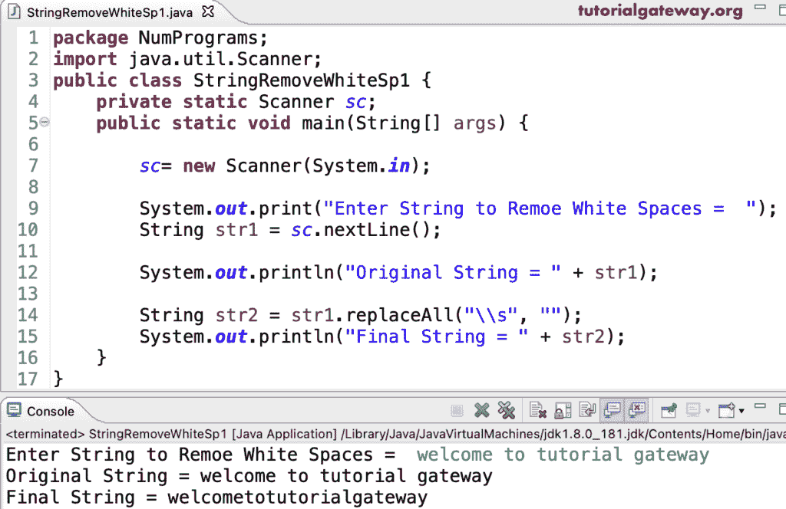

# Java 程序：从字符串中删除所有空格

> 原文：<https://www.tutorialgateway.org/java-program-to-remove-all-whitespaces-from-a-string/>

用一个例子编写一个 Java 程序来删除字符串中的所有空格。在 Java 中，我们可以使用字符串 replaceAll 方法来替换字符串中的空格。为此，我们必须使用 replaceAll("\s "，"")，其中" \s "表示单个空格。

```java
package NumPrograms;

import java.util.Scanner;

public class StringRemoveWhiteSp1 {

	private static Scanner sc;

	public static void main(String[] args) {

		sc= new Scanner(System.in);

		System.out.print("Enter String to Remoe White Spaces =  ");
		String str1 = sc.nextLine();

		System.out.println("Original String = " + str1);

		String str2 = str1.replaceAll("\\s", "");
		System.out.println("Final String = " + str2);
	}
}
```



这个 Java 程序使用 StringBuffer 和 for 循环来移除字符串中的所有空格。首先，我们将给定的字符串转换成字符数组。接下来，对于(int I = 0；i < strArray.length; i++) iterate the string characters, and the if statement if(strArray[i] != ‘ ‘ && strArray[i] != ‘\t’) filters the non-empty characters. Then, append those non-empty characters to a [Java](https://www.tutorialgateway.org/learn-java-programs/) 字符串缓冲区。

```java
package NumPrograms;

import java.util.Scanner;

public class StringRemoveWhiteSp2 {
	private static Scanner sc;
	public static void main(String[] args) {

		sc= new Scanner(System.in);
		StringBuffer strBuffer = new StringBuffer();

		System.out.print("Enter String to Remoe White Spaces =  ");
		String str1 = sc.nextLine();

		System.out.println("Original String = " + str1);

		char[] strArray = str1.toCharArray();
		for(int i =0; i < strArray.length; i++)
		{
			if(strArray[i] != ' ' && strArray[i] != '\t')
			{
				strBuffer.append(strArray[i]);
			}
		}

		System.out.println("Final String = " + strBuffer.toString());
	}
}
```

```java
Enter String to Remoe White Spaces =  learn java programs for free
Original String = learn java programs for free
Final String = learnjavaprogramsforfree
```

使用 while 循环从字符串中删除所有空格的 Java 程序。

```java
package NumPrograms;

import java.util.Scanner;

public class StringRemoveWhiteSp3 {
	private static Scanner sc;
	public static void main(String[] args) {

		sc= new Scanner(System.in);
		StringBuffer strBuffer = new StringBuffer();

		System.out.print("Enter String to Remove White Spaces =  ");
		String str1 = sc.nextLine();

		System.out.println("Original String = " + str1);
		int i = 0; 

		while(i < str1.length())
		{
			if(str1.charAt(i) != ' ' && str1.charAt(i) != '\t')
			{
				strBuffer.append(str1.charAt(i));
			}
			i++;
		}

		System.out.println("Final String = " + strBuffer.toString());
	}
}
```

```java
Enter String to Remove White Spaces =  hello java programming world
Original String = hello java programming world
Final String = hellojavaprogrammingworld
```