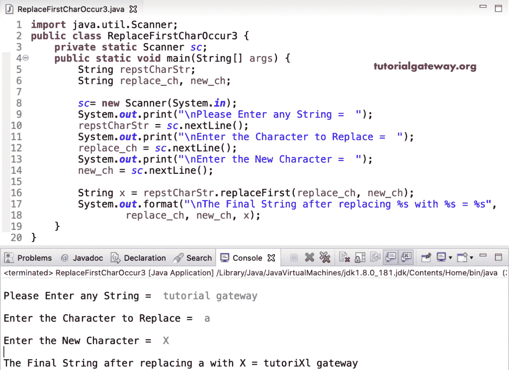

# Java 程序：替换字符串中第一个字符

> 原文：<https://www.tutorialgateway.org/java-program-to-replace-first-character-occurrence-in-a-string/>

编写一个 Java 程序，用一个例子替换字符串中出现的第一个字符。在这个 Java 替换字符的第一次出现的例子中，我们将 repstCharStr 字符串中的每个字符与 replace_ch 进行比较。如果它们相等，我们在索引位置分配 new_ch，后面跟 break 语句，退出 While 循环。

```java
import java.util.Scanner;

public class ReplaceFirstCharOccur1 {
	private static Scanner sc;
	public static void main(String[] args) {
		String repstCharStr;
		char replace_ch, new_ch;
		int i = 0;

		sc= new Scanner(System.in);

		System.out.print("\nPlease Enter any String =  ");
		repstCharStr = sc.nextLine();

		System.out.print("\nEnter the Character to Replace =  ");
		replace_ch = sc.next().charAt(0);

		System.out.print("\nEnter the New Character =  ");
		new_ch = sc.next().charAt(0);

		char[] repstCharArr = repstCharStr.toCharArray();
		while(i < repstCharArr.length)
		{
			if(repstCharArr[i] ==  replace_ch) {
				repstCharArr[i] = new_ch;
				break;
			}
			i++;
		}
		System.out.format("\nThe Final String after replacing %c with %c = ", replace_ch, new_ch);
		System.out.print(repstCharArr);
	}
}
```

Java 替换字符串输出中出现的第一个字符

```java
Please Enter any String =  Java

Enter the Character to Replace =  a

Enter the New Character =  M

The Final String after replacing a with M = JMva
```

## 替换字符串中第一个字符的 Java 程序示例 2

这个 Java 替换第一次出现的一个字符的例子同上，我们把 [While 循环](https://www.tutorialgateway.org/java-while-loop/)替换为 [For 循环](https://www.tutorialgateway.org/java-for-loop/)。

```java
import java.util.Scanner;

public class ReplaceFirstCharOccur2 {
	private static Scanner sc;
	public static void main(String[] args) {
		String repstCharStr;
		char replace_ch, new_ch;

		sc= new Scanner(System.in);

		System.out.print("\nPlease Enter any String =  ");
		repstCharStr = sc.nextLine();

		System.out.print("\nEnter the Character to Replace =  ");
		replace_ch = sc.next().charAt(0);

		System.out.print("\nEnter the New Character =  ");
		new_ch = sc.next().charAt(0);

		char[] repstCharArr = repstCharStr.toCharArray();
		for(int i = 0; i < repstCharArr.length; i++)
		{
			if(repstCharArr[i] ==  replace_ch) {
				repstCharArr[i] = new_ch;
				break;
			}
		}
		System.out.format("\nThe Final String after replacing %c with %c = ", replace_ch, new_ch);
		System.out.print(repstCharArr);
	}
}
```

```java
Please Enter any String =  Programming

Enter the Character to Replace =  r

Enter the New Character =  K

The Final String after replacing r with K = PKogramming
```

[replaceFirst](https://www.tutorialgateway.org/java-string-replacefirst-method/) 是一个字符串函数，它用新字符替换宪章的第一个出现。

```java
import java.util.Scanner;

public class ReplaceFirstCharOccur3 {
	private static Scanner sc;
	public static void main(String[] args) {
		String repstCharStr;
		String replace_ch, new_ch;

		sc= new Scanner(System.in);

		System.out.print("\nPlease Enter any String =  ");
		repstCharStr = sc.nextLine();

		System.out.print("\nEnter the Character to Replace =  ");
		replace_ch = sc.nextLine();

		System.out.print("\nEnter the New Character =  ");
		new_ch = sc.nextLine();

		String x = repstCharStr.replaceFirst(replace_ch, new_ch);

		System.out.format("\nThe Final String after replacing %s with %s = %s", 
				replace_ch, new_ch, x);
	}
}
```



我们可以使用 [Java](https://www.tutorialgateway.org/java-tutorial/) String [子串函数](https://www.tutorialgateway.org/java-substring-method/)来替换字符的第一次出现。在这个 [Java 程序](https://www.tutorialgateway.org/learn-java-programs/)中，repstCharStr.substring(0，I)返回直到 replace_ch 字符索引位置的子字符串。接下来，我们在其中添加了 new_ch。然后，我们使用另一个子字符串 repstCharStr.substring(i + 1，repstCharStr.length()将字符串从 I 连接到该字符串的末尾。

```java
import java.util.Scanner;

public class ReplaceFirstCharOccur4 {
	private static Scanner sc;
	public static void main(String[] args) {
		String repstCharStr;
		String replace_ch, new_ch;

		sc= new Scanner(System.in);

		System.out.print("\nPlease Enter any String =  ");
		repstCharStr = sc.nextLine();

		System.out.print("\nEnter the Character to Replace =  ");
		replace_ch = sc.nextLine();

		System.out.print("\nEnter the New Character =  ");
		new_ch = sc.nextLine();

		int i = repstCharStr.indexOf(replace_ch);
		String x = repstCharStr.substring(0, i) + new_ch +
					repstCharStr.substring(i + 1, repstCharStr.length() );

		System.out.format("\nThe Final String after replacing %s with %s = %s", 
				replace_ch, new_ch, x);
	}
}
```

```java
Please Enter any String =  Learn Java

Enter the Character to Replace =  a

Enter the New Character =  Q

The Final String after replacing a with Q = LeQrn Java
```