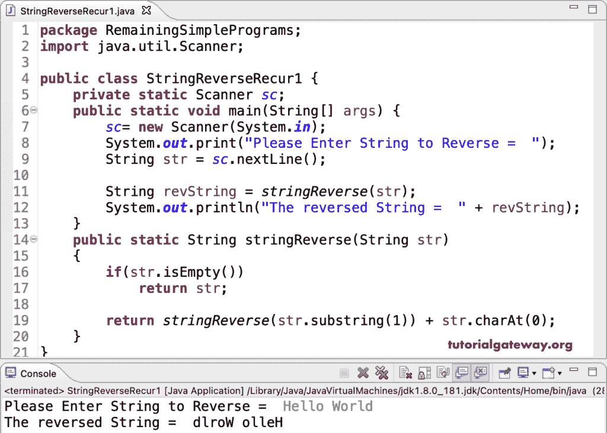

# Java 程序：使用递归反转字符串 Java 字符串反向

> 原文：<https://www.tutorialgateway.org/java-string-reverse-program-using-recursion/>

使用递归或递归函数编写一个 Java 字符串反向程序。在这个 Java 示例中，stringReverse 检查字符串是否为空，如果为真，则打印确切的字符串。否则，它递归地执行字符串反转。

```java
package RemainingSimplePrograms;

import java.util.Scanner;

public class StringReverseRecur1 {

	private static Scanner sc;

	public static void main(String[] args) {

		sc= new Scanner(System.in);

		System.out.print("Please Enter String to Reverse =  ");
		String str = sc.nextLine();

		String revString = stringReverse(str);	
		System.out.println("The reversed String =  " + revString);
	}

	public static String stringReverse(String str)
	{
		if(str.isEmpty())
			return str;

		return stringReverse(str.substring(1)) + str.charAt(0);
	}
}
```



使用递归是在 [Java](https://www.tutorialgateway.org/learn-java-programs/) 中编写字符串反向程序的另一种方式。

```java
package RemainingSimplePrograms;

import java.util.Scanner;

public class StringReverseRecur2 {

	private static Scanner sc;

	public static void main(String[] args) {

		sc= new Scanner(System.in);

		System.out.print("Please Enter String to Reverse =  ");
		String str = sc.nextLine();

		System.out.print("The reversed String =  " );
		stringReverse(str);	
	}

	public static void stringReverse(String str)
	{
		if(str.isEmpty()) {
			System.out.print(str);
		}
		else {
			System.out.print(str.charAt(str.length() - 1));
			stringReverse(str.substring(0, str.length() - 1));
		}	
	}
}
```

```java
Please Enter String to Reverse =  Welcome to Java World!
The reversed String =  !dlroW avaJ ot emocleW
```