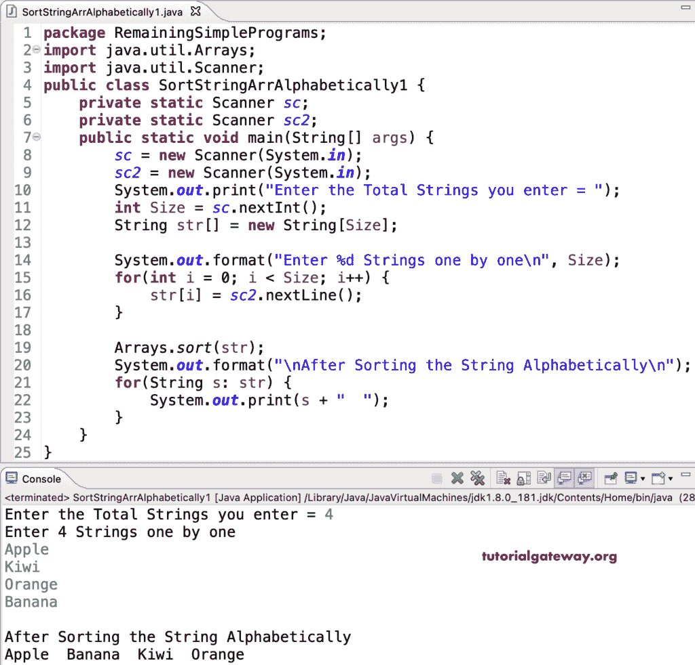

# Java 程序：按字母顺序排序字符串

> 原文：<https://www.tutorialgateway.org/java-program-to-sort-strings-in-alphabetical-order/>

编写一个 Java 程序，按照字母顺序对字符串进行排序。这个 Java 示例允许输入大小和字符串项。接下来，我们使用 Java Array 排序函数按字母顺序对字符串或字符串数组进行排序。

```java
package RemainingSimplePrograms;

import java.util.Arrays;

import java.util.Scanner;

public class SortStringArrAlphabetically1 {
	private static Scanner sc;
	private static Scanner sc2;
	public static void main(String[] args) {

		sc = new Scanner(System.in);
		sc2 = new Scanner(System.in);

		System.out.print("Enter the Total Strings you enter = ");
		int Size = sc.nextInt();

		String str[] = new String[Size];

		System.out.format("Enter %d Strings one by one\n", Size);
		for(int i = 0; i < Size; i++) 
		{
			str[i] = sc2.nextLine();
		}

		Arrays.sort(str);

		System.out.format("\nAfter Sorting the String Alphabetically\n");
		for(String s: str) 
		{
			System.out.print(s + "  ");
		}
	}
}
```



## 使用 for 循环按字母顺序排序字符串的 Java 程序

在这个 [Java 示例](https://www.tutorialgateway.org/learn-java-programs/)中，我们使用 for 循环从头到尾迭代字符串数组，并将每个字符串与另一个字符串进行比较。我们使用 temp 变量根据结果移动它们的位置。

```java
package RemainingSimplePrograms;

import java.util.Scanner;

public class SortStringArrAlphabetically2 {
	private static Scanner sc;
	private static Scanner sc2;
	public static void main(String[] args) {
		int Size, i, j;
		String temp;

		sc = new Scanner(System.in);
		sc2 = new Scanner(System.in);

		System.out.print("Enter the Total Strings you enter = ");
		Size = sc.nextInt();

		String str[] = new String[Size];

		System.out.format("Enter %d Strings one by one\n", Size);
		for(i = 0; i < Size; i++) 
		{
			str[i] = sc2.nextLine();
		}

		for(i = 0; i < Size; i++) 
		{
			for(j = i + 1; j < Size; j++)
			{
				if(str[i].compareTo(str[j]) > 0)
				{
					temp = str[i];
					str[i] = str[j];
					str[j] = temp;
				}
			}
		}

		System.out.format("\nAfter Sorting the String Alphabetically\n");
		for(i = 0; i < Size; i++) 
		{
			System.out.print(str[i] + "  ");
		}
	}
}
```

```java
Enter the Total Strings you enter = 5
Enter 5 Strings one by one
banana
kiwi
apple
usa
canada

After Sorting the String Alphabetically
apple  banana  canada  kiwi  usa 
```