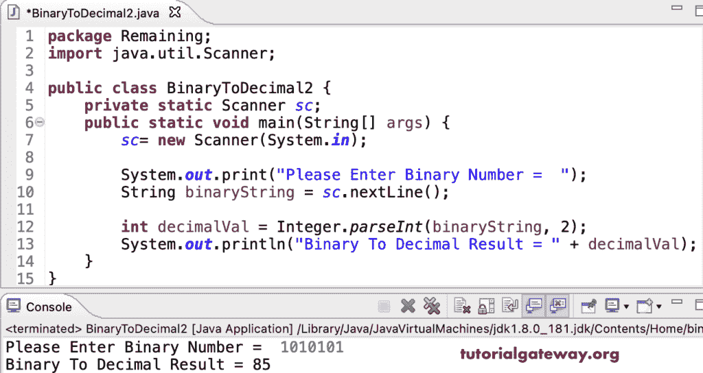

# Java 程序：将二进制转换为十进制

> 原文：<https://www.tutorialgateway.org/java-program-to-convert-binary-to-decimal/>

写一个 Java 程序，把二进制转换成十进制。在 Java 中，我们可以使用带有两个参数的 parseInt 作为第二个参数，将二进制字符串转换为十进制整数。

```java
package Remaining;

public class BinaryToDecimal1 {

	public static void main(String[] args) {

		String s1 = "1101";
		String s2 = "10101";
		String s3 = "11111";
		String s4 = "110101";

		System.out.println(Integer.parseInt(s1, 2));
		System.out.println(Integer.parseInt(s2, 2));
		System.out.println(Integer.parseInt(s3, 2));
		System.out.println(Integer.parseInt(s4, 2));
	}
}
```

```java
13
21
31
53
```

这个 [Java 示例](https://www.tutorialgateway.org/learn-java-programs/)接受二进制字符串，并将其转换为十进制数。

```java
package Remaining;

import java.util.Scanner;

public class BinaryToDecimal2 {
	private static Scanner sc;

	public static void main(String[] args) {

		sc= new Scanner(System.in);

		System.out.print("Please Enter Binary Number =  ");
		String binaryString = sc.nextLine();

		int decimalVal = Integer.parseInt(binaryString, 2);
		System.out.println("Binary To Decimal Result = " + decimalVal);
	}
}
```



使用 while 循环将二进制转换为十进制的 Java 程序。我们已经解释了 c 程序中的逻辑。

```java
package Remaining;

import java.util.Scanner;

public class BinaryToDecimal3 {
	private static Scanner sc;

	public static void main(String[] args) {

		int  binaryVal, temp, remainder, decimal = 0, n = 0;
		sc= new Scanner(System.in);

		System.out.print("Please Enter Binary Number =  ");
		binaryVal = sc.nextInt();

		temp = binaryVal;

		while(temp > 0)
		{
			remainder = temp % 10;
			decimal = (int) (decimal + remainder * Math.pow(2, n));
			temp = temp / 10;
			n++;
		}

		System.out.println("Binary " + binaryVal + " To Decimal Result = " + decimal);
	}
}
```

```java
Please Enter Binary Number =  110011001
Binary 110011001 To Decimal Result = 409

Please Enter Binary Number =  11111
Binary 11111 To Decimal Result = 31
```

使用函数将二进制转换成十进制的 Java 程序。

```java
package Remaining;

import java.util.Scanner;

public class BinaryToDecimal4 {
	private static Scanner sc;

	public static void main(String[] args) {

		sc= new Scanner(System.in);

		System.out.print("Please Enter Number =  ");
		int binaryVal = sc.nextInt();

		int decimal = binaryToDecimal(binaryVal);

		System.out.println("Result = " + decimal);
	}

	public static int binaryToDecimal(int binaryVal)
	{
		int remainder, decimal = 0, base = 1;

		while(binaryVal > 0)
		{
			remainder = binaryVal % 10;
			decimal = decimal + (remainder * base);
			binaryVal = binaryVal / 10;
			base = base * 2;
		}
		return decimal;
	}
}
```

```java
Please Enter Number =  11011010
Result = 218

Please Enter Number =  1111111
Result = 127
```