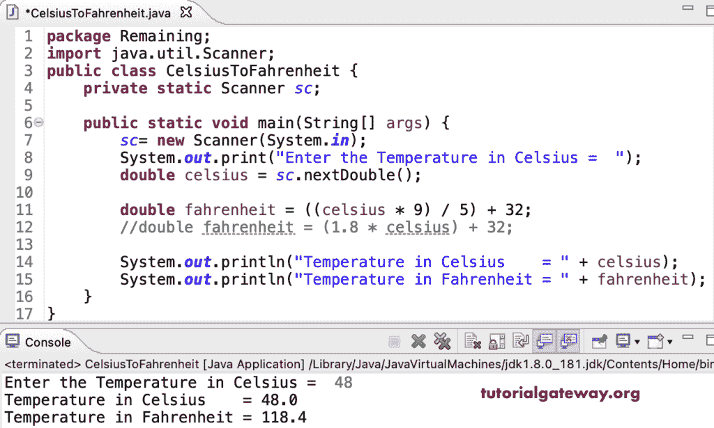

# Java 程序：将摄氏温度转换为华氏温度

> 原文：<https://www.tutorialgateway.org/java-program-to-convert-celsius-to-fahrenheit/>

写一个 Java 程序，用例子把摄氏温度转换成华氏温度。以及转换华氏= (1.8 *摄氏)+ 32 度的公式

```java
package Remaining;

import java.util.Scanner;

public class CelsiusToFahrenheit {

	private static Scanner sc;

	public static void main(String[] args) {

		sc= new Scanner(System.in);

		System.out.print("Enter the Temperature in Celsius =  ");
		double celsius = sc.nextDouble();

		double fahrenheit = ((celsius * 9) / 5) + 32;
		//double fahrenheit = (1.8 * celsius) + 32;

		System.out.println("Temperature in Celsius    = " + celsius);
		System.out.println("Temperature in Fahrenheit = " + fahrenheit);		
	}
}
```



```java
Enter the Temperature in Celsius =  36
Temperature in Celsius    = 36.0
Temperature in Fahrenheit = 96.8
```