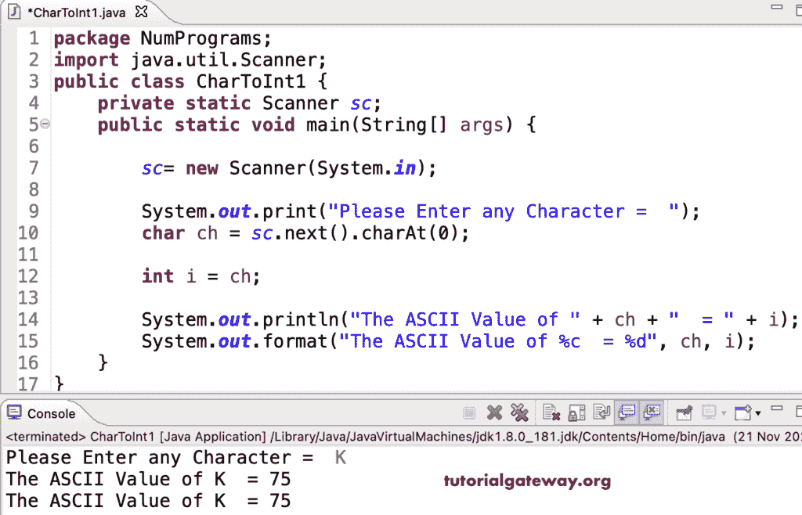

# Java 程序：将字符转换为整数

> 原文：<https://www.tutorialgateway.org/java-program-to-convert-char-to-int/>

用一个例子编写一个将 char 转换成 int 的 Java 程序。在 Java 中，我们不需要做任何事情来将字符转换为整数，因为它是隐式类型转换。相反，我们必须将字符分配给一个整数变量。这个 Java 示例接受用户输入字符，并将其转换为 int。

```java
package NumPrograms;

import java.util.Scanner;

public class CharToInt1 {
	private static Scanner sc;	

	public static void main(String[] args) {

		sc= new Scanner(System.in);	

		System.out.print("Please Enter any Character =  ");
		char ch = sc.next().charAt(0);

		int i = ch;

		System.out.println("The ASCII Value of " + ch + "  = " + i);
		System.out.format("The ASCII Value of %c  = %d", ch, i);
	}
}
```



这个 Java 示例使用 Character.getNumericValue 方法将字符转换为整数。

```java
package NumPrograms;

import java.util.Scanner;

public class CharToInt2 {
	private static Scanner sc;	

	public static void main(String[] args) {

		sc= new Scanner(System.in);	

		System.out.print("Please Enter any Character =  ");
		char ch = sc.next().charAt(0);

		int i = Character.getNumericValue(ch);

		System.out.println( i);
	}
}
```

```java
Please Enter any Character =  q
26
```

如果给定的字符是数值，那么我们可以使用[Java](https://www.tutorialgateway.org/java-tutorial/)integer . parsent 方法。但是，它接受字符串，所以我们必须将字符转换为字符串。这个 [Java 例子](https://www.tutorialgateway.org/learn-java-programs/)使用这个方法将字符转换成整数。

```java
package NumPrograms;

public class CharToInt3 {

	public static void main(String[] args) {

		char ch1 = '8';
		char ch2 = '5';

		int i = Integer.parseInt(String.valueOf(ch1));
		int j = Integer.parseInt(String.valueOf(ch2));

		System.out.println(i);
		System.out.println(j);
	}
}
```

```java
8
5
```