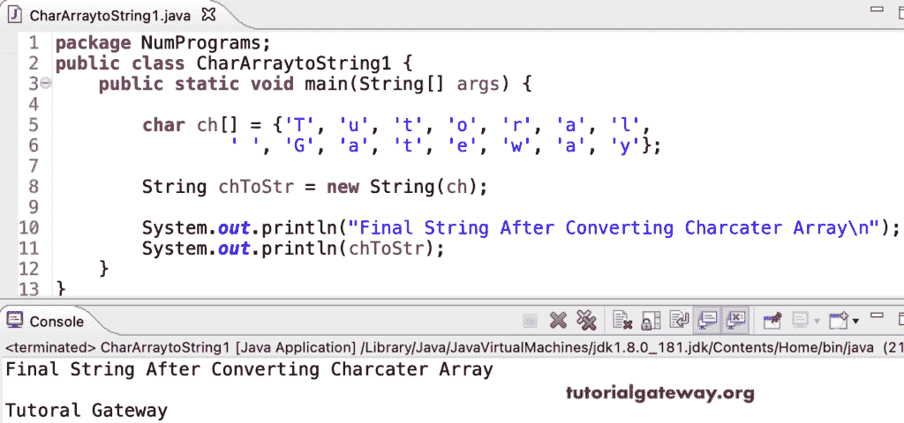

# Java 程序：将字符数组转换为字符串

> 原文：<https://www.tutorialgateway.org/java-program-to-convert-character-array-to-string/>

写一个 Java 程序，用例子把字符数组转换成字符串。在这个 Java 示例中，我们将字符数组传递给字符串构造函数，该构造函数将字符数组转换为字符串。

```java
package NumPrograms;

public class CharArraytoString1 {	

	public static void main(String[] args) {

		char ch[] = {'T', 'u', 't', 'o', 'r', 'a', 'l', ' ', 'G', 'a', 't', 'e', 'w', 'a', 'y'};

		String chToStr = new String(ch);

		System.out.println("Final String After Converting Charcater Array\n");
		System.out.println(chToStr);
	}
}
```



这个 Java 程序使用字符串复制值函数将字符数组转换成字符串。

```java
package NumPrograms;

public class CharArraytoString2 {

	public static void main(String[] args) {

		char ch[] = {'T', 'u', 't', 'o', 'r', 'a', 'l', ' ', 'G', 'a', 't', 'e', 'w', 'a', 'y'};

		String chToStr = String.copyValueOf(ch);

		System.out.println("After Converting the Charcater Array to String\n");
		System.out.println(chToStr);

	}
}
```

```java
After Converting the Charcater Array to String

Tutoral Gateway
```

使用字符串值函数将字符数组转换为字符串的 Java 程序。

```java
package NumPrograms;

public class CharArraytoString3 {

	public static void main(String[] args) {

		char ch[] = {'L', 'e', 'a', 'r', 'n', ' ', 'J', 'a', 'v', 'a'};

		String chToStr = String.valueOf(ch);

		System.out.println("After Converting the Charcater Array to String\n");
		System.out.println(chToStr);

	}
}
```

```java
After Converting the Charcater Array to String

Learn Java
```

在这个 [Java 示例](https://www.tutorialgateway.org/learn-java-programs/)中，我们使用 for 循环来迭代字符数组，并将每个字符追加到字符串生成器中。接下来，我们将字符串生成器转换为字符串。

```java
package NumPrograms;

public class CharArraytoString4 {

	public static void main(String[] args) {

		char ch[] = {'L', 'e', 'a', 'r', 'n', ' ', 'J', 'a', 'v', 'a'};

		StringBuilder sb = new StringBuilder();

		for(int i = 0; i < ch.length; i++)
		{
			sb.append(ch[i]);
		}

		String chToStr = sb.toString();

		System.out.println("After Converting the Charcater Array to String\n");
		System.out.println(chToStr);

	}
}
```

```java
After Converting the Charcater Array to String

Learn Java
```