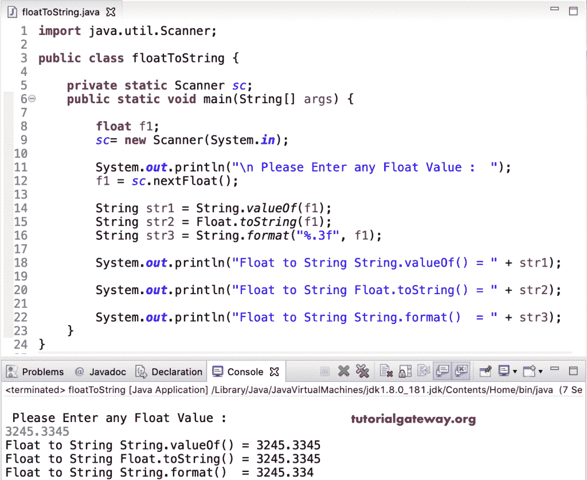

# Java 程序：将浮点转换为字符串

> 原文：<https://www.tutorialgateway.org/java-program-to-convert-float-to-string/>

本文展示了如何编写一个 Java 程序来将浮点转换为字符串。在 Java 中，我们可以使用传统的 String.valueOf(f)函数、Float.toString()或 String.format()函数将 Float 转换为 string。

在这个 Java 例子中，我们声明了两个浮点值。接下来，我们使用 String.valueOf()函数将浮点值转换为字符串。然后，我们打印这些转换后的字符串数据作为输出。

```java
public class floatToString {

	public static void main(String[] args) {

		float f1 = 102.53F;
		float f2 = 22.96F;

		String s1 = String.valueOf(f1);
		String s2 = String.valueOf(f2);

		System.out.println("String.valueOf(f1) result = " + s1);
		System.out.println("String.valueOf(f2) result = " + s2);
	}
}
```

```java
String.valueOf(f1) result = 102.53
String.valueOf(f2) result = 22.96
```

## Java 将浮点转换为字符串

这个 Java 示例与上面的相同。但是，我们使用 toString()函数将浮点值转换为字符串数据类型。

```java
public class floatToString {

	public static void main(String[] args) {

		float f1 = 29.53F;
		float f2 = 12.06F;

		String s1 = Float.toString(f1);
		String s2 = Float.toString(f2);

		System.out.println("Float.toString(f1) result = " + s1);
		System.out.println("Float.toString(f2) result = " + s2);
	}
}
```

```java
Float.toString(f1) result = 29.53
Float.toString(f2) result = 12.06
```

这次我们使用的是带有必需格式说明符的 String.format()函数，即%f。

```java
public class floatToString {

	public static void main(String[] args) {

		float f1 = 1459.2223F;
		float f2 = 90.68764F;

		String s1 = String.format("%.3f", f1);
		String s2 = String.format("%.2f", f2);

		System.out.println("F1 Formatted to Str = " + s1);
		System.out.println("F2 Formatted to Str = " + s2);
	}
}
```

```java
F1 Formatted to Str = 1452.222
F2 Formatted to Str = 90.69
```

### 将浮点转换为字符串的 Java 程序示例 4

这个 Java Float to string [程序](https://www.tutorialgateway.org/learn-java-programs/)允许用户输入值。接下来，我们在用户给定的值上使用了所有三个函数 valueOf(f)、format()和 toString()。

```java
import java.util.Scanner;

public class floatToString {

	private static Scanner sc;
	public static void main(String[] args) {

		float f1;
		sc= new Scanner(System.in);

		System.out.println("\n Please Enter any Float Value :  ");
		f1 = sc.nextFloat();

		String str1 = String.valueOf(f1);
		String str2 = Float.toString(f1);
		String str3 = String.format("%.3f", f1);

		System.out.println("Float f1 Converted to String Value = " + str1);

		System.out.println("Float f1 Converted to String Value = " + str2);

		System.out.println("Float f1 Converted to String Value = " + str3);
	}
}
```

