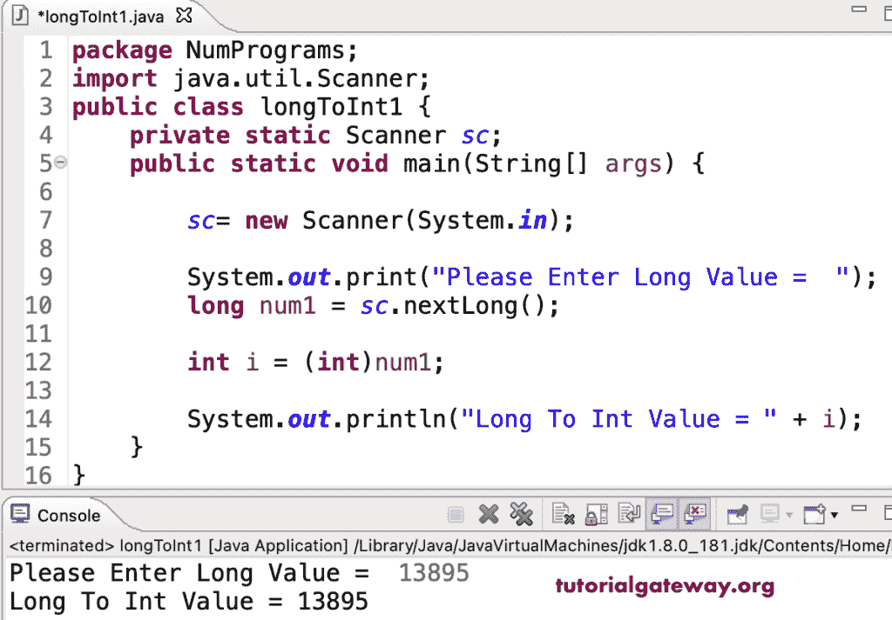

# Java 程序：将长整型转换为整型

> 原文：<https://www.tutorialgateway.org/java-program-to-convert-long-to-int/>

编写一个 Java 程序，将 long 转换为 int 或 integer。在 Java 中，我们必须通过在值之前放置 int 来显式地将 long 转换为整数，因为 long 是比整数更大的数据类型。

```java
package NumPrograms;

import java.util.Scanner;

public class longToInt1 {
	private static Scanner sc;	

	public static void main(String[] args) {

		sc= new Scanner(System.in);	

		System.out.print("Please Enter Long Value =  ");
		long num1 = sc.nextLong();

		int i = (int)num1;

		System.out.println("Long To Int Value = " + i);
	}
}
```



在 Java 中，我们还可以使用 intValue 方法将长数据类型转换为整数。

```java
package NumPrograms;

import java.util.Scanner;

public class longToInt2 {
	private static Scanner sc;	

	public static void main(String[] args) {

		Long num1 = new Long(24890);
		int i = num1.intValue();
		System.out.println("Long To Int Value = " + i);

		sc= new Scanner(System.in);	

		System.out.print("Please Enter Long Value =  ");
		Long num2 = sc.nextLong();

		int j = num2.intValue();

		System.out.println("Long To Int Value = " + j);
	}
}
```

```java
Long To Int Value = 24890
Please Enter Long Value =  2135
Long To Int Value = 2135
```

这个 [Java 例子](https://www.tutorialgateway.org/learn-java-programs/)使用数学 toIntExact 方法将 long 转换为 int 或整数。

```java
package NumPrograms;

import java.util.Scanner;

public class longToInt3 {
	private static Scanner sc;	

	public static void main(String[] args) {

		sc= new Scanner(System.in);	

		System.out.print("Please Enter Long Value =  ");
		long num1 = sc.nextLong();

		int i = Math.toIntExact(num1);

		System.out.println("Long To Int Value = " + i);
	}
}
```

```java
Please Enter Long Value =  1345698
Long To Int Value = 1345698
```