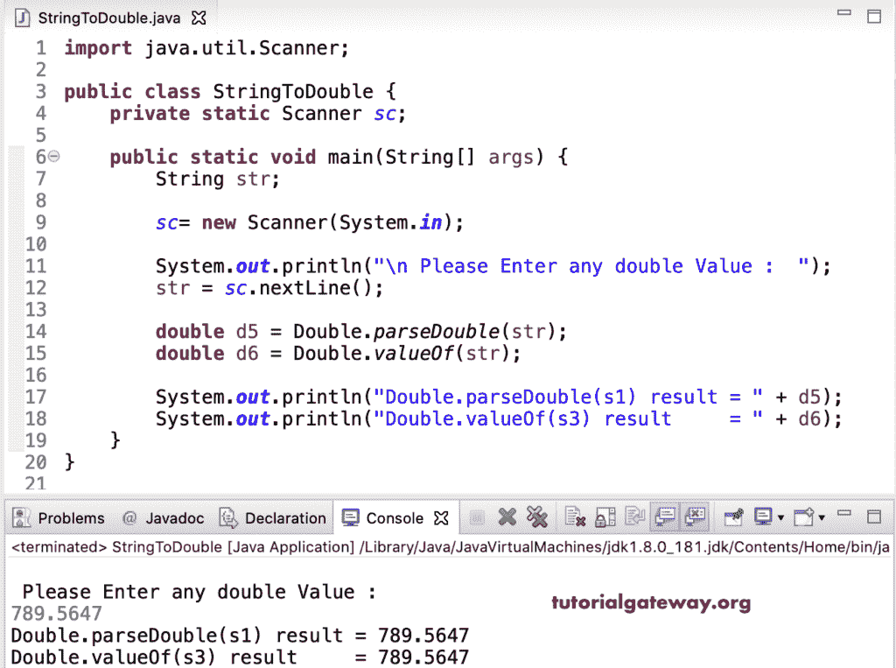

# Java 程序：将字符串转换为双精度

> 原文：<https://www.tutorialgateway.org/java-program-to-convert-string-to-double/>

本文展示了如何编写一个 Java 程序来将字符串转换为 Double。在 Java 中，我们可以使用 parseDouble()函数和 Double.valueOf()函数将字符串转换为 Double。在这个 Java 例子中，我们声明了两个文本值。接下来，我们使用 Double.parseDouble()函数将字符串值转换为 Double。注意，如果您解析文本输入，parseDouble()函数将抛出一个错误。

```java
public class StringToDouble {

	public static void main(String[] args) {
		String s1 = "111.456";
		String s2 = "2233.9821";

		double d1 = Double.parseDouble(s1);
		double d2 = Double.parseDouble(s2);

		System.out.println("Double.parseDouble(s1) result = " + d1);
		System.out.println("Double.parseDouble(s1) result = " + d2);
	}
}
```

```java
Double.parseDouble(s1) result = 111.456
Double.parseDouble(s1) result = 2233.9821
```

## Java 字符串到双程序

这个 [Java](https://www.tutorialgateway.org/java-tutorial/) 双例同上。但是，我们使用了 Double.valueOf()函数将字符串值转换为 Double 数据类型。

```java
public class StringToDouble {

	public static void main(String[] args) {
		String s3 = "909.876";
		String s4 = "1430.34";

		double d3 = Double.valueOf(s3);
		double d4 = Double.valueOf(s4);

		System.out.println("Double.valueOf(s3) result  = " + d3);
		System.out.println("Double.valueOf(s4) result  = " + d4);
	}
}
```

```java
Double.valueOf(s3) result  = 909.876
Double.valueOf(s4) result  = 1430.34
```

### 将字符串转换为双精度的 Java 程序示例 3

这个 Java 字符串到 Double [程序](https://www.tutorialgateway.org/learn-java-programs/)允许用户输入任何文本。接下来，我们对该用户给定的字符串值使用了 Double.parseDouble()函数和 Double.valueOf()函数。

```java
import java.util.Scanner;

public class StringToDouble {
	private static Scanner sc;

	public static void main(String[] args) {
		String str;

		sc= new Scanner(System.in);

		System.out.println("\n Please Enter any double Value :  ");
		str = sc.nextLine();

		double d5 = Double.parseDouble(str);
		double d6 = Double.valueOf(str);

		System.out.println("Double.parseDouble(s1) result = " + d5);
		System.out.println("Double.valueOf(s3) result     = " + d6);
	}
}
```

