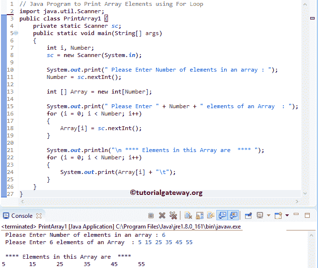

# Java 程序：打印数组元素

> 原文：<https://www.tutorialgateway.org/java-program-to-print-array-elements/>

编写一个 Java 程序来打印数组元素。或者，编写一个 Java 程序，使用 For 循环、While 循环和函数打印数组中的元素，每个函数都有一个例子。

## 使用 For 循环打印数组元素的 Java 程序

这个 Java 程序允许用户输入数组的大小和项目。接下来，我们使用 For 循环来迭代这个数组中的每个元素，并打印那些数组元素。

```java
// Java Program to Print Array Elements using For Loop
import java.util.Scanner;

public class PrintArray1 {
	private static Scanner sc;
	public static void main(String[] args) 
	{
		int i, Number;
		sc = new Scanner(System.in);

		System.out.print(" Please Enter Number of elements in an array : ");
		Number = sc.nextInt();	

		int [] Array = new int[Number];

		System.out.print(" Please Enter " + Number + " elements of an Array  : ");
		for (i = 0; i < Number; i++)
		{
			Array[i] = sc.nextInt();
		}     

		System.out.println("\n **** Elements in this Array are  **** ");
		for (i = 0; i < Number; i++)
		{
			System.out.print(Array[i] + "\t");
		}
	}
}
```



这里，Java [For Loop](https://www.tutorialgateway.org/java-for-loop/) 确保数字在 0 和最大大小值之间。在这个例子中，它是从 0 到 7。

```java
for(i = 0; i < Size; i ++)
```

第一次迭代:对于(I = 0；0 < 6; 0++)
条件为真。因此，编译器打印这个[数组](https://www.tutorialgateway.org/java-array/)中的第一个元素(6)

第二次迭代:对于(I = 1；1 < 6; 1++)
条件为真–编译器打印第二个 elemen (15)

Java For 循环第三次迭代:For(I = 2；2 < 6; 2++)
条件为真。于是， [Java](https://www.tutorialgateway.org/java-tutorial/) 编译器打印出第三个第二值(25)

第四次迭代:for(I = 3；3 < 6; 3++)
条件为真。因此，它打印第四个值(35)

第五次迭代:for(I = 4；4 < 6; 4++)
条件为真。于是，Java 编译器打印第四个值(45)

第六次迭代:for(I = 5；5 < 6; 5++)
条件为真。因此，它打印第四个值(55)

第七次迭代:for(I = 6；6 < 6; 6++)
条件为假。因此，编译器从 for 循环中退出

## 使用 While 循环打印数组元素的 Java 程序

这个[程序](https://www.tutorialgateway.org/learn-java-programs/)同上，但是这次我们使用了 [While Loop](https://www.tutorialgateway.org/java-while-loop/) 来打印数组项目

```java
import java.util.Scanner;

public class PrintArray2 {
	private static Scanner sc;
	public static void main(String[] args) 
	{
		int i = 0, j = 0, Number;
		sc = new Scanner(System.in);

		System.out.print(" Please Enter Number of elements in an array : ");
		Number = sc.nextInt();	

		int [] Array = new int[Number];

		System.out.print(" Please Enter " + Number + " elements of an Array  : ");
		while (i < Number)
		{
			Array[i] = sc.nextInt();
			i++;
		}     

		System.out.println("\n **** Elements in this Array are  **** ");
		while (j < Number)
		{
			System.out.print(Array[j] + "\t");
			j++;
		}
	}
}
```

```java
 Please Enter Number of elements in an array : 10
 Please Enter 10 elements of an Array  : 10 20 30 540 60 876 11 44 89 13

 **** Elements in this Array are  **** 
10	20	30	540	60	876	11	44	89	13 
```

## 使用函数打印数组元素

这个显示数组元素的 Java 程序与第一个例子相同。然而，我们使用了一个单独的 Java 方法来放置显示数组项的逻辑。

```java
import java.util.Scanner;

public class PrintArray3 {
	private static Scanner sc;
	public static void main(String[] args) 
	{
		int i, Number;
		sc = new Scanner(System.in);

		System.out.print(" Please Enter Total Numbers  : ");
		Number = sc.nextInt();	

		int [] Array = new int[Number];

		System.out.print(" Please Enter " + Number + " Items   : ");
		for (i = 0; i < Number; i++)
		{
			Array[i] = sc.nextInt();
		}     
		printAttay(Number, Array);
	}

	public static void printAttay(int Number, int[] Array)
	{
		int i;

		System.out.println("\n **** Items are  **** ");
		for (i = 0; i < Number; i++)
		{
			System.out.println(" Element at Array["+ i +"] = " + Array[i]);
		}
	}
}
```

```java
 Please Enter Total Numbers : 5
 Please Enter 5 Items  : 12 24 54 65 78

 **** Items are  **** 
 Item at Array[0] = 12
 Item at Array[1] = 24
 Item at Array[2] = 54
 Item at Array[3] = 65
 Item at Array[4] = 78
```

## 使用递归方法打印数组元素

这个 Java 程序和上面的一样。但是这次，我们用更新的值递归地调用打印数组元素方法。

```java
import java.util.Scanner;

public class PrintArray4 {
	private static Scanner sc;
	public static void main(String[] args) 
	{
		int i, Number;
		sc = new Scanner(System.in);

		System.out.print(" Please Enter Size : ");
		Number = sc.nextInt();	

		int [] Array = new int[Number];

		System.out.print(" Please Enter " + Number + " Items  : ");
		for (i = 0; i < Number; i++)
		{
			Array[i] = sc.nextInt();
		}     
		printAttay(Array, 0, Number);
	}

	public static void printAttay(int[] Array, int Start, int Size)
	{
		if(Start >= Size)
		{
			return;
		}

		System.out.println(" Element at Arr["+ Start +"] = " + Array[Start]);
		printAttay(Array, Start + 1, Size);
	}
}
```

```java
 Please Enter Size : 6
 Please Enter 6 Items  : 3 6 9 12 15 18
 Element at Arr[0] = 3
 Element at Arr[1] = 6
 Element at Arr[2] = 9
 Element at Arr[3] = 12
 Element at Arr[4] = 15
 Element at Arr[5] = 18
```