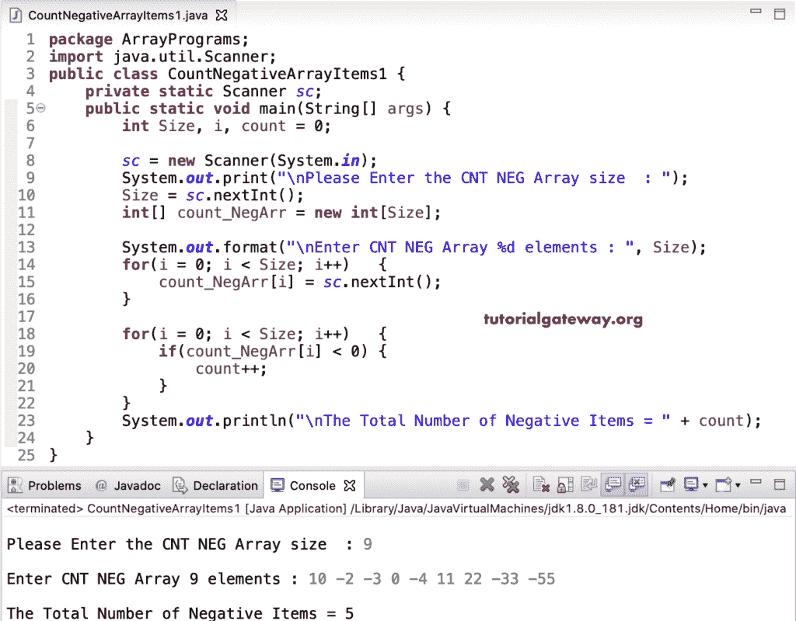

# Java 程序：计算负数组数

> 原文：<https://www.tutorialgateway.org/java-program-to-count-negative-array-numbers/>

用一个例子写一个计算负数组数的 Java 程序。或者如何编写一个 Java 程序来计算并返回给定数组中的负值或项目。

在这个 [Java](https://www.tutorialgateway.org/java-tutorial/) 计数负数组数的例子中，我们使用 while 循环来迭代 count_NegArr 数组并计数负项(一个小于零的数)并打印它。

```java
package ArrayPrograms;

public class CountNegativeArrayItems {

	public static void main(String[] args) {
		int i = 0, count = 0;
		int[] count_NegArr = {-40, 15, -4, 11, -8, -13, 22, 16, -11, -99, 55, 18, -60};

		while(i < count_NegArr.length) 
		{
			if(count_NegArr[i] < 0) {
				count++;
			}
			i++;
		}
		System.out.println("\nThe Total Number of Negative Array Items = " + count);
	}
}
```

Java 计算数组输出中的负数

```java
The Total Number of Negative Array Items = 7
```

## 用 For 循环计算负数组数的 Java 程序

```java
package ArrayPrograms;

import java.util.Scanner;

public class CountNegativeArrayItems1 {
	private static Scanner sc;

	public static void main(String[] args) {
		int Size, i, count = 0;
		int[] count_NegArr = new int[10];

		sc = new Scanner(System.in);

		System.out.print("\nPlease Enter the CNT NEG Array size  : ");
		Size = sc.nextInt();

		System.out.format("\nEnter CNT NEG Array %d elements : ", Size);
		for(i = 0; i < Size; i++) 
		{
			count_NegArr[i] = sc.nextInt();
		}

		for(i = 0; i < Size; i++) 
		{
			if(count_NegArr[i] < 0) {
				count++;
			}
		}
		System.out.println("\nThe Total Number of Negative Array Items = " + count);
	}
}
```



在这个计数负数组项[的 Java 例子](https://www.tutorialgateway.org/learn-java-programs/)中，我们创建了一个单独的 CountNegativeElement 函数来计数并返回负的[数组](https://www.tutorialgateway.org/java-array/)项。

```java
package ArrayPrograms;

import java.util.Scanner;

public class CountNegativeArrayItems2 {
	private static Scanner sc;

	public static void main(String[] args) {
		int Size, i;

		sc = new Scanner(System.in);

		System.out.print("\nPlease Enter the CNT NEG Array size  : ");
		Size = sc.nextInt();

		int[] count_NegArr = new int[Size];
		System.out.format("\nEnter CNT NEG Array %d elements : ", Size);
		for(i = 0; i < Size; i++) 
		{
			count_NegArr[i] = sc.nextInt();
		}

		int count = CountNegativeElement(count_NegArr, Size );

		System.out.println("\nThe Total Number of Negative Items = " + count);
	}

	public static int CountNegativeElement(int[] count_NegArr, int size ) {
		int i, count = 0;

		for(i = 0; i < size; i++) 
		{
			if(count_NegArr[i] < 0) {
				count++;
			}
		}
		return count;
	}
}
```

Java 计数数组中的负数使用 for 循环和函数输出

```java
Please Enter the CNT NEG Array size  : 11

Enter CNT NEG Array 11 elements : -3 -5 0 -8 -11 8 6 99 -22 -55 4

The Total Number of Negative Items = 6
```