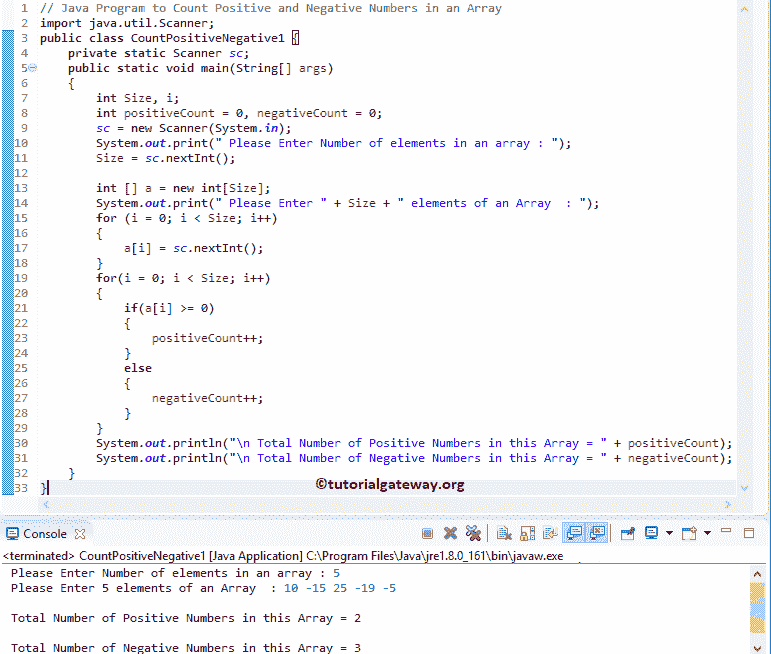

# Java 程序：统计数组中正数和负数

> 原文：<https://www.tutorialgateway.org/java-program-to-count-positive-and-negative-numbers-in-an-array/>

编写一个 Java 程序，使用 For 循环、While 循环和带有示例的函数来计算数组中的正数和负数。

## 使用 For 循环计算数组中正数和负数的 Java 程序

这个程序允许用户输入尺寸和一维数组元素。接下来，它将使用 For 循环计算该数组中正数和负数的总数。

```java
// Java Program to Count Positive and Negative Numbers in an Array
import java.util.Scanner;
public class CountPositiveNegative1 {
	private static Scanner sc;
	public static void main(String[] args) 
	{
		int Size, i;
		int positiveCount = 0, negativeCount = 0;
		sc = new Scanner(System.in);

		System.out.print(" Please Enter Number of elements in an array : ");
		Size = sc.nextInt();	

		int [] a = new int[Size];

		System.out.print(" Please Enter " + Size + " elements of an Array  : ");
		for (i = 0; i < Size; i++)
		{
			a[i] = sc.nextInt();
		}   

		for(i = 0; i < Size; i++)
		{
			if(a[i] >= 0)
			{
				positiveCount++;
			}
			else
			{
				negativeCount++;
			}
		}		
		System.out.println("\n Total Number of Positive Numbers in this Array = " + positiveCount);
		System.out.println("\n Total Number of Negative Numbers in this Array = " + negativeCount);
	}
}
```



首先，我们声明了用户指定大小的一维数组。接下来，我们使用 For 循环将用户输入的值存储为[数组](https://www.tutorialgateway.org/java-array/)元素，如[0]、a[1]、a[2]、a[3]、a[4]

```java
for (i = 0; i < Size; i++)
{
	a[i] = sc.nextInt();
}
```

在 Java 的下一行中，我们还有一个 for 循环来迭代每个元素。在 [For 循环](https://www.tutorialgateway.org/java-for-loop/)中，我们使用了 [If 语句](https://www.tutorialgateway.org/java-if-statement/)。

任何大于或等于 0 ^ 2 的数字都是正数。If 语句将检查相同的。

*   如果条件为真，则为正数，java 编译器将[递增](https://www.tutorialgateway.org/increment-and-decrement-operators-in-java/) positiveCount。
*   如果条件为假，则它是负数。java 编译器将递增否定计数。

```java
for(i = 0; i < Size; i++)
{
	if(a[i] >= 0)  {
		positiveCount++;
	}
	else  {
		negativeCount++;
	}
}
```

用户插入的值是[5] = {10，-15，25，-19，-5}}

第一次迭代:对于(I = 0；0< 5; 0++)
I 的值为 0，条件(i < 5)为真。因此，它将开始执行 If 语句。

if(a[I]> = 0)= > if(a[0]> = 0)
if(10>= 0)–条件为真。所以，positiveCount 将变成 1

第二次迭代:对于(I = 1；1 < 5; 1++)
条件(i < 5)为真。

如果(a[1] >= 0)
如果(-15>= 0)–条件为假。所以，负数将变成 1

对剩余的迭代进行同样的操作，直到条件(i < 5)失败。

## 使用 While 循环计算数组中正数和负数的 Java 程序

这个[程序](https://www.tutorialgateway.org/learn-java-programs/)同上，但是这次我们使用了 [While Loop](https://www.tutorialgateway.org/java-while-loop/) 来计算一个数组中的正数和负数。

```java
// Java Program to Count Positive and Negative Numbers in an Array using While Loop
import java.util.Scanner;
public class CountPositiveNegative2 {
	private static Scanner sc;
	public static void main(String[] args) 
	{
		int Size, i = 0, j = 0;
		int positiveCount = 0, negativeCount = 0;
		sc = new Scanner(System.in);

		System.out.print(" Please Enter Number of elements in an array : ");
		Size = sc.nextInt();	

		int [] a = new int[Size];

		System.out.print(" Please Enter " + Size + " elements of an Array  : ");
		while (i < Size)
		{
			a[i] = sc.nextInt();
			i++;
		}   

		while (j < Size)
		{
			if(a[j] >= 0)
			{
				positiveCount++;
			}
			else
			{
				negativeCount++;
			}
			j++;
		}		
		System.out.println("\n Total Number of Positive Numbers in this Array = " + positiveCount);
		System.out.println("\n Total Number of Negative Numbers in this Array = " + negativeCount);
	}
}
```

Java 使用 While 循环输出计数正负数组项

```java
 Please Enter Number of elements in an array : 10
 Please Enter 10 elements of an Array  : 4 -8 -12 15 -17 -25 105 110 -89 77

 Total Number of Positive Numbers in this Array = 5

 Total Number of Negative Numbers in this Array = 5
```

## 用方法计算数组中正数和负数的 Java 程序

这个[程序](https://www.tutorialgateway.org/learn-java-programs/)和第一个例子一样。但是这次我们创建了一个单独的方法来计算正数，另一个方法来计算负数。

```java
// Java Program to Count Positive and Negative Numbers in an Array
import java.util.Scanner;
public class CountPositiveNegative3 {
	private static Scanner sc;
	public static void main(String[] args) 
	{
		int Size, i;
		int positiveCount = 0, negativeCount = 0;
		sc = new Scanner(System.in);

		System.out.print(" Please Enter Number of elements in an array : ");
		Size = sc.nextInt();	

		int [] a = new int[Size];

		System.out.print(" Please Enter " + Size + " elements of an Array  : ");
		for (i = 0; i < Size; i++)
		{
			a[i] = sc.nextInt();
		}   

		positiveCount = CountPositive(a, Size);
		negativeCount = CountNegative(a, Size);		
		System.out.println("\n Total Number of Positive Numbers in this Array = " + positiveCount);
		System.out.println(" Total Number of Negative Numbers in this Array = " + negativeCount);

	}
	public static int CountPositive(int [] a, int Size)
	{
		int i, positiveCount = 0;
		System.out.print("\n List of Positive Numbers in this Array are :");  
		for(i = 0; i < Size; i++)
		{
			if(a[i] >= 0)
			{
				System.out.print(a[i] +" ");
				positiveCount++;
			}
		}
		return positiveCount;
	}
	public static int CountNegative(int [] a, int Size)
	{
		int i, negativeCount = 0;
		System.out.print("\n List of Negative Numbers in this Array are :");  
		for(i = 0; i < Size; i++)
		{
			if(a[i] < 0)
			{
				System.out.print(a[i] + " ");
				negativeCount++;
			}
		}
		return negativeCount;
	}
}
```

```java
 Please Enter Number of elements in an array : 10
 Please Enter 10 elements of an Array  : 10 -25 -14 8 -19 -78 105 -77 -11 4

 List of Positive Numbers in this Array are :10 8 105 4 
 List of Negative Numbers in this Array are :-25 -14 -19 -78 -77 -11 
 Total Number of Positive Numbers in this Array = 4
 Total Number of Negative Numbers in this Array = 6
```