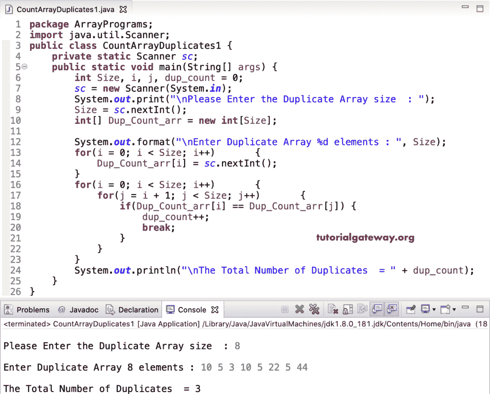

# Java 程序：计算数组重复

> 原文：<https://www.tutorialgateway.org/java-program-to-count-array-duplicates/>

用一个例子写一个计算数组重复的 Java 程序。或者如何编写一个 Java 程序来查找和计数给定数组中的重复项。

在这个 [Java](https://www.tutorialgateway.org/java-tutorial/) 计数重复数组数量的例子中，我们使用 while 循环来迭代 Dup_Count_arrr 数组，并计数重复的项目(项目显示了不止一次)并打印总数。

```java
package ArrayPrograms;

public class CountArrayDuplicates {

	public static void main(String[] args) {

		int i = 0, j, dup_count = 0;
		int[] Dup_Count_arr = {10, 15, 25, 10, 8, 12, 10, 15, 55, 10, 60};

		while(i < Dup_Count_arr.length) 
		{
			j = i + 1;
			while(j < Dup_Count_arr.length)
			{		
				if(Dup_Count_arr[i] == Dup_Count_arr[j]) {
					dup_count++;
					break;
				}
				j++;
			}
			i++;
		}
		System.out.println("\nThe Total Number of Duplicates  = " + dup_count);
	}
}
```

```java
The Total Number of Duplicates  = 4
```

## 使用 For 循环计数数组中重复项的 Java 程序

```java
package ArrayPrograms;

import java.util.Scanner;

public class CountArrayDuplicates1 {
	private static Scanner sc;

	public static void main(String[] args) {
		int Size, i, j, dup_count = 0;

		sc = new Scanner(System.in);

		System.out.print("\nPlease Enter the Duplicate Array size  : ");
		Size = sc.nextInt();

		int[] Dup_Count_arr = new int[Size];

		System.out.format("\nEnter Duplicate Array %d elements : ", Size);
		for(i = 0; i < Size; i++) 
		{
			Dup_Count_arr[i] = sc.nextInt();
		}

		for(i = 0; i < Size; i++) 
		{
			for(j = i + 1; j < Size; j++)
			{
				if(Dup_Count_arr[i] == Dup_Count_arr[j]) {
					dup_count++;
					break;
				}
			}
		}
		System.out.println("\nThe Total Number of Duplicates  = " + dup_count);
	}
}
```



在 [Java 示例](https://www.tutorialgateway.org/learn-java-programs/)中的这个计数重复数组项目中，我们创建了一个单独的函数 CountDuplicateElement 来计数和返回重复计数。

```java
package ArrayPrograms;

import java.util.Scanner;

public class CountArrayDuplicates2 {
	private static Scanner sc;

	public static void main(String[] args) {
		int Size, i;

		sc = new Scanner(System.in);

		System.out.print("\nPlease Enter the Duplicate Array size  : ");
		Size = sc.nextInt();

		int[] Dup_Count_arr = new int[Size];

		System.out.format("\nEnter Duplicate Array %d elements : ", Size);
		for(i = 0; i < Size; i++) 
		{
			Dup_Count_arr[i] = sc.nextInt();
		}

		int dup_count = CountDuplicateElement(Dup_Count_arr, Size);

		System.out.println("\nThe Total Number of Duplicates  = " + dup_count);
	}

	public static int CountDuplicateElement(int[] Dup_Count_arr, int Size ) {
		int i, j, dup_count = 0;

		for(i = 0; i < Size; i++) 
		{
			for(j = i + 1; j < Size; j++)
			{
				if(Dup_Count_arr[i] == Dup_Count_arr[j]) {
					dup_count++;
					break;
				}
			}
		}
		return dup_count;
	}
}
```

```java
 Please Enter the Duplicate Array size  : 11

Enter Duplicate Array 11 elements : 4 22 19 4 22 11 4 19 9 19 99

The Total Number of Duplicates  = 5
```