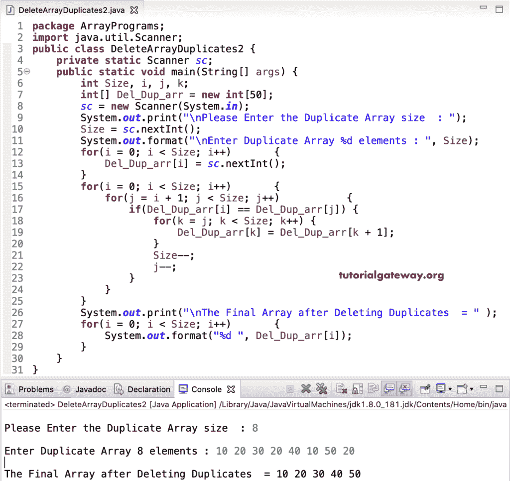

# Java 程序：删除数组重复项

> 原文：<https://www.tutorialgateway.org/java-program-to-delete-array-duplicates/>

写一个 Java 程序删除数组重复的例子。或者如何编写一个 Java 程序来查找和删除给定数组中的重复项。

在这个 [Java](https://www.tutorialgateway.org/java-tutorial/) 删除重复数组编号的例子中，我们使用了 [while 循环](https://www.tutorialgateway.org/java-while-loop/)来迭代 Dup_Count_arrr。然后，删除重复的项目(显示多次的值)并打印最终的数组。

```java
package ArrayPrograms;

public class DeleteArrayDuplicates1 {

	public static void main(String[] args) {

		int i = 0, j, k;
		int[] Dup_Count_arr = {10, 15, 25, 10, 8, 12, 10, 15, 55, 10, 60};

		int Size = Dup_Count_arr.length - 1;

		while(i < Size) 
		{
			j = i + 1;
			while(j < Size)
			{		
				if(Dup_Count_arr[i] == Dup_Count_arr[j]) {
					k = j;
					while(k < Size) {
						Dup_Count_arr[k] = Dup_Count_arr[k + 1];
						k++;
					}
					Size--;
					j--;
				}
				j++;
			}
			i++;
		}
		System.out.print("\nThe Final Array after Deleting Duplicates  = " );
		for(i = 0; i < Size; i++) 
		{
			System.out.format("%d ", Dup_Count_arr[i]);
		}
	}
}
```

```java
The Final Array after Deleting Duplicates  = 10 15 25 8 12 55 
```

## 使用 For 循环删除数组中重复项的 Java 程序

```java
package ArrayPrograms;

import java.util.Scanner;

public class DeleteArrayDuplicates2 {
	private static Scanner sc;

	public static void main(String[] args) {
		int Size, i, j, k;
		int[] Del_Dup_arr = new int[50];

		sc = new Scanner(System.in);

		System.out.print("\nPlease Enter the Duplicate Array size  : ");
		Size = sc.nextInt();

		System.out.format("\nEnter Duplicate Array %d elements : ", Size);
		for(i = 0; i < Size; i++) 
		{
			Del_Dup_arr[i] = sc.nextInt();
		}

		for(i = 0; i < Size; i++) 
		{
			for(j = i + 1; j < Size; j++)
			{
				if(Del_Dup_arr[i] == Del_Dup_arr[j]) {
					for(k = j; k < Size; k++) {
						Del_Dup_arr[k] = Del_Dup_arr[k + 1];
					}
					Size--;
					j--;
				}
			}
		}
		System.out.print("\nThe Final Array after Deleting Duplicates  = " );
		for(i = 0; i < Size; i++) 
		{
			System.out.format("%d ", Del_Dup_arr[i]);
		}
	}
}
```



在这个 [Java 代码](https://www.tutorialgateway.org/learn-java-programs/)的例子中，我们创建了一个单独的函数 DeleteDuplicateArrayItems 来查找和删除重复的值，并打印最终的[数组](https://www.tutorialgateway.org/java-array/)。

```java
package ArrayPrograms;

import java.util.Scanner;

public class DeleteArrayDuplicates3 {
	private static Scanner sc;

	public static void main(String[] args) {
		int Sz, i;
		int[] Del_Dup_arr = new int[50];

		sc = new Scanner(System.in);

		System.out.print("\nPlease Enter the size  : ");
		Sz = sc.nextInt();

		System.out.format("\nEnter %d elements : ", Sz);
		for(i = 0; i < Sz; i++) 
		{
			Del_Dup_arr[i] = sc.nextInt();
		}		
		DeleteDuplicateArrayItems(Del_Dup_arr, Sz);
	}
	public static void DeleteDuplicateArrayItems(int[] Del_Dup_arr, int Sz) {
		int i, j, count = 0;
		int[] x = new int[50];

		for(i = 0; i < Sz; i++) 
		{
			for(j = 0; j < count; j++)
			{
				if(Del_Dup_arr[i] == x[j]) {
					break;
				}
			}
			if(j == count) {
				x[count] = Del_Dup_arr[i];
				count++;
			}			
		}
		System.out.print("\nThe Final Array  = " );
		PrintArrayElement(x, count);

	}
	public static void PrintArrayElement(int[] arr, int sz) {
		int i;

		for(i = 0; i < sz; i++) 
		{
			System.out.format("%d ", arr[i]);
		}
	}
}
```

```java
Please Enter the size  : 12

Enter 12 elements : 10 20 30 10 40 10 50 20 60 40 70 30 

The Final Array  = 10 20 30 40 50 60 70 
```