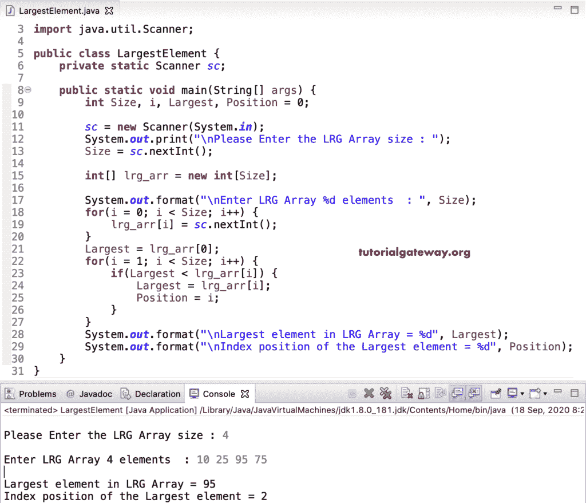

# Java 程序：寻找最大数组数

> 原文：<https://www.tutorialgateway.org/java-program-to-find-largest-array-number/>

用一个例子编写一个寻找最大数组数的 Java 程序。或者如何编写一个 Java 程序来打印或返回给定数组中最大的元素或项。

在这个 Java 最大数组数的例子中，我们允许用户输入 lrg_arr 大小和项目。接下来，我们将 lrg_arr 第一个数组项分配给最大变量。然后，我们将每个项目与这个变量进行比较。如果最大值小于任何其他 lrg_arr 项，我们用该 lrg_arr 项替换变量值。

```java
package ArrayPrograms;

import java.util.Scanner;

public class LargestElement {
	private static Scanner sc;

	public static void main(String[] args) {
		int Size, i, Largest, Position = 0;

		sc = new Scanner(System.in);		
		System.out.print("\nPlease Enter the LRG Array size : ");
		Size = sc.nextInt();

		int[] lrg_arr = new int[Size];

		System.out.format("\nEnter LRG Array %d elements  : ", Size);
		for(i = 0; i < Size; i++) {
			lrg_arr[i] = sc.nextInt();
		}
		Largest = lrg_arr[0];
		for(i = 1; i < Size; i++) {
			if(Largest < lrg_arr[i]) {
				Largest = lrg_arr[i];
				Position = i;
			}
		}
		System.out.format("\nLargest element in LRG Array = %d", Largest);
		System.out.format("\nIndex position of the Largest element = %d", Position);
	}
}
```



## 寻找最大数组数的 Java 程序示例 2

在这个 [Java](https://www.tutorialgateway.org/java-tutorial/) 例子中，我们创建了一个单独的函数来返回给定的[数组](https://www.tutorialgateway.org/java-array/)中最大的项目。请参考 [C 程序获取最高数字](https://www.tutorialgateway.org/c-program-to-find-largest-number-in-an-array/)文章了解 For 循环迭代。

```java
package ArrayPrograms;

import java.util.Scanner;

public class LargestElementUsingMethods {
	private static Scanner sc;
	static int Size, i, Largest, Position = 0;	
	public static void main(String[] args) {
		int[] lrg_arr = new int[10];

		sc = new Scanner(System.in);		
		System.out.print("\nPlease Enter the LRG size :  ");
		Size = sc.nextInt();

		System.out.format("\nEnter LRG %d elements : ", Size);
		for(i = 0; i < Size; i++) {
			lrg_arr[i] = sc.nextInt();
		}
		Largest = LargestElement(lrg_arr);
		System.out.format("\nLargest element in LRG = %d", Largest);
	}
	public static int LargestElement(int[] lrg_arr ) {
		Largest = lrg_arr[0];
		for(i = 1; i < Size; i++) {
			if(Largest < lrg_arr[i]) {
				Largest = lrg_arr[i];
				Position = i;
			}
		}
		return Largest; 
	}
}
```

```java
 Please Enter the LRG size :  7

Enter LRG 7 elements : 10 19 67 44 89 77 11

Largest element in LRG = 89
```