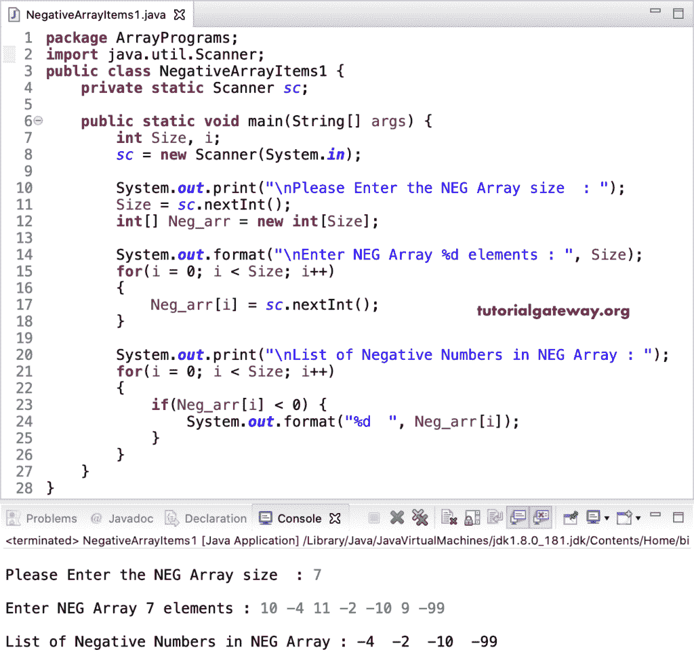

# Java 程序：打印数组中的负数

> 原文：<https://www.tutorialgateway.org/java-program-to-print-negative-array-numbers/>

用一个例子写一个打印负数组的 Java 程序。或者如何编写一个 Java 程序来查找并返回给定数组中的负项。在这个 Java 计数负数组数字的例子中，我们使用 while 循环来迭代 count_NegArr 数组并计数负项目(一个小于零的数字)，并输出相同的结果。

```java
package ArrayPrograms;

public class NegativeArrayItems {

	public static void main(String[] args) {
		int j = 0;
		int[] Neg_arr = {-40, 15, -4, 11, -8, -13, 22, 16, -11, -99, 55, 18, -60};

		System.out.print("\nList of Negative Numbers in NEG Array : ");
		while(j < Neg_arr.length) 
		{
			if(Neg_arr[j] < 0) {
				System.out.format("%d ", Neg_arr[j]);
			}
			j++;
		}
	}
}
```

Java 负数组数字使用 while 循环输出

```java
List of Negative Numbers in NEG Array : -40 -4 -8 -13 -11 -99 -60 
```

## 用 For 循环打印负数组数的 Java 程序

这个 [Java](https://www.tutorialgateway.org/java-tutorial/) 负数组项目示例允许用户输入 Neg_arr 数组大小和项目。

```java
package ArrayPrograms;

import java.util.Scanner;

public class NegativeArrayItems1 {
	private static Scanner sc;

	public static void main(String[] args) {
		int Size, i;	
		sc = new Scanner(System.in);

		System.out.print("\nPlease Enter the NEG Array size  : ");
		Size = sc.nextInt();
		int[] Neg_arr = new int[Size];

		System.out.format("\nEnter NEG Array %d elements : ", Size);
		for(i = 0; i < Size; i++) 
		{
			Neg_arr[i] = sc.nextInt();
		}

		System.out.print("\nList of Negative Numbers in NEG Array : ");
		for(i = 0; i < Size; i++) 
		{
			if(Neg_arr[i] < 0) {
				System.out.format("%d  ", Neg_arr[i]);
			}
		}
	}
}
```



在这个负数组项目 [Java 示例](https://www.tutorialgateway.org/learn-java-programs/)中，我们创建了一个单独的函数否定元素来打印给定的[数组](https://www.tutorialgateway.org/java-array/)中的负数组项目。

```java
package ArrayPrograms;

import java.util.Scanner;

public class NegativeArrayItems2 {
	private static Scanner sc;

	public static void main(String[] args) {
		int Size, i;	
		sc = new Scanner(System.in);

		System.out.print("\nPlease Enter the NEG Array size  : ");
		Size = sc.nextInt();
		int[] Neg_arr = new int[Size];

		System.out.format("\nEnter NEG Array %d elements : ", Size);
		for(i = 0; i < Size; i++) 
		{
			Neg_arr[i] = sc.nextInt();
		}

		NegativeElement(Neg_arr, Size);

	}
	public static void NegativeElement(int[] Neg_arr, int size ) {
		int i;

		System.out.print("\nList of Negative Numbers in NEG Array : ");
		for(i = 0; i < size; i++) 
		{
			if(Neg_arr[i] < 0) {
				System.out.format("%d  ", Neg_arr[i]);
			}
		}
	}
}
```

Java 负数组项目使用 For 循环和函数输出

```java
Please Enter the NEG Array size  : 9

Enter NEG Array 9 elements : -1 5 0 11 -2 -3 99 3 -5

List of Negative Numbers in NEG Array : -1  -2  -3  -5 
```