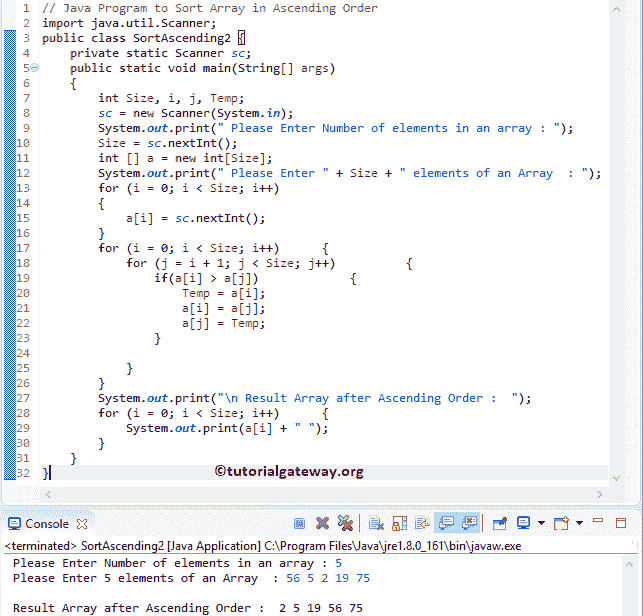

# Java 程序：按升序排列数组

> 原文：<https://www.tutorialgateway.org/java-program-to-sort-array-in-ascending-order/>

编写一个 Java 程序，在不使用内置函数和使用排序方法的情况下，以升序对数组进行排序。

## 用排序法对数组进行升序排序的 Java 程序

在这个 Java 程序中，我们使用[数组排序](https://www.tutorialgateway.org/java-array-sort/)方法对元素进行升序排序。

```java
// Java Program to Sort Array in Ascending Order
import java.util.Arrays;
import java.util.Scanner;

public class SortAscending1 {
	private static Scanner sc;
	public static void main(String[] args) 
	{
		int Size, i;
		sc = new Scanner(System.in);

		System.out.print(" Please Enter Number of elements in an array : ");
		Size = sc.nextInt();	

		int [] a = new int[Size];

		System.out.print(" Please Enter " + Size + " elements of an Array  : ");
		for (i = 0; i < Size; i++)
		{
			a[i] = sc.nextInt();
		}

		Arrays.sort(a);

		System.out.println("\n Result of a Sorted Array :  ");
		for (int Number: a)
		{
			System.out.print(Number + "  ");
		}
	}
}
```

```java
 Please Enter Number of elements in an array : 5
 Please Enter 5 elements of an Array  : 25 19 17 89 65

 Result of a Sorted Array :  
17  19  25  65  89 
```

## 用临时变量对数组进行升序排序的 Java 程序

这个 [Java 程序](https://www.tutorialgateway.org/learn-java-programs/)允许用户输入尺寸和一维[数组](https://www.tutorialgateway.org/java-array/)元素。接下来，它将使用[对循环](https://www.tutorialgateway.org/java-for-loop/)按升序对数组元素进行排序。

```java
import java.util.Scanner;

public class SortAscending2 {
	private static Scanner sc;
	public static void main(String[] args) 
	{
		int Size, i, j, Temp;
		sc = new Scanner(System.in);

		System.out.print(" Please Enter Number of elements in an array : ");
		Size = sc.nextInt();	

		int [] a = new int[Size];

		System.out.print(" Please Enter " + Size + " elements of an Array  : ");
		for (i = 0; i < Size; i++)
		{
			a[i] = sc.nextInt();
		}

		for (i = 0; i < Size; i++)
		{
			for (j = i + 1; j < Size; j++)
			{
				if(a[i] > a[j])
				{
					Temp = a[i];
					a[i] = a[j];
					a[j] = Temp;
				}

			}
		}

		System.out.print("\n Result Array after Ascending Order :  ");
		for (i = 0; i < Size; i++)
		{
			System.out.print(a[i] + " ");
		}
	}
}
```



用户插入的值是 a[5] = {56，5，2，19，75}

第一次 For 循环–第一次迭代:For(I = 0；0< 5; 0++)
I 的值为 0，条件(i < 5)为真。因此，它将进入内部或 [Java](https://www.tutorialgateway.org/java-tutorial/) 嵌套 For 循环。

第二次 For 循环–第一次迭代:For(j = 0+1；1 < 5; 1++)
条件(1 < 5)为真。因此，它将进入 [If 语句。](https://www.tutorialgateway.org/java-if-statement/)

如果(a[i] > a[j]) = >如果(56 > 5)–条件为真

Temp = a[I]= a[0]
Temp = 56

a[i] = a[j]。意思是 a[0] = a[1]
a[0] = 5

a[j] =温度
a[1] = 56

第二次 For 循环–第二次迭代:For(j = 2；2 < 5; 2++)
条件(i < 5)为真。

如果(a[i] > a[j]) = >如果(5 > 2)–条件为真

温度= a[0]
温度= 5

a[0]= a[2]
a[0]= 2

a[j] =温度
a[2] = 5

对剩余的迭代进行同样的操作，直到条件(i < 5)失败。

循环的下一步是打印排序后的元素。我建议你参考 [Java 程序打印数组元素](https://www.tutorialgateway.org/java-program-to-print-array-elements/)的文章来理解同样的

## 使用函数对数组进行升序排序的程序

本[程序](https://www.tutorialgateway.org/learn-java-programs/)同上。但是，这一次，我们使用方法分离了按升序排序数组元素的逻辑。

```java
import java.util.Scanner;

public class SortAscending3 {
	private static Scanner sc;
	public static void main(String[] args) 
	{
		int Size, i;
		sc = new Scanner(System.in);

		System.out.print(" Please Enter Number of elements : ");
		Size = sc.nextInt();	

		int [] a = new int[Size];

		System.out.print(" Please Enter " + Size + " elements  : ");
		for (i = 0; i < Size; i++)
		{
			a[i] = sc.nextInt();
		}

		SortAscending(a, Size);
		System.out.print("\n Result after Ascending Order :  ");
		printAttay(a, Size);
	}
	public static void SortAscending(int[] a, int Size)
	{
		int i, j, Temp;

		for (i = 0; i < Size; i++)
		{
			for (j = i + 1; j < Size; j++)
			{
				if(a[i] > a[j])
				{
					Temp = a[i];
					a[i] = a[j];
					a[j] = Temp;
				}			
			}
		}	
	}
	public static void printAttay(int[] Array, int Size)
	{
		int i;

		for (i = 0; i < Size; i++)
		{
			System.out.print(Array[i] + " ");
		}
	}
}
```

```java
Please Enter Number of elements : 10
 Please Enter 10 elements  : 89 56 42 25 365 14 198 241 12 5

 Result after Ascending Order :  5 12 14 25 42 56 89 198 241 365 
```