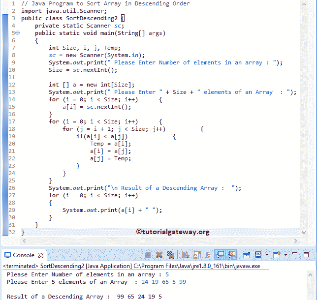

# Java 程序：按降序排序数组

> 原文：<https://www.tutorialgateway.org/java-program-to-sort-array-in-descending-order/>

编写一个 Java 程序对数组进行降序排序，不使用内置函数，并使用 Sort 方法举例说明。

## 按降序排序数组的 Java 程序

在这个程序中，我们使用 Collections.reverseOrder()和 Array.sort 方法对数组元素进行降序排序。

```java
// Java Program to Sort Array in Descending Order
import java.util.Arrays;
import java.util.Collections;
import java.util.Scanner;
import java.util.Comparator;

public class SortDescending1 {
	private static Scanner sc;
	public static void main(String[] args) 
	{
		int Size, i;
		sc = new Scanner(System.in);

		System.out.print(" Please Enter Number of elements in an array : ");
		Size = sc.nextInt();	

		Object [] a = new Object[Size];

		System.out.print(" Please Enter " + Size + " elements of an Array  : ");
		for (i = 0; i < Size; i++)
		{
			a[i] = sc.nextInt();
		}

		Comparator<Object> cms = Collections.reverseOrder();
		Arrays.sort(a, cms);

		System.out.println("\n Result of a Sorted Array :  ");
		for (Object Number: a)
		{
			System.out.print(Number + "  ");
		}
	}
}
```

```java
 Please Enter Number of elements in an array : 10
 Please Enter 10 elements of an Array  : 89 56 42 567 14 189 222 11 7 99

 Result of a Sorted Array :  
567  222  189  99  89  56  42  14  11  7 
```

请参考[数组排序](https://www.tutorialgateway.org/java-array-sort/)文章。

## 用临时变量对数组进行降序排序的 Java 程序

这个 [Java 程序](https://www.tutorialgateway.org/learn-java-programs/)允许用户输入大小和[数组](https://www.tutorialgateway.org/java-array/)元素。接下来，它将使用【循环的 T4】对数组元素进行降序排序。

```java
import java.util.Scanner;

public class SortDescending2 {
	private static Scanner sc;
	public static void main(String[] args) 
	{
		int Size, i, j, Temp;
		sc = new Scanner(System.in);

		System.out.print(" Please Enter Number of elements in an array : ");
		Size = sc.nextInt();	

		int [] a = new int[Size];

		System.out.print(" Please Enter " + Size + " elements of an Array  : ");
		for (i = 0; i < Size; i++)
		{
			a[i] = sc.nextInt();
		}

		for (i = 0; i < Size; i++)
		{
			for (j = i + 1; j < Size; j++)
			{
				if(a[i] < a[j])
				{
					Temp = a[i];
					a[i] = a[j];
					a[j] = Temp;
				}		
			}
		}

		System.out.print("\n Result of a Descending Array :  ");
		for (i = 0; i < Size; i++)
		{
			System.out.print(a[i] + " ");
		}
	}
}
```



用户在该 [Java](https://www.tutorialgateway.org/java-tutorial/) 程序中插入的值是 a[5] = {24，19，65，5，99}

第一次 For 循环–第一次迭代:For(I = 0；0< 5; 0++)
I 的值为 0，条件(i < 5)为真。因此，它将进入内部或嵌套循环。

第二次 For 循环–第一次迭代:For(j = 0+1；1 < 5; 1++)
条件(1 < 5)为真。因此，它将进入 [If 语句。](https://www.tutorialgateway.org/java-if-statement/)

若(一【我】< a[j]) =>若(二十四< 19) – Condition is False

第二次 For 循环–第二次迭代:For(j = 2；2 < 5; 2++)
条件(i < 5)为真。

如果(24 < 65)–条件为真

温度= a[0]
温度= 24

a[0] = a[2]
a[0] = 65

a[j] =温度
a[2] = 24

对剩余迭代进行同样的操作，直到条件(i < 5) fails.

下一个 for 循环是在排序数组后打印元素。我建议你参考 [Java 程序打印数组元素](https://www.tutorialgateway.org/java-program-to-print-array-elements/)的文章来理解

## 使用函数对数组进行降序排序的程序

本[程序](https://www.tutorialgateway.org/learn-java-programs/)同上。不过，这一次我们使用方法分离了按降序对数组元素进行排序的逻辑。

```java
import java.util.Scanner;

public class SortDescending3 {
	private static Scanner sc;
	public static void main(String[] args) 
	{
		int Size, i;
		sc = new Scanner(System.in);

		System.out.print(" Please Enter Number of elements in an array : ");
		Size = sc.nextInt();	

		int [] a = new int[Size];

		System.out.print(" Please Enter " + Size + " elements of an Array  : ");
		for (i = 0; i < Size; i++)
		{
			a[i] = sc.nextInt();
		}

		SortDescending(a, Size);
		System.out.print("\n Result of a Descending Array :  ");
		printAttay(a, Size);
	}
	public static void SortDescending(int[] a, int Size)
	{
		int i, j, Temp;

		for (i = 0; i < Size; i++)
		{
			for (j = i + 1; j < Size; j++)
			{
				if(a[i] < a[j])
				{
					Temp = a[i];
					a[i] = a[j];
					a[j] = Temp;
				}			
			}
		}	
	}
	public static void printAttay(int[] Array, int Size)
	{
		int i;

		for (i = 0; i < Size; i++)
		{
			System.out.print(Array[i] + " ");
		}
	}
}
```

```java
 Please Enter Number of elements in an array : 8
 Please Enter 8 elements of an Array  : 25 95 86 15 88 77 5 126

 Result of a Descending Array :  126 95 88 86 77 25 15 5 
```