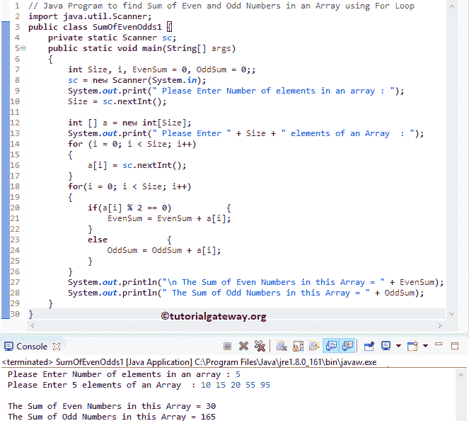

# Java 程序：寻找数组中偶数和奇数之和

> 原文：<https://www.tutorialgateway.org/java-program-to-find-sum-of-even-and-odd-numbers-in-an-array/>

编写一个 Java 程序，使用 For 循环、While 循环和带有示例的函数来查找数组中偶数和奇数的和。

## 用 For 循环求数组中偶数和奇数之和的 Java 程序

这个 Java 程序允许用户输入大小和数组元素。接下来，它将使用 For 循环在这个数组中找到偶数和奇数的和。

```java
// Java Program to find Sum of Even and Odd Numbers in an Array using For Loop
import java.util.Scanner;

public class SumOfEvenOdds1 {
	private static Scanner sc;
	public static void main(String[] args) 
	{
		int Size, i, EvenSum = 0, OddSum = 0;;
		sc = new Scanner(System.in);

		System.out.print(" Please Enter Number of elements in an array : ");
		Size = sc.nextInt();	

		int [] a = new int[Size];

		System.out.print(" Please Enter " + Size + " elements of an Array  : ");
		for (i = 0; i < Size; i++)
		{
			a[i] = sc.nextInt();
		}   

		for(i = 0; i < Size; i++)
		{
			if(a[i] % 2 == 0)
			{
				EvenSum = EvenSum + a[i]; 
			}
			else
			{
				OddSum = OddSum + a[i]; 
			}
		}		
		System.out.println("\n The Sum of Even Numbers in this Array = " + EvenSum);
		System.out.println(" The Sum of Odd Numbers in this Array = " + OddSum);
	}
}
```



任何能被 2 整除的数都是偶数。If 语句将检查当前数组元素的余数除以 2 是否正好等于 0。

*   如果条件为真，则为偶数， [Java](https://www.tutorialgateway.org/java-tutorial/) 编译器会将该值加到 EvenSum 上。
*   如果条件为假，则它是奇数。Java 编译器将为 OddSum 增加价值。

```java
for(i = 0; i < Size; i++) {
	if(a[i] % 2 == 0) {
		EvenSum = EvenSum + a[i]; 
	}
	else {
		OddSum = OddSum + a[i]; 
	}
}
```

用户插入的[数组](https://www.tutorialgateway.org/java-array/)值为 a[5] = {10，15，20，55，95}}

第一次迭代:对于(I = 0；0< 5; 0++)
I 的值为 0，回路条件(i < 5)的[为真。](https://www.tutorialgateway.org/java-for-loop/)

if(a[I]% 2 = = 0)= > if(a[0]% 2 = = 0)
if(10% 2 = = 0)–条件为真。

EvenSum = evenSum + a[0]
evenSum = 0 + 10 = 10

第二次迭代:对于(I = 1；1 < 5; 1++)
条件(i < 5)为真。

如果(a[1] % 2 == 0)
如果(15% 2 = = 0)–条件为假。

odd sum = odd sum+a[1]【T1】odd sum = 0+15 = 15

第三次迭代:for(I = 2；2< 5; 2++)
I 的值为 0，条件(i < 5)为真。

if(a[2]% 2 = = 0)
if(20% 2 = = 0)–条件为真。

EvenSum = evenSum + a[2]
evenSum = 10 + 20 = 30

对剩余迭代进行同样的操作，直到条件(i < 5) fails.

## 用 While 循环求数组中偶数和奇数之和的 Java 程序

这个 [Java 程序](https://www.tutorialgateway.org/learn-java-programs/)计算一个数组中的偶数和奇数之和同上。但是这次，我们使用了 [Java While 循环。](https://www.tutorialgateway.org/java-while-loop/)

```java
import java.util.Scanner;

public class SumOfEvenOdds2 {
	private static Scanner sc;
	public static void main(String[] args) 
	{
		int Size, i = 0, j = 0, EvenSum = 0, OddSum = 0;;
		sc = new Scanner(System.in);

		System.out.print(" Please Enter Number of elements in an array : ");
		Size = sc.nextInt();	

		int [] a = new int[Size];

		System.out.print(" Please Enter " + Size + " elements of an Array  : ");
		while(i < Size)
		{
			a[i] = sc.nextInt();
			i++;
		}   

		while(j < Size)
		{
			if(a[j] % 2 == 0)
			{
				EvenSum = EvenSum + a[j]; 
			}
			else
			{
				OddSum = OddSum + a[j]; 
			}
			j++;
		}		
		System.out.println("\n The Sum of Even Numbers in this Array = " + EvenSum);
		System.out.println(" The Sum of Odd Numbers in this Array = " + OddSum);
	}
}
```

```java
 Please Enter Number of elements in an array : 8
 Please Enter 8 elements of an Array  : 15 25 20 40 60 89 97 200

 The Sum of Even Numbers in this Array = 320
 The Sum of Odd Numbers in this Array = 226
```

## 用方法求数组中偶数和奇数之和的 Java 程序

这个[程序](https://www.tutorialgateway.org/learn-java-programs/)和第一个例子一样。但是这次，我们创建了一个单独的方法来[计算偶数之和](https://www.tutorialgateway.org/java-program-to-calculate-sum-of-even-numbers/)，以及另一个方法来[计算奇数之和](https://www.tutorialgateway.org/java-program-to-calculate-sum-of-odd-numbers/)。

```java
import java.util.Scanner;

public class SumOfEvenOdds3 {
	private static Scanner sc;
	public static void main(String[] args) 
	{
		int Size, i, EvenSum = 0, OddSum = 0;
		sc = new Scanner(System.in);	 
		System.out.print(" Please Enter Number of elements in an array : ");
		Size = sc.nextInt();	

		int [] a = new int[Size];		
		System.out.print(" Please Enter " + Size + " elements of an Array  : ");
		for (i = 0; i < Size; i++)
		{
			a[i] = sc.nextInt();
		}   
		EvenSum = SumOfEvensinArray(a, Size);
		OddSum = SumOfOddsinArray(a, Size);

		System.out.println("\n The Sum of Even Numbers in this Array = " + EvenSum);
		System.out.println(" The Sum of Odd  Numbers in this Array = " + OddSum);
	}
	public static int SumOfEvensinArray(int[] a, int Size)
	{
		int i, EvenSum = 0;		
		for(i = 0; i < Size; i++)
		{
			if(a[i] % 2 == 0)
			{
				EvenSum = EvenSum + a[i]; 
			}
		}	
		return EvenSum;
	}
	public static int SumOfOddsinArray(int[] a, int Size)
	{
		int i, OddSum = 0;		
		for(i = 0; i < Size; i++)
		{
			if(a[i] % 2 != 0)
			{
				OddSum = OddSum + a[i]; 
			}
		}	
		return OddSum;
	}
}
```

```java
 Please Enter Number of elements in an array : 10
 Please Enter 10 elements of an Array  : 14 24 59 89 100 209 77 16 125 196

 The Sum of Even Numbers in this Array = 350
 The Sum of Odd  Numbers in this Array = 559
```