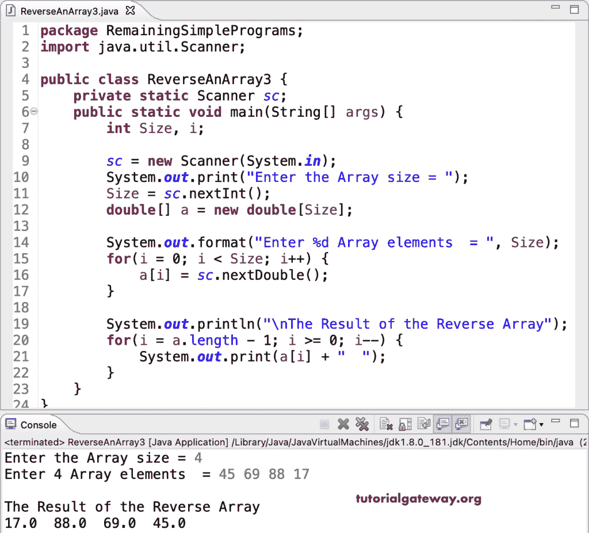

# Java 程序：反转数组

> 原文：<https://www.tutorialgateway.org/java-program-to-reverse-an-array/>

编写一个 Java 程序，使用 for 循环来反转数组。在这个 Java 示例中，for 循环从上到下迭代，并将每个值分配给另一个数组。接下来，我们使用另一个 for 循环打印反向数组。

```java
package RemainingSimplePrograms;

import java.util.Scanner;

public class ReverseAnArray1 {
	private static Scanner sc;
	public static void main(String[] args) {
		int Size, i, j;

		sc = new Scanner(System.in);		
		System.out.print("Enter the Array size = ");
		Size = sc.nextInt();

		double[] a = new double[Size];
		double[] b = new double[Size];

		System.out.format("Enter %d Array elements  = ", Size);
		for(i = 0; i < Size; i++) 
		{
			a[i] = sc.nextDouble();
		}

		for(i = Size - 1, j = 0; i >= 0; i--, j++) 
		{
			b[j] = a[i];
		}

		System.out.println("\nThe Result of the Reverse Array");
		for(i = 0; i < Size; i++) 
		{
			System.out.print(b[i] + "  ");
		}
	}
}
```

```java
Enter the Array size = 4
Enter 4 Array elements  = 22 67 94 122

The Result of the Reverse Array
122.0  94.0  67.0  22.0 
```

## 使用 while 循环反转数组的 Java 程序

```java
package RemainingSimplePrograms;

import java.util.Scanner;

public class ReverseAnArray2 {
	private static Scanner sc;
	public static void main(String[] args) {
		int Size, i, j;
		double temp;

		sc = new Scanner(System.in);		
		System.out.print("Enter the Array size = ");
		Size = sc.nextInt();

		double[] a = new double[Size];

		System.out.format("Enter %d Array elements  = ", Size);
		for(i = 0; i < Size; i++) 
		{
			a[i] = sc.nextDouble();
		}

		j = i - 1;
		i = 0;

		while(i < j) 
		{
			temp = a[i];
			a[i] = a[j];
			a[j] = temp;
			i++;
			j--;
		}

		System.out.println("\nThe Result of the Reverse Array");
		for(i = 0; i < Size; i++) 
		{
			System.out.print(a[i] + "  ");
		}
	}
}
```

```java
Enter the Array size = 6
Enter 6 Array elements  = 11 98.4 29.6 12.9 14.4 12.1

The Result of the Reverse Array
12.1  14.4  12.9  29.6  98.4  11.0 
```

在这个 [Java 示例](https://www.tutorialgateway.org/learn-java-programs/)中，我们没有使用另一个数组，而是在一个 for 循环中反转并打印了这个数组。

```java
package RemainingSimplePrograms;

import java.util.Scanner;

public class ReverseAnArray3 {

	private static Scanner sc;

	public static void main(String[] args) {

		int Size, i;

		sc = new Scanner(System.in);

		System.out.print("Enter the Array size = ");
		Size = sc.nextInt();	

		double[] a = new double[Size];

		System.out.format("Enter %d Array elements  = ", Size);
		for(i = 0; i < Size; i++) 
		{
			a[i] = sc.nextDouble();
		}

		System.out.println("\nThe Result of the Reverse Array");
		for(i = a.length - 1; i >= 0; i--) 
		{
			System.out.print(a[i] + "  ");
		}
	}
}
```



使用递归函数反转数组的 Java 程序。

```java
package RemainingSimplePrograms;

import java.util.Scanner;

public class ReverseAnArray4 {
	private static Scanner sc;
	public static void main(String[] args) {
		int Size, i;

		sc = new Scanner(System.in);		
		System.out.print("Enter the Array size = ");
		Size = sc.nextInt();

		int[] a = new int[Size];

		System.out.format("Enter %d Array elements  = ", Size);
		for(i = 0; i < Size; i++) 
		{
			a[i] = sc.nextInt();
		}

		reverseArray(a, 0, Size - 1);

		System.out.println("\nThe Result of the Reverse Array");
		for(i = 0; i < Size; i++) 
		{
			System.out.print(a[i] + "  ");
		}
	}

	public static void reverseArray(int[] a, int start, int end) {
		int temp;

		if(start < end)
		{
			temp = a[start];
			a[start] = a[end];
			a[end] = temp;
			reverseArray(a, start + 1, end - 1);
		}
	}
}
```

```java
Enter the Array size = 8
Enter 8 Array elements  = 12 45 32 44 687 17 122 986

The Result of the Reverse Array
986  122  17  687  44  32  45  12 
```